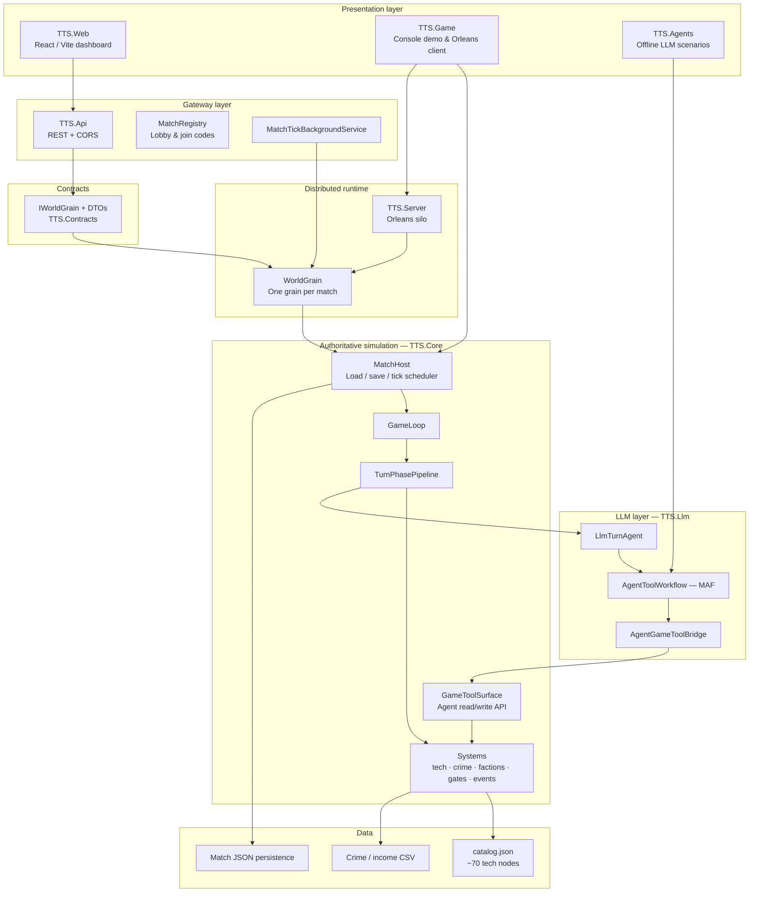
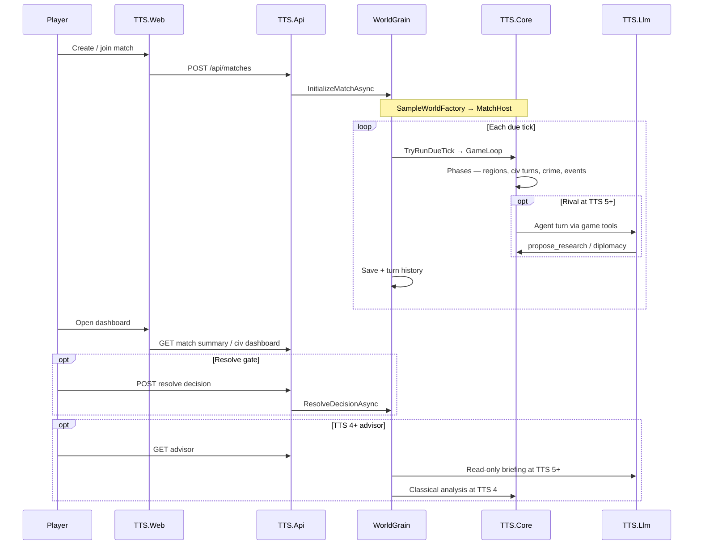
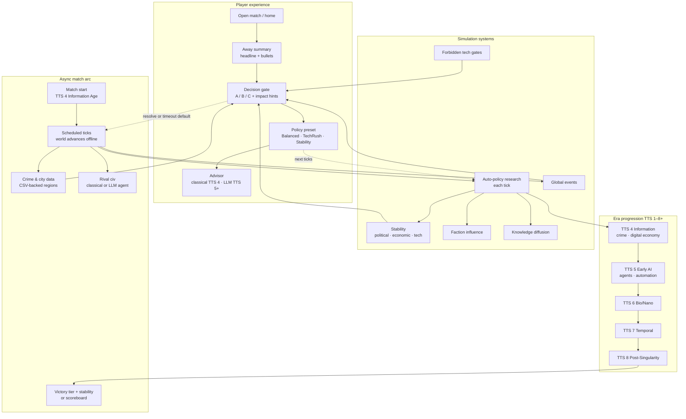
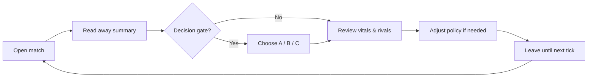

# TTS — Architecture Overview

**Project:** TTS — Technology Tier Simulation  
**Status:** Reflects shipped code (TTS 4 default start, web MVP, LLM agents)  
**Related:** [README.md](README.md) · [current-state.md](current-state.md) · [player-experience.md](player-experience.md) · [v2/agent-integration.md](v2/agent-integration.md)

---

## Executive summary

TTS is a grand-strategy civilization sim where matches progress through **Technology Tier Systems (TTS 1–8+)**. Each era changes mechanics, not just stats.

The codebase is a **.NET simulation engine** (`TTS.Core`) with **Orleans-backed async multiplayer**, a **React governor dashboard**, and optional **LLM agents** at higher tiers.

**Core principle:** `TTS.Core` is always authoritative. Clients and LLMs never mutate game state directly — they call into `MatchHost` → `GameLoop` → systems, or (for agents) through `GameToolSurface` with validation.

---

# Part A — Technical Architecture

## High overview — technical diagram

> **Exportable version:** [`assets/architecture-technical-overview.md`](../assets/architecture-technical-overview.md) · PNG: [`assets/architecture-technical-overview.png`](../assets/architecture-technical-overview.png)



## End-to-end request flow



## Projects and responsibilities

| Project | Role |
|---------|------|
| **TTS.Core** | Pure rules engine — no HTTP, no Orleans |
| **TTS.Contracts** | Orleans grain interfaces and wire DTOs |
| **TTS.Grains** | `WorldGrain` — hosts `MatchHost`, persistence, tick timer |
| **TTS.Server** | Orleans silo host |
| **TTS.Api** | REST API for match create/join/play |
| **TTS.Web** | React governor dashboard |
| **TTS.Game** | Local CLI or Orleans client |
| **TTS.Llm** | MAF agent workflows (Ollama / OpenAI / Gemini) |
| **TTS.Agents** | Standalone scenario runner for LLM testing |
| **TTS.Tests** | Unit tests |

## Solution structure

```
From-Stone-to-Ascension.sln
├── src/TTS.Core/          Rules engine
├── src/TTS.Contracts/     Grain interfaces + DTOs
├── src/TTS.Grains/        WorldGrain
├── src/TTS.Server/        Orleans silo
├── src/TTS.Api/           REST API
├── src/TTS.Web/           React dashboard
├── src/TTS.Llm/           MAF workflows
├── src/TTS.Game/          Console client
├── src/TTS.Agents/        Offline scenarios
├── src/TTS.Tests/         Tests
└── src/data/              Tech catalog + crime CSV
```

## Match lifecycle

1. **Create** — `SampleWorldFactory` builds `WorldState` (civs, regions, tech catalog, match config).
2. **Bootstrap** — modern modes start at **TTS 4** via `InformationAgeTechSpine` (`MatchConfig.StartingTier`).
3. **Host** — `MatchHost` wraps world + `SimulationServices` + `GameLoop` + JSON persistence.
4. **Schedule** — `TickScheduler` compares wall clock to `MatchConfig` (e.g. Sprint 8h = 8 ticks × 1h).
5. **Tick** — `TryRunDueTick` → `GameLoop.RunTurn()` runs the phase pipeline.
6. **Serve** — `WorldGrain` maps state to DTOs; API maps to JSON for the web client.

## Tick pipeline (implementation order)

```
Expire gates
→ Region growth
→ Stability decay
→ Per-civ turn (Agent or Classical AI)
→ Knowledge diffusion
→ Faction influence
→ Economy
→ Crime pressure
→ Global event spawn
→ Event impacts
→ Event tick
→ Scan for new decision gates
→ Finalize turn history
→ Win/loss check
```

Civilization turns use a **strategy chain**: `AgentTurnRunner` (rival, TTS 5+) first, then `ClassicalAiTurnRunner`.

## Agent integration boundary

See [v2/agent-integration.md](v2/agent-integration.md).

| Concern | Where |
|---------|-------|
| Tool definitions | `GameTool` enum + `GameToolRegistry` |
| Validated writes | `GameToolSurface` → `ResearchExecutor` |
| Orchestration | `AgentOrchestrator` — LLM first, classical fallback |
| Injection | `WorldGrain` → `MatchHost` |

**Rules:** `TTS.Core` never calls LLM directly. Tools are the only agent write path.

## Deployment (dev)

```bash
dotnet run --project src/TTS.Server          # Orleans silo
dotnet run --project src/TTS.Api             # REST :5000
cd src/TTS.Web && npm run dev              # UI :5173
```

---

# Part B — Gameplay Architecture

## High overview — gameplay diagram



## Primary player loop



Most visits are **2–5 minutes**. The world advances on a schedule; player agency concentrates on **gates**, **policy**, and **advisor** guidance.

## World model

| Entity | Gameplay role |
|--------|----------------|
| **Civilization** | Tier, stability, researched techs, policy, factions, pending gates |
| **Region / city** | Population, economy; TTS 4+ crime/income profiles (CSV) |
| **Faction** | Internal politics — influences research direction |
| **Technology** | ~70 nodes — Core, Branch, Forbidden, Fusion |
| **Knowledge network** | Tech diffusion via trade, espionage |
| **Global events** | Tier-scaled crises |
| **Match** | Fixed wall-clock arc with victory tier target |

Default demo: **Aurora Collective** (player) vs **Iron Dominion** (rival), regions anchored to California / Louisiana 2015 data.

## Era progression

| Tier | Era | Key gameplay shift |
|------|-----|-------------------|
| **1** | Pre-Industrial | Survival, agriculture (`classic-stone` mode) |
| **2** | Industrial | Production vs unrest |
| **3** | Early Electronics | Grids, communication |
| **4** | Information Age | **Default start** — crime, digital economy, advisor lite |
| **5** | Early AI | LLM rival turns + strategic advisor |
| **6** | Bio/Nano | Genetic / nanotech policy |
| **7** | Temporal | Paradox stability |
| **8+** | Post-Singularity | Superintelligence governance |

## Player vs AI behavior

| Actor | Tick behavior | Player interaction |
|-------|---------------|-------------------|
| **Player civ** | Classical auto-policy | Gates, policy, advisor refresh |
| **Rival (TTS < 5)** | Classical AI | Observed in away summary / rival card |
| **Rival (TTS 5+)** | LLM agent with game tools | Research + diplomacy; classical fallback |

Pending gates **block research** for that civ until resolved or expired (default applies).

## Match modes

| Mode | Wall clock | Typical victory tier | Start tier |
|------|------------|----------------------|------------|
| Sprint 8h | ~8h | TTS 6 | TTS 4 |
| Blitz 24h | ~24h | TTS 7 | TTS 4 |
| Standard 36h | ~36h | TTS 7 | TTS 4 |
| Extended 48h | ~48h | TTS 8 | TTS 4 |
| Classic stone | ~36h | TTS 6 | TTS 1 |
| Dev blitz 3m | ~3m | TTS 5 | TTS 4 |

See [match-modes.md](match-modes.md) and [player-experience.md](player-experience.md).

## Design pillars (gameplay)

1. **Era-driven gameplay** — each TTS is a distinct mode  
2. **Progress vs stability** — power increases fragility  
3. **Emergent civ behavior** — factions, diffusion, rival agents  
4. **Rule evolution** — higher tiers change which systems matter  

---

## Document map

| If you need… | Read… |
|--------------|-------|
| What runs today | [current-state.md](current-state.md) |
| Player UX guidance | [player-experience.md](player-experience.md) |
| LLM agents in detail | [v2/agent-integration.md](v2/agent-integration.md) |
| Match schedules | [match-modes.md](match-modes.md) |
| UI wireframes | [ui-design.md](ui-design.md) |
| Async MP concept | [async-multiplayer-gameplay.md](async-multiplayer-gameplay.md) |
| v2 planning | [v2/README.md](v2/README.md) |
