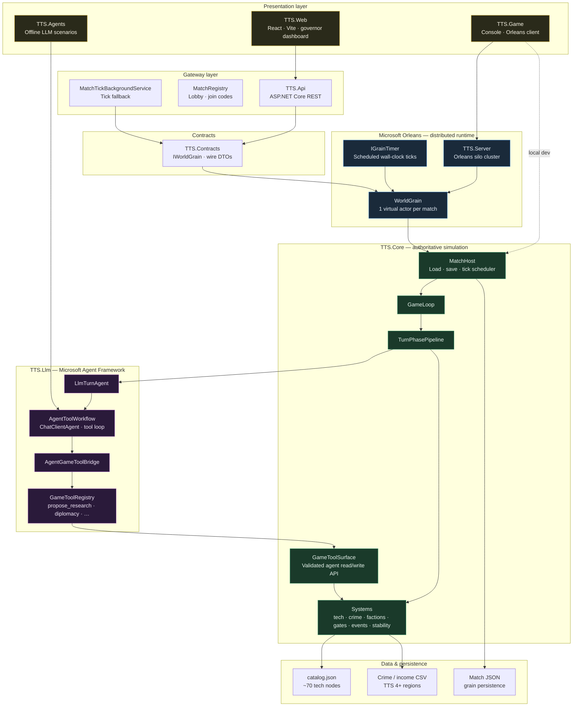

# TTS — Technical Architecture (High Overview)

**Project:** [From-Stone-to-Ascension](https://github.com/PiotrZak/From-Stone-to-Ascension)  
**Use for:** LinkedIn / Medium / README embeds  
**Source:** [`architecture-technical-overview.mmd`](architecture-technical-overview.mmd)  
**Full doc:** [`architecture-overview.md`](../architecture-overview.md)

---

## Diagram



---

## Layer summary

| Layer | Projects | Role |
|-------|----------|------|
| **Presentation** | `TTS.Web`, `TTS.Game`, `TTS.Agents` | Dashboard, CLI, offline agent scenarios |
| **Gateway** | `TTS.Api` | REST API, lobby, tick fallback service |
| **Contracts** | `TTS.Contracts` | `IWorldGrain` + DTOs — API ↔ Orleans boundary |
| **Orleans** | `TTS.Server`, `TTS.Grains` | One `WorldGrain` per match; timers; JSON persistence |
| **Core** | `TTS.Core` | **Authoritative** rules — `MatchHost` → `GameLoop` → systems |
| **MAF** | `TTS.Llm` | Microsoft Agent Framework tool workflows (TTS 5+) |
| **Data** | `src/data/`, saves | Tech catalog, crime CSV, match JSON |

**Rule:** clients and LLMs never write game state directly. Agents use `GameToolSurface` only; the engine validates every action.

---

## Export as PNG (LinkedIn / Medium)

```bash
npx @mermaid-js/mermaid-cli \
  -i assets/architecture-technical-overview.mmd \
  -o assets/architecture-technical-overview.png \
  -b transparent \
  -w 2400
```

Or open [mermaid.live](https://mermaid.live), paste contents of `architecture-technical-overview.mmd`, export PNG/SVG.

---

## Simplified one-glance flow

```
Player (browser)
    → TTS.Api (REST)
        → TTS.Contracts (IWorldGrain)
            → WorldGrain (Orleans, 1 per match)
                → MatchHost (TTS.Core)
                    → GameLoop → Systems
                    → GameToolSurface ← MAF agents (TTS 5+)
                → JSON persistence
```
