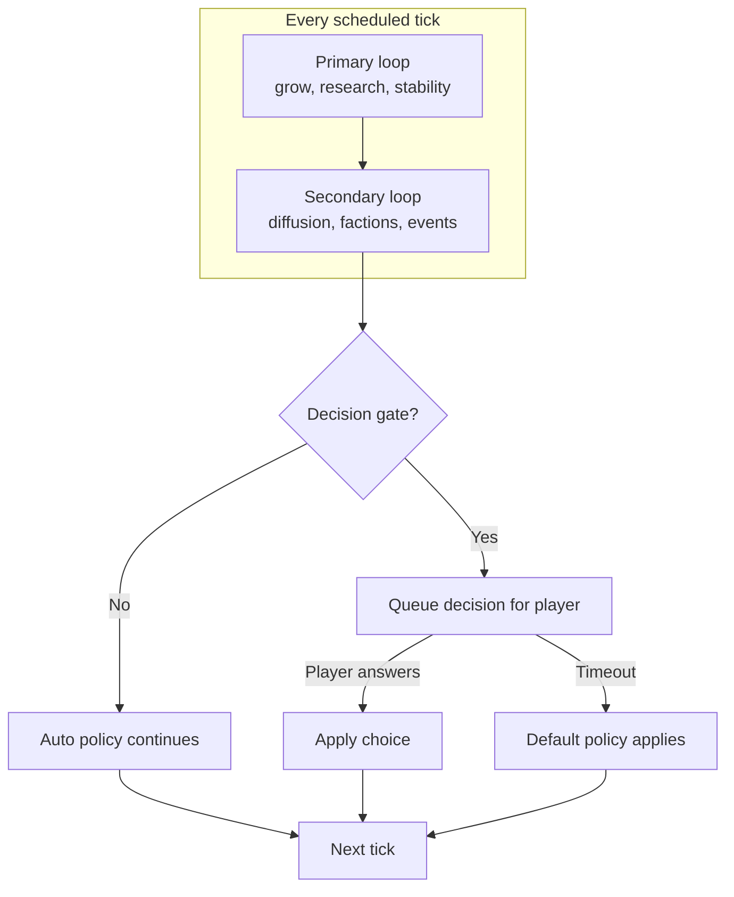
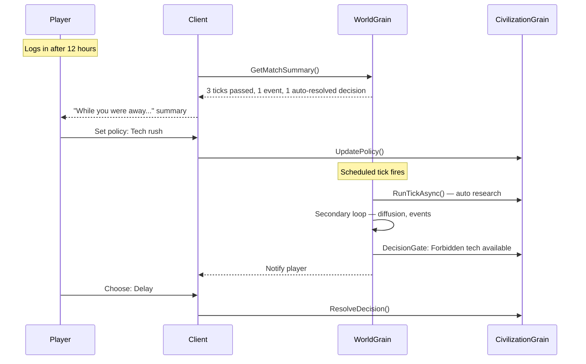

# Asynchronous Multiplayer Gameplay

**Project:** TTS — Technology Tier Simulation  
**Mode:** Multiplayer — slow-evolving, decision-driven, autonomous progression  
**Status:** Design document — current `TTS.Game` demo runs instant turns locally

**Related:**
- [README.md](README.md) — core game design
- [match-modes.md](match-modes.md) — **8h / 24h / 36h / 48h presets** + [match lifecycle diagrams](match-modes.md#7-match-lifecycle)
- [llm-deployment.md](llm-deployment.md) — Ollama vs cloud for internet MP + cost
- [company-sim.md](company-sim.md) — separate procurement / company sim (Supply Ascent)
- [orleans-integration.md](orleans-integration.md) — distributed server hosting
- [agent-framework-integration.md](agent-framework-integration.md) — TTS 5+ agent intelligence
- [implementation-plan.md](implementation-plan.md) — master roadmap (Phases 0–9)

---

## 1. Concept

TTS multiplayer is **asynchronous grand strategy**: a shared world that evolves slowly over real time. Players make **important decisions** at key moments, but their civilizations **continue to develop when they are offline**.

> The world does not wait for you — but it asks for your judgment when it matters.

This is not:

| Not this | Why |
|----------|-----|
| Real-time strategy (RTS) | No per-second combat or APM race |
| Fully idle clicker | Player choices shape direction and crises |
| Turn-based “everyone must click End Turn” | One absent player must not freeze the match |
| Single burst simulation | Not “run 8 turns in 2 seconds” like the current console demo |

This is closest to **slow-burn civ sims** (OGame, Travian, play-by-email Civ) combined with TTS’s **era-changing rules** and optional **agentic AI at higher tiers**.

---

## 2. Design Pillars

| Pillar | Meaning |
|--------|---------|
| **Slow evolution** | World advances on scheduled ticks (hours), not continuous real-time |
| **Autonomous progress** | Civs grow, research, and react via policy when the player is away |
| **Meaningful decisions** | Crises, tier shifts, diplomacy, and forbidden tech require player input |
| **Shared timeline** | All players exist in one world; actions and diffusion affect each other |
| **Progress vs stability** | Auto-growth continues; ignoring decisions increases risk |

---

## 3. Time Model

### Ticks, not sessions

A **tick** is one simulation step for the entire match. Ticks run on a **real-time schedule**, independent of whether players are online.

```
Match created
    → Tick every N hours (configurable, e.g. 4h)
    → Each tick runs Primary loop + Secondary loop
    → Decision gates may pause *one civ* until answered or timeout
    → World turn counter increments
```

| Term | Meaning |
|------|---------|
| **Tick** | One global simulation step (`GameLoop.RunTurn()` today) |
| **Tick interval** | Real time between ticks (e.g. 1h, 4h, 24h) |
| **Decision window** | Real time a player has to answer before default applies |
| **Era** | TTS tier band — may change rules mid-match |

### Example schedule (default proposal)

| Setting | Default | Notes |
|---------|---------|-------|
| Tick interval | 4 hours | One “turn” per few hours of real time |
| Decision window | 48 hours | Crises don’t block the world; defaults apply |
| Catch-up summary | On login | “While you were away: 6 ticks, 2 events, 1 decision auto-resolved” |

Ticks are **fast to compute** but **slow to arrive** — the pacing is in the schedule, not the CPU.

---

## 4. Primary vs Secondary Loop (Multiplayer Context)

The loops in `TTS.Core/GameLoop.cs` map directly to this mode.

### Primary loop — autonomous growth

Runs every tick for **every civilization**, whether the player is online or not.

| System | Autonomous behavior |
|--------|---------------------|
| Regions | Resources and infrastructure grow |
| Stability | Natural decay per tick |
| Research | Follows **auto policy** (research priority, branch weights) |
| Tier advancement | Triggers when enough tech is researched |

**Player role:** set policy and priorities — not micromanage every tick.

### Secondary loop — world pressure

Runs every tick after primary; affects all civs and creates interaction between players.

| System | Multiplayer effect |
|--------|-------------------|
| Knowledge diffusion | Your tech leaks to rivals via trade/espionage |
| Factions | Internal pressure accelerates or resists progress |
| Global events | Shared crises (AI alignment, resource collapse) |
| Event impact | Stability shifts for all affected civs |

**Player role:** respond when a **decision gate** opens; otherwise auto-policy handles fallout where possible.



---

## 5. Player Interaction Modes

Each civilization is always in one of three modes.

### 5.1 Auto mode (default)

**When:** Player offline, no pending decision, or chose “let advisors handle it”.

**Behavior:**

- Research follows `ResearchPolicy` (branch weights, risk tolerance)
- Stability managed by policy stance (stability-first vs tech-rush)
- Classical AI below TTS 5; MAF-assisted policy at TTS 5+ (future)
- Factions and events apply standard modifiers

The civ **never stalls** because the player closed the app.

### 5.2 Decision mode

**When:** A decision gate fires for this civ.

**Behavior:**

- Tick processing for **other civs and world systems continues**
- This civ’s sensitive action waits (or uses default after timeout)
- Player notified: push, email, in-game banner (client concern)
- Options are structured (not free-text) — e.g. `regulate | accelerate | isolate`

### 5.3 Override mode

**When:** Player is online and actively sets strategy.

**Behavior:**

- Update research priority, diplomacy stance, faction support
- Overrides persist as policy until changed
- Does not require per-tick input — changes apply on next ticks

---

## 6. Decision Gates

Not every tick needs player input. Decisions are reserved for **high-impact moments**.

### Proposed gate types

| Gate | Trigger | Example choices | If timeout |
|------|---------|-----------------|------------|
| **Tier advancement** | Civ reaches new TTS | Embrace / regulate / delay | Embrace with default stability cost |
| **Global crisis** | Event targets this civ | Regulate / accelerate / isolate | Safest stability option |
| **Forbidden tech** | Early unlock available | Pursue / ban / delay | Ban (preservationist default) |
| **Diplomacy** | Rival proposal | Accept trade / reject / counter | Reject |
| **Faction crisis** | Stability below threshold | Appease / suppress / reform | Appease |
| **AI alignment** (TTS 5+) | Alignment event | Align / contain / merge | Contain |

### Gate rules

1. **World never blocks** on one player — other civs keep ticking
2. **At most one active gate per civ** (queue extras if needed)
3. **Default on timeout** is always valid but not always optimal
4. **Decisions are validated** by `TTS.Core` — same as agent tools today

---

## 7. Auto Policy

Auto policy is how a civ progresses without the player. It should feel like a **governance stance**, not random noise.

### Policy dimensions (future model)

```csharp
// Conceptual — not yet in TTS.Core
public class CivilizationPolicy
{
    public ResearchStance Research { get; set; }      // TechRush, Balanced, StabilityFirst
    public RiskTolerance Risk { get; set; }           // Low, Medium, High
    public DiplomacyStance Diplomacy { get; set; }    // Cooperative, Neutral, Aggressive
    public Dictionary<string, double> BranchWeights { get; set; }  // ai, nano, temporal, ...
}
```

### Preset stances (player-selectable)

| Stance | Research | Risk | Good when |
|--------|----------|------|-----------|
| **Expansionist** | Broad branches | Medium | Early tiers, map pressure |
| **Tech rush** | Deepest branch | High | Racing to next TTS |
| **Stability first** | Safe techs only | Low | Low stability, faction unrest |
| **Diplomatic** | Trade/diffusion bonuses | Low | Strong neighbors |

Below **TTS 5:** classical AI executes policy.  
At **TTS 5+:** MAF can interpret policy in richer ways (advisor recommends; auto mode executes).

---

## 8. Multiplayer Dynamics

### Shared world effects

| System | Why it matters in MP |
|--------|----------------------|
| Knowledge diffusion | Leading in tech spreads — or leaks — to rivals |
| Global events | Same crisis can hit multiple players differently |
| Tier disparity | One player at TTS 5 changes pressure on TTS 3 civs |
| Forbidden tech | Early unlock by one player can trigger world instability |

### Player experience arc



### Fairness principles

1. **No freeze** — absent players don’t slow the match
2. **Catch-up clarity** — summary of what happened while away
3. **Same rules** — AI and human civs use same policy/decision systems
4. **Tier gating** — higher TTS unlocks more autonomy and more risk

---

## 9. Architecture

### Stack for async multiplayer

```
┌──────────────┐
│ Game Client  │  notifications, policy UI, decision modals
└──────┬───────┘
       │ HTTPS / WebSocket
┌──────▼───────────────────────────────────────────┐
│ TTS.Api                                        │
└──────┬─────────────────────────────────────────┘
       │
┌──────▼───────────────────────────────────────────┐
│ TTS.Server (Orleans)                             │
│  WorldGrain        — tick timer, match state     │
│  CivilizationGrain — policy, decisions, auto AI  │
│       │                                          │
│       ▼                                          │
│  TTS.Core — GameLoop, systems, validation        │
│       │                                          │
│       ▼ (TTS 5+)                                 │
│  TTS.Agents (MAF) — agentic auto policy          │
└──────────────────────────────────────────────────┘
```

| Component | Role in async MP |
|-----------|------------------|
| **WorldGrain** | Fires scheduled ticks; owns global events and turn counter |
| **CivilizationGrain** | Policy, decision queue, auto mode; activates on tick or player action |
| **GameLoop** | One tick = `RunPrimaryLoop()` + `RunSecondaryLoop()` |
| **IGameToolSurface** | API for MAF and client overrides |
| **Client** | Policy screens, decision UI, away summaries |

See [orleans-integration.md](orleans-integration.md) for grain details and [agent-framework-integration.md](agent-framework-integration.md) for TTS 5+ agents.

---

## 10. Away Summary (Catch-Up UX)

When a player returns, the client shows a concise **tick digest** — not every number, but meaningful changes.

**Example:**

```
While you were away (3 ticks, ~12 hours)

  TTS    4 → 5  (Early AI Age unlocked)
  Tech   Researched: Machine Learning, AGI Theory
  Stability  67 → 61  (faction pressure)
  Event  AI Alignment Crisis — you chose: Regulate (auto after 48h)
  World  Iron Dominion reached TTS 4
  Diffusion  Leaked: Digital Computing → Iron Dominion (espionage)

  Pending: 1 decision — Forbidden recursive AI research
```

This reinforces: **the world moved without you**, but **your choices still matter**.

---

## 11. Relationship to Current Code

| Current (`TTS.Game` demo) | Target (async multiplayer) |
|---------------------------|----------------------------|
| 8 instant turns in a loop | 1 tick per scheduled interval |
| Player auto-researches first available tech | Player sets `CivilizationPolicy` |
| Rival does nothing (agent stub) | All civs run auto policy each tick |
| No decisions | `DecisionGate` queue per civ |
| In-process `WorldState` | Orleans `WorldGrain` + `CivilizationGrain` |
| No notifications | Client push / poll for pending decisions |

`GameLoop.cs` structure is already correct — **primary then secondary**. What changes is **what triggers a tick** (timer), **how research is chosen** (policy), and **when player input is required** (gates).

---

## 12. Implementation Roadmap

> **Master plan:** [implementation-plan.md](implementation-plan.md) — unified Phases 0–9 across Core, async MP, Orleans, and MAF.

| Phase | This document | Status |
|-------|---------------|--------|
| 0–1 | Design + core scaffold | Done |
| **2–4** | **Auto policy, decision gates, scheduled ticks** | **This doc — next** |
| 5–6 | Orleans + MP API | [orleans-integration.md](orleans-integration.md) |
| 8 | MAF in-game auto policy | [agent-framework-integration.md](agent-framework-integration.md) |

### Phase 2 — Auto policy & classical AI

- [x] `CivilizationPolicy`, `AutoPolicySystem`, `ClassicalAiSystem`
- [x] Policy-driven research in `GameLoop`
- [x] All civs progress without player input

### Phase 3 — Decision gates & away summary

- [ ] `DecisionGate`, `DecisionGateSystem`, timeout defaults
- [ ] `AwaySummary` for catch-up UX

### Phase 4 — Scheduled ticks (local)

- [ ] `MatchConfig`, `MatchState`, `TickScheduler`
- [ ] Compressed-time demo

Details, files, and exit criteria: [implementation-plan.md § Phase 2–4](implementation-plan.md#phase-2--auto-policy--classical-ai).

---

## 13. Configuration Reference (Proposed)

| Key | Default | Description |
|-----|---------|-------------|
| `tick_interval_hours` | 3 (Standard) / 1 (Sprint) | Real hours between world ticks — see [match-modes.md](match-modes.md) |
| `decision_window_hours` | 12 (Standard) / 2 (Sprint) | Time before default applies |
| `max_pending_decisions` | 3 | Queue depth per civ |
| `auto_research_enabled` | true | Civ researches on policy each tick |
| `offline_progress_enabled` | true | Ticks run when player offline |
| `default_stance` | Balanced | New player policy preset |

---

## 14. Summary

TTS multiplayer is a **slowly evolving shared world** where:

- **Ticks** advance the simulation on a real-time schedule
- **Primary loop** grows every civ autonomously via **policy**
- **Secondary loop** applies world pressure and player interaction
- **Decision gates** ask for judgment at critical moments
- **Timeouts** ensure the world never stalls on an absent player
- **Orleans** hosts the scheduled, persistent match
- **MAF** enriches auto policy and crises at TTS 5+

The player is a **governor**, not a babysitter: set direction, answer crises, return to a world that kept moving.
