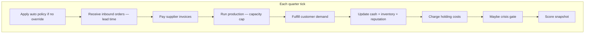
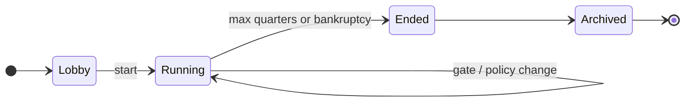
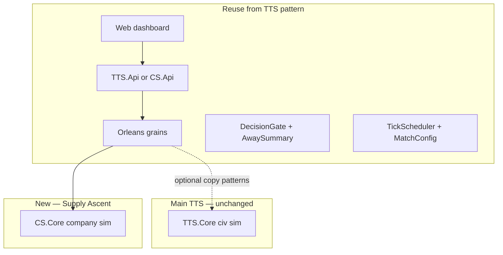
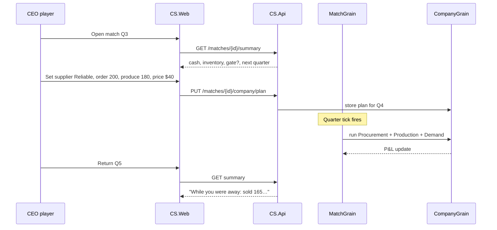

# Company Sim — Separate Small Game

**Codename:** Supply Ascent  
**Genre:** Async multiplayer business / procurement simulation  
**Status:** Design only — not implemented; **separate** from main TTS civ sim  
**Repo relationship:** Same monorepo pattern as TTS; **new** `CS.Core` (or `TTS.Supply`) — does not replace [README.md](README.md) TTS vision

**Related:**
- [match-modes.md](match-modes.md) — reuse async match timing (8h Sprint, etc.)
- [async-multiplayer-gameplay.md](async-multiplayer-gameplay.md) — governor check-in model
- [ui-design.md](ui-design.md) — dashboard-first client (adapted screens)
- [llm-deployment.md](llm-deployment.md) — optional advisor on server

---

## 1. Why a separate game?

| Main TTS | This game (Supply Ascent) |
|----------|---------------------------|
| Civilization through **tech eras** (TTS 1–8+) | **One company** through **quarters** |
| Research tree, stability, factions | Suppliers, inventory, cash, margins |
| Sci-fi ascension fantasy | Grounded ops / procurement fantasy |
| Long design horizon (500+ tech nodes) | **Small MVP** — one product chain |

> Reuse the **async match platform** (lobby, ticks, gates, away summary, API).  
> Replace the **simulation rules** with company / supply-chain logic.

Inspired by [Sim Companies](https://www.simcompanies.com/), [Supply Chain Disaster](https://www.supplychaindisaster.com/), and the [Beer Game](https://beergame.suplay.nl/) — but **bounded matches** (8–48h), not open-ended MMO economies.

---

## 2. High concept

**Genre:** Async multiplayer company management / procurement  

**Core idea:**  
Each player runs a **small manufacturing company** in a shared market. Every few hours (one **tick** = one **quarter**), you set procurement, production, and pricing — or rely on **auto policy** while offline. Crises (supplier failure, demand shock, quality recall) force **structured decisions**. Highest **company score** at match end wins.

> “Your supply chain runs while you sleep — but the wrong supplier blows up your quarter.”

---

## 3. Design pillars

| Pillar | Meaning |
|--------|---------|
| **Async quarters** | World advances on schedule; no live APM race |
| **Procurement matters** | Supplier choice = cost vs reliability vs lead time |
| **Inventory risk** | Too much stock burns cash; too little loses sales |
| **Sparse decisions** | 2–4 gates per match — not spreadsheet hell |
| **Bounded match** | 8–48h; clear winner; good for friends & tournaments |
| **Optional LLM** | Advisor explains crises; never runs the ledger |

---

## 4. Player fantasy

You are the **CEO/COO** of a company that makes **one finished product** from **2–3 inputs** (MVP).

| You manage | You don’t (MVP) |
|------------|-----------------|
| Which supplier to buy from | 50-SKU catalog |
| How much to produce | Real-time player market trading |
| Retail price band | HR, accounting minigames |
| Emergency gate choices | 3D factory view |

**Check-in rhythm:** 2–5 minutes every few hours — same as [ui-design.md](ui-design.md) governor dashboard.

---

## 5. Core loop (one tick = one quarter)



### Player inputs per quarter (when online)

| Input | Effect |
|-------|--------|
| **Supplier** | Cost, reliability, lead time for raw material A |
| **Order quantity** | Units to procure (arrives after lead time) |
| **Production level** | Units to make (limited by capacity + inputs) |
| **Price** | Affects demand % and margin |
| **Gate choice** | Crisis override (A/B/C) |

If absent: **CompanyPolicy** auto-picks (like TTS `CivilizationPolicy`).

---

## 6. Match structure

Reuse [match-modes.md](match-modes.md) timing with quarter flavor:

| Mode | ID | Quarters | Interval | Wall clock | Best for |
|------|-----|----------|----------|------------|----------|
| **Sprint** | `cs-sprint-8h` | 8 | 1 hour | ~8h | Evening with friends |
| **Standard** | `cs-standard-36h` | 12 | 3 hours | ~36h | Weekend league |
| **Blitz** | `cs-blitz-24h` | 6 | 4 hours | ~24h | Casual day |

**Players:** 2–8 companies in one **shared demand pool** (your sales steal from same market).

---

## 7. Match lifecycle



| Phase | Player does |
|-------|-------------|
| **Lobby** | Company name, starting policy, ready |
| **Running** | Quarterly plan or auto; resolve gates |
| **Ended** | P&L summary, placement, rematch |

Full platform diagram: [match-modes.md §7](match-modes.md#7-match-lifecycle) (same API/Orleans shape).

---

## 8. Domain model (MVP)

```
Match
├── MatchConfig (mode, tick interval, max quarters)
├── MarketState (total demand, price index)
└── Companies[]
    └── Company
        ├── Cash
        ├── Reputation (0–100)
        ├── Inventory { rawA, rawB, finished }
        ├── Capacity (units/quarter)
        ├── CompanyPolicy (auto procurement stance)
        ├── ActiveSupplierId
        ├── PendingOrders[] (arrival quarter)
        ├── PendingDecisions[] (gates)
        └── ScoreHistory[]
```

### Suppliers (fixed roster per match)

| Supplier | Cost/unit | Reliability | Lead time (quarters) | Risk event chance |
|----------|-----------|-------------|----------------------|-------------------|
| **FastCheap Ltd** | Low | 70% | 1 | Higher delay |
| **Reliable Co** | Medium | 95% | 2 | Lower delay |
| **Premium Global** | High | 99% | 1 | Lowest delay |

### One product chain (MVP)

```
Raw Material A ──┐
                 ├──► Finished Unit ──► Market demand
Raw Material B ──┘     (assembly)
```

**Recipe:** 2×A + 1×B → 1 finished unit  
**Starting cash:** 10,000  
**Starting inventory:** small buffer

---

## 9. Systems (new — not in TTS.Core)

| System | Responsibility |
|--------|----------------|
| `ProcurementSystem` | Place orders, lead times, supplier reliability |
| `ProductionSystem` | Convert inputs → finished goods (capacity cap) |
| `DemandSystem` | Market demand split by price + reputation across companies |
| `InventorySystem` | Stock levels, holding cost per quarter |
| `CashFlowSystem` | Revenue, COGS, penalties, bankruptcy check |
| `CrisisSystem` | Supplier delay, quality fail, demand spike events |
| `DecisionGateSystem` | Same pattern as TTS Phase 3 — procurement crises |
| `CompanyPolicySystem` | Auto supplier/qty/price (like `AutoPolicySystem`) |
| `ScoringSystem` | Company score = f(cash, reputation, market share) |

---

## 10. Decision gates (procurement-themed)

| Gate | Trigger | Options (example) | Default on timeout |
|------|---------|-------------------|-------------------|
| **Supplier failure** | Reliability roll failed | Switch supplier / Wait / Emergency buy (expensive) | Emergency buy |
| **Quality recall** | Random event | Recall all / Partial / Ignore (reputation risk) | Recall |
| **Demand spike** | Market +40% | Max production / Raise price / Turn down orders | Raise price |
| **Cash crunch** | Cash &lt; threshold | Cut production / Short-term loan / Fire sale inventory | Cut production |
| **Ethics / compliance** | Optional flavor | Certify supplier / Audit later / Swap supplier | Audit later |

**Rule:** Other companies’ ticks continue; only your gated action waits (or defaults).

---

## 11. Company policy (auto mode)

Analogous to TTS `CivilizationPolicy`:

| Preset | Procurement | Production | Pricing |
|--------|-------------|------------|---------|
| **Balanced** | Mid reliability supplier | Match forecast demand | Market average |
| **Cost cutter** | Cheapest supplier | High utilization | Low price |
| **Quality first** | Premium supplier | Conservative | Premium price |
| **Just-in-time** | Short lead time | Minimal inventory | Competitive |

```csharp
// Conceptual — CS.Core
public class CompanyPolicy
{
    public ProcurementStance Procurement { get; set; }
    public InventoryStance Inventory { get; set; }
    public PricingStance Pricing { get; set; }
}
```

---

## 12. Scoring & win conditions

### Company score (each quarter)

```
score = cash * 0.01
      + reputation * 2
      + market_share_pct * 5
      - stockout_penalty
      - excess_inventory_penalty
```

### Match end

| Condition | Result |
|-----------|--------|
| **Final quarter reached** | Highest score wins |
| **Bankruptcy** (cash &lt; 0) | Eliminated; company runs as zombie or AI |
| **Instant win** (optional) | 60%+ market share for 2 consecutive quarters |

---

## 13. Away summary (example)

```
Match: CS Sprint 8h — Quarter 4/8
━━━━━━━━━━━━━━━━━━━━━━━━━━━━━━━━━━
While you were away (2 quarters):
  Procured    200× Raw A from Reliable Co (arrives Q5)
  Produced    180 finished units
  Sold        165 @ $42 → revenue $6,930
  Cash        $8,420 → $9,100
  Reputation  72 → 74
  Market      You 28% share (leader: Nova Parts 31%)

⚠ DECISION (expires 1h 10m)
  Supplier delay — FastCheap shipment stuck
  [A] Switch to Reliable Co (+cost)
  [B] Wait (miss 50 units demand)
  [C] Spot market buy (+30% cost) [default]

Next quarter in 52 minutes.
```

---

## 14. UI (adapted from TTS dashboard)

| Screen | Content |
|--------|---------|
| **Home** | Active company matches, pending gates |
| **Lobby** | Mode, join code, policy preset |
| **Dashboard** | Cash, inventory bars, gate, away summary |
| **Procurement** | Supplier comparison table, order qty |
| **Operations** | Production slider, capacity |
| **Market** | Demand forecast, your price, share % |
| **Results** | P&L, quarter chart, placement |

No map — **cards and numbers** (CEO terminal).

Optional: LLM **advisor** tab — [llm-deployment.md](llm-deployment.md), rate-limited, `provider=none` OK.

---

## 15. Architecture — shared vs new



| Layer | TTS main game | Supply Ascent |
|-------|---------------|---------------|
| Match lobby / ticks | Planned | **Same pattern** |
| `GameLoop` / quarter loop | `TTS.Core` | **`CS.Core`** new |
| `IGameToolSurface` | Civ tools | `ICompanyToolSurface` |
| `TTS.Agents` | Civ scenarios | Optional `CS.Agents` advisor |
| Orleans grains | `WorldGrain` / `CivilizationGrain` | `MatchGrain` / `CompanyGrain` |

**Principle:** Copy **infrastructure**, not **rules**. No dependency from `CS.Core` → `TTS.Core` required.

---

## 16. Proposed repo layout

```
From-Stone-to-Ascension.sln   (or separate solution later)
├── src/
│   ├── TTS.Core/              # existing civ sim
│   ├── TTS.Game/
│   ├── TTS.Api/               # shared API host (future)
│   │
│   ├── CS.Core/               # NEW — company sim rules
│   │   ├── Models/            Company, Supplier, Order, Inventory
│   │   ├── Systems/           Procurement, Production, Demand, …
│   │   ├── Simulation/        QuarterLoop, CompanyPolicy
│   │   └── Match/             MatchConfig presets (cs-sprint-8h)
│   │
│   ├── CS.Game/               # NEW — console quarter demo
│   ├── CS.Tests/
│   └── CS.Web/                # NEW — or shared TTS.Web with mode flag
│
├── company-sim.md             # this file
└── match-modes.md             # TTS match timing reference
```

---

## 17. MVP scope

### In MVP (v0.1)

- [ ] `CS.Core` — one product, 3 suppliers, 8-quarter sprint
- [ ] `CompanyPolicy` + auto quarter
- [ ] Shared demand market (2–4 companies)
- [ ] 2 crisis gate types (supplier delay, demand spike)
- [ ] `CS.Game` console demo with away summary text
- [ ] Unit tests: procurement lead time, cash flow, bankruptcy

### Out of MVP (later)

- Player-to-player trading market
- Multiple product lines
- ERP / tech upgrades (could later **link** to TTS as Easter egg)
- LLM advisor
- Mobile PWA
- Full Orleans + public API

### MVP success criteria

- 2 friends run **cs-sprint-8h** (compressed to ~8 min locally)
- Each makes **1–2 gate choices**
- Winner determined by score at Q8
- Away summary readable without reading code

---

## 18. Implementation phases

| Phase | Deliverable | Depends on |
|-------|-------------|------------|
| **CS-0** | This doc + models sketch | — |
| **CS-1** | `CS.Core` + `CS.Game` 8-quarter console | TTS Phase 3 patterns (gates) as reference |
| **CS-2** | `CompanyPolicy`, crises, 2–4 company market | CS-1 |
| **CS-3** | `MatchConfig` + compressed sprint demo | TTS Phase 4 scheduler pattern |
| **CS-4** | `CS.Api` + thin web dashboard | TTS Phase 6 |
| **CS-5** | Internet beta (optional LLM) | [llm-deployment.md](llm-deployment.md) |

**Can start CS-1 in parallel** with TTS Phase 3 — gate/away-summary code is the main shared learning.

---

## 19. Sequence — one player, one quarter (internet)



---

## 20. Comparison to reference games

| Feature | Sim Companies | Beer Game | Supply Ascent (this) |
|---------|---------------|-----------|----------------------|
| Session length | Open-ended | ~1 hour live | **8–48h async** |
| Multiplayer market | Yes, complex | Classroom chain | **Shared demand pool** |
| Procurement focus | High | High | **High (MVP core)** |
| Tech / era progression | Buildings unlock | None | None (MVP) |
| Check-in model | Frequent | Synchronous | **Async quarters** |
| Match end | No | Yes (round) | **Yes (score)** |

**Differentiator:** Bounded **async CEO matches** with procurement crises — not an infinite economy sim.

---

## 21. Relationship to main TTS (future optional bridge)

Not required for MVP. Later ideas:

| Bridge | Idea |
|--------|------|
| **TTS Industrial tier** | Import `CS.Core` procurement as TTS 3–4 regional mechanic |
| **Shared API** | One login; `gameMode=tts | supply` |
| **Narrative** | Same sci-fi universe — “pre-ascension supply chains” |

Keep games **separate in rules** until both are fun alone.

---

## 22. Configuration reference (MVP)

| Key | Sprint default | Description |
|-----|----------------|-------------|
| `mode_id` | `cs-sprint-8h` | Preset id |
| `max_quarters` | 8 | End tick |
| `quarter_interval_hours` | 1 | Real time between ticks |
| `decision_window_hours` | 2 | Gate timeout |
| `starting_cash` | 10000 | Per company |
| `holding_cost_pct` | 2% | Inventory charge per quarter |
| `min_players` | 2 | |
| `max_players` | 4 | MVP cap |

---

## 23. Summary

| Question | Answer |
|----------|--------|
| **What is it?** | Separate async **company / procurement** match game |
| **Same as TTS?** | **No** — new `CS.Core`; same **match platform** ideas |
| **How long is a match?** | **8h sprint** recommended first |
| **What does player do?** | Suppliers, orders, production, price, crisis gates |
| **First build?** | `CS.Core` + console 8-quarter demo |
| **Docs to read next** | [match-modes.md](match-modes.md), [ui-design.md](ui-design.md) |

**Next step:** Implement **CS-1** — `Company`, `Supplier`, `QuarterLoop`, `CS.Game` demo — or finish TTS Phase 3 gates first and port the gate pattern to CS.
