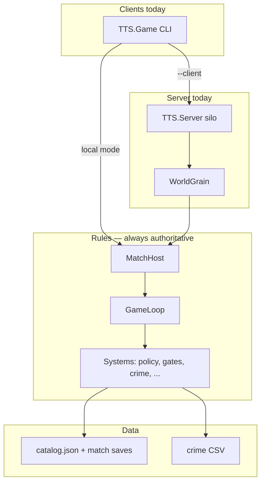

# Current State — What the Code Does Today

**Project:** TTS — Technology Tier Simulation  
**Last updated:** Phase 6 (partial) — React web client + REST API for match create/join/play  
**Tests:** 32 passing (`dotnet test`)

**Related docs:**
- [implementation-plan.md](implementation-plan.md) — roadmap Phases 0–9
- [match-modes.md](match-modes.md) — Sprint / Blitz / Standard / Extended presets
- [tech-trees-by-tier.md](tech-trees-by-tier.md) — per-TTS sub-tree design
- [async-multiplayer-gameplay.md](async-multiplayer-gameplay.md) — async MP concept
- [orleans-integration.md](orleans-integration.md) — Orleans grain design (long-term)

---

## 1. What you can run today

| Command | What it does |
|---------|----------------|
| `dotnet run --project src/TTS.Game` | **Instant demo** — 8 ticks back-to-back, auto policy, one manual gate resolve |
| `dotnet run --project src/TTS.Game -- --new` | Create a **local** saved match (`match-state.json`) |
| `dotnet run --project src/TTS.Game -- --tick` | Run **one tick** on local save if wall-clock due |
| `dotnet run --project src/TTS.Game -- --watch` | Local match on compressed schedule (~8 min for Sprint) |
| `dotnet run --project src/TTS.Game -- --status` | Show tick count, next tick ETA, pending gates |
| `dotnet run --project src/TTS.Server` | Start **Orleans silo** (keep running) |
| `dotnet run --project src/TTS.Game -- --client init` | Create match on silo (`WorldGrain`) |
| `dotnet run --project src/TTS.Game -- --client tick` | Run one tick **on the server** if due |
| `dotnet run --project src/TTS.Agents -- list` | List Ollama offline scenarios |
| `dotnet run --project src/TTS.Api` | Start **REST API** (needs silo running) |
| `cd src/TTS.Web && npm run dev` | Start **React UI** at http://localhost:5173 |

### Web client (3 terminals)

```bash
dotnet run --project src/TTS.Server          # 1 — Orleans silo
dotnet run --project src/TTS.Api             # 2 — REST on :5000
cd src/TTS.Web && npm install && npm run dev # 3 — UI on :5173
```

Create a match, share the join code, open the dashboard, resolve decision gates.

---

## 2. What the simulation actually does

Each **tick** is one turn of the world. The sim is **mostly automatic** — civs research via policy, not manual tech picks.

### Per tick (in order)

```
1. Advance simulated time (+1 hour for Sprint preset)
2. Expire decision gates → apply default option if past deadline
3. Region growth + stability decay
4. Each civilization turn:
      - If pending gate → skip research
      - Else → AutoPolicy picks best tech → research it
5. Knowledge diffusion between civs
6. Faction influence
7. Crime pressure (TTS 4+)
8. Maybe spawn global event
9. Apply event impacts + tick event duration
10. Scan for new decision gates (tier jump, crime, crisis, forbidden tech)
11. Save turn history (for away summary)
```

### Two demo civilizations

| Civ | Policy | Behavior |
|-----|--------|----------|
| **Aurora Collective** (player) | Balanced | Even branch weights, medium risk |
| **Iron Dominion** (rival) | TechRush | Favors AI/computing, high risk |

### Data loaded at startup

- **70 technologies** from `src/data/tech/catalog.json` (TTS 1–8 sub-trees)
- **Crime profiles** from `state_crime_income_merged.csv` (California → player region, Louisiana → rival)
- Crime **perspective** visible from TTS 4+; pressure affects stability

---

## 3. Solution structure

```
From-Stone-to-Ascension.sln
├── src/TTS.Core/          Rules engine (no Orleans, no HTTP)
├── src/TTS.Contracts/       Grain interfaces + wire DTOs
├── src/TTS.Grains/          WorldGrain implementation
├── src/TTS.Server/          Orleans silo host
├── src/TTS.Game/            Console demo + local/Orleans client CLI
├── src/TTS.Api/             REST API (Orleans client + match registry)
├── src/TTS.Web/             React governor dashboard (Vite)
├── src/TTS.Tests/           32 unit tests
├── src/TTS.Agents/          Ollama offline scenarios
└── src/data/                Tech catalog + crime CSV
```

### Layer diagram



---

## 4. New & changed files (by area)

### 4.1 Technology trees (Phase 7 data)

| File | Role |
|------|------|
| `src/data/tech/catalog.json` | ~70 nodes across TTS 1–8 (core / branch / forbidden / fusion) |
| `src/TTS.Core/Systems/TechTreeCatalog.cs` | Loads JSON → `Technology` objects |
| `src/TTS.Core/Models/TechNodeRole.cs` | `Core`, `Branch`, `Forbidden`, `Fusion` on each node |
| `tech-trees-by-tier.md` | Design doc — node tables, mermaid diagrams per tier |

**Before:** 10 hardcoded techs in `SampleWorldFactory`.  
**Now:** Full catalog from JSON; factory falls back to 10-node spine if JSON missing.

---

### 4.2 Decision gates (Phase 3)

| File | Role |
|------|------|
| `src/TTS.Core/Models/DecisionGate.cs` | Gate types, options, expiry, defaults |
| `src/TTS.Core/Systems/DecisionGateSystem.cs` | Open gates, resolve choices, timeout defaults |
| `src/TTS.Core/Systems/AwaySummaryBuilder.cs` | “While you were away” digest text |
| `src/TTS.Core/Simulation/TurnSnapshot.cs` | Per-turn record for summaries |
| `src/TTS.Tests/DecisionGateTests.cs` | Gate blocking, resolve, timeout, summary |

**Gate types implemented:**

| Type | Trigger | Default on timeout |
|------|---------|-------------------|
| CrimePressure | TTS 4+ high regional crime | invest |
| TierAdvancement | Civ reaches new TTS | embrace |
| GlobalCrisis | Active world event | regulate |
| AiAlignment | TTS 5+ crisis event | contain |
| ForbiddenTech | Forbidden tech available | ban |
| FactionCrisis | Stability below 40 | appease |

**Rules:**
- One **blocking** gate per civ → research paused until resolved or expired
- World never stops — other civs keep ticking
- `GameToolSurface`: `GetPendingDecisions`, `ResolveDecision`, `GetAwaySummary`

---

### 4.3 Scheduled matches (Phase 4)

| File | Role |
|------|------|
| `src/TTS.Core/Models/MatchConfig.cs` | Presets: Sprint8h, Blitz24h, Standard36h, Extended48h |
| `src/TTS.Core/Systems/TickScheduler.cs` | `ShouldTick` / wall-clock due check |
| `src/TTS.Core/Simulation/MatchHost.cs` | Load/create/save match, run due ticks |
| `src/TTS.Core/Simulation/MatchPersistence.cs` | JSON save/load (`match-state.json`) |
| `src/TTS.Core/Simulation/MatchStatusInfo.cs` | Status DTO for CLI/API |
| `src/TTS.Game/GameCli.cs` | `--new`, `--tick`, `--watch`, `--status`, `--instant` |
| `src/TTS.Game/MatchConsoleReporter.cs` | Shared turn/status printing |
| `src/TTS.Tests/MatchHostTests.cs` | Persistence round-trip, scheduler |

**Sprint 8h preset:** 8 ticks, 1 hour apart, 2-hour decision window.

**Save file:** `./match-state.json` (gitignored) — survives between CLI invocations.

---

### 4.4 Orleans server (Phase 5 partial)

| File | Role |
|------|------|
| `src/TTS.Contracts/IWorldGrain.cs` | Grain interface + `GrainMapping` helpers |
| `src/TTS.Contracts/GrainDtos.cs` | Serializable DTOs for client ↔ silo |
| `src/TTS.Grains/WorldGrain.cs` | Wraps `MatchHost`; one grain per match id |
| `src/TTS.Server/Program.cs` | Localhost Orleans silo |
| `src/TTS.Game/OrleansClientCli.cs` | `--client init/status/tick/resolve/summary` |

**Grain key:** default `"demo"` (override with `--match-id`).

**Server save path:** `bin/.../matches/demo.json` under silo output directory.

**Orleans gives you:** long-running host, stable match identity, client/server split.  
**Orleans does not yet:** auto-tick on timer (you call `--client tick`), HTTP API, multi-player lobby.

---

### 4.5 Core simulation (existing, refactored)

| File | Role |
|------|------|
| `src/TTS.Core/GameLoop.cs` | Runs turn phases; expires gates at start |
| `src/TTS.Core/Simulation/SimulationServices.cs` | Composition root; turn history |
| `src/TTS.Core/Simulation/TurnPhases.cs` | 9 phases: regions → civ turns → diffusion → events |
| `src/TTS.Core/Systems/AutoPolicySystem.cs` | Scores techs by policy branches + risk |
| `src/TTS.Core/SampleWorldFactory.cs` | Demo world; optional `--demo-gate` crime briefing |
| `src/TTS.Core/Agents/GameToolSurface.cs` | MAF/agent tool API over world state |

---

## 5. Two ways to run a match

### A. Local (no silo)

```
match-state.json  ←→  MatchHost  ←→  GameLoop
```

Good for: solo dev, fast iteration, `--watch` compressed demo.

### B. Orleans (silo + client)

```
Terminal 1: TTS.Server (always on)
Terminal 2: TTS.Game --client tick/status/resolve
                ↓
           WorldGrain("demo")
                ↓
           MatchHost → matches/demo.json
```

Good for: proving server-authoritative async MP model before `TTS.Api`.

**Do not mix** the same match across local JSON and Orleans — they use different save paths.

---

## 6. Typical session walkthrough

### Instant demo (fastest)

```bash
dotnet run --project src/TTS.Game
```

8 ticks instantly. Turn 1: crime gate blocks player. Turn 2: auto-resolves gate. End: away summary.

### Local scheduled match

```bash
dotnet run --project src/TTS.Game -- --new --demo-gate
dotnet run --project src/TTS.Game -- --tick          # tick 1 (immediate)
dotnet run --project src/TTS.Game -- --status
# wait 1 hour OR use --watch for compressed
dotnet run --project src/TTS.Game -- --tick          # tick 2
```

### Orleans match

```bash
# Terminal 1
dotnet run --project src/TTS.Server

# Terminal 2
dotnet run --project src/TTS.Game -- --client init --demo-gate
dotnet run --project src/TTS.Game -- --client tick
dotnet run --project src/TTS.Game -- --client resolve civ-player gate-demo-start invest
dotnet run --project src/TTS.Game -- --client tick
dotnet run --project src/TTS.Game -- --client summary 1 2
```

---

## 7. What is NOT built yet

| Feature | Phase | Notes |
|---------|-------|-------|
| Web UI / dashboard | 6 | Designed in [ui-design.md](ui-design.md) |
| HTTP API (`TTS.Api`) | 6 | REST endpoints for match join, policy, gates |
| Auto-tick on silo timer | 5 | Orleans reminders — manual `--client tick` today |
| `CivilizationGrain` per player | 5 | Single `WorldGrain` holds whole world for now |
| Player manual tech picks | 3+ | Policy auto-selects; `ProposeResearch` exists for agents |
| Multi-human lobby / join codes | 6 | Designed in [match-modes.md](match-modes.md) |
| MAF in live match | 8 | Ollama scenarios offline only (`TTS.Agents`) |
| Company sim (`CS.Core`) | — | Doc only: [company-sim.md](company-sim.md) |

---

## 8. Phase completion snapshot

| Phase | Name | Status |
|-------|------|--------|
| 0–2 | Design + core sim + auto policy | Done |
| 2b | Crime CSV perspective | Done |
| 3 | Decision gates + away summary | Done (~90%) |
| 4 | Scheduled ticks + persistence | Done |
| 5 | Orleans silo + client | Partial (~50%) |
| 6 | Async MP API | Not started |
| 7 | MAF / procedural tech | Partial (catalog + Ollama scenarios) |

---

## 9. Key design rules (unchanged)

1. **`TTS.Core` is authoritative** — all clients/agents call into it; no duplicate rules in UI or Orleans.
2. **World never blocks on one player** — gates pause one civ; others keep going.
3. **Timeout defaults are always valid** — missing a gate applies preset default, not a crash.
4. **Tier gating** — can't research tech more than 1 tier above current civ tier.
5. **TTS 5+ agents** — `AgentOrchestrator` for rivals; classical AI below that.

---

## 10. Quick reference — CLI flags

```
--instant              Force 8-turn instant demo (default)
--new                  Create new local saved match
--tick                 One local tick if due
--watch                Compressed local schedule loop
--status               Local match status
--client <cmd>         Orleans client (silo must run)
--mode sprint-8h       Match preset
--match-id demo        Orleans grain key
--demo-gate            Inject crime briefing gate on init
--save path.json       Custom local save path
--compression 60       1 game hour = 60 seconds in --watch
```

---

## 11. Next recommended steps

1. **Orleans reminders** — silo auto-fires ticks every hour (no manual `--client tick`)
2. **`TTS.Api`** — HTTP wrapper over `IWorldGrain` for web dashboard
3. **CivilizationGrain** — split per-player state from monolithic `WorldGrain`
4. **Decision gate UI** — wire [ui-design.md](ui-design.md) screens to API

See [implementation-plan.md](implementation-plan.md) for full roadmap.
