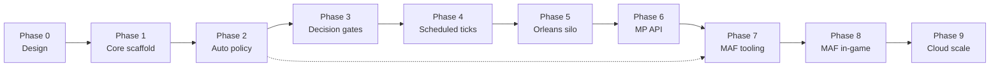

# Implementation Plan

**Project:** TTS — Technology Tier Simulation  
**Last updated:** Phase 2 complete — Phase 3 is next  
**Status:** Auto policy & classical AI implemented; both civs progress in demo

---

## 1. Overview

This document is the **master implementation plan**. It unifies work across:

| Document | Focus |
|----------|-------|
| [README.md](README.md) | Game design and systems |
| [async-multiplayer-gameplay.md](async-multiplayer-gameplay.md) | Slow-evolving async MP |
| [orleans-integration.md](orleans-integration.md) | Distributed server / grains |
| [agent-framework-integration.md](agent-framework-integration.md) | MAF / LLM agents (TTS 5+) |

### Principle

Build in layers. Each phase produces a **testable milestone**. Do not skip to Orleans or MAF until `TTS.Core` gameplay loops are credible locally.

```
TTS.Core (rules) → Auto policy & decisions → Scheduled ticks → Orleans → API → MAF
```

---

## 2. Phase Map



| Phase | Name | Host | Status |
|-------|------|------|--------|
| **0** | Design & documentation | — | Done |
| **1** | Core simulation scaffold | `TTS.Game` | Done |
| **2** | Auto policy & classical AI | `TTS.Core` | **Done** |
| **3** | Decision gates & away summary | `TTS.Core` | **Next** |
| **4** | Scheduled ticks (local) | `TTS.Core` / `TTS.Game` | Planned |
| **5** | Orleans local silo | `TTS.Server` | Planned |
| **6** | Async multiplayer API | `TTS.Api` | Planned |
| **7** | MAF tooling (offline) | `TTS.Agents` | Planned |
| **8** | MAF in-game (TTS 5+) | `TTS.Agents` + grains | Planned |
| **9** | Cloud scale & polish | Cluster | Planned |

---

## 3. Milestones

| Milestone | Phases | Player-visible outcome |
|-----------|--------|------------------------|
| **M1 — Credible sim** | 0–2 | Both civs progress; policy drives research |
| **M2 — Governor gameplay** | 3–4 | Decisions, timeouts, away summary; ticks on timer |
| **M3 — Online match** | 5–6 | 2+ players in persistent world via API |
| **M4 — Intelligent eras** | 7–8 | MAF advisors, crises, procedural tech |
| **M5 — Production** | 9 | Hosted cluster, persistence, observability |

---

## Phase 0 — Design & Documentation

**Goal:** Align game design, architecture, and integration strategies before more code.

**Status:** Done

### Deliverables

- [x] [README.md](README.md) — game concept, systems, TTS tiers
- [x] [tech-tree.md](tech-tree.md) — procedural tech tree design
- [x] [Diagram.md](Diagram.md) — TTS progression diagram
- [x] [agent-framework-integration.md](agent-framework-integration.md)
- [x] [orleans-integration.md](orleans-integration.md)
- [x] [async-multiplayer-gameplay.md](async-multiplayer-gameplay.md)
- [x] [implementation-plan.md](implementation-plan.md) (this file)

---

## Phase 1 — Core Simulation Scaffold

**Goal:** Runnable turn-based simulation with models, systems, and tests.

**Status:** Done (verify build locally)

**Depends on:** Phase 0

### Deliverables

- [x] `From-Stone-to-Ascension.sln`
- [x] `TTS.Core` — models, systems, `GameLoop`, `SampleWorldFactory`
- [x] `TTS.Core/Agents` — `IGameToolSurface`, `GameToolSurface`, `AgentOrchestrator` stub
- [x] `TTS.Game` — console demo (8 instant turns)
- [x] `TTS.Tests` — core system tests
- [x] Confirm `dotnet build && dotnet test` passes on dev machine

### Key files (existing)

```
src/TTS.Core/Models/          TechTier, Region, Faction, Technology, Civilization, ...
src/TTS.Core/Systems/         Stability, TechTree, Faction, GlobalEvent, ...
src/TTS.Core/GameLoop.cs      Primary + secondary loops
src/TTS.Game/Program.cs       Demo host
```

### Known gaps (fixed in Phase 2)

- Player auto-researches first available tech (no policy)
- Rival civ does not research below TTS 5
- No decision gates or scheduled ticks

---

## Phase 2 — Auto Policy & Classical AI

**Goal:** Every civilization progresses autonomously via governance policy — foundation for async MP.

**Status:** Done

**Depends on:** Phase 1

**Doc:** [async-multiplayer-gameplay.md §5–7](async-multiplayer-gameplay.md#5-player-interaction-modes)

### Tasks

- [x] Add `CivilizationPolicy` model (`ResearchStance`, `RiskTolerance`, `DiplomacyStance`, `BranchWeights`)
- [x] Add policy presets: `Expansionist`, `TechRush`, `StabilityFirst`, `Diplomatic`
- [x] Add `AutoPolicySystem` — select next tech from policy + available tree
- [x] Add `ClassicalAiSystem` — runs auto policy for non-player civs (all tiers)
- [x] Refactor `GameLoop.RunPrimaryLoop()`:
  - [x] Player civ uses policy when no manual override
  - [x] All AI civs use `ClassicalAiSystem` below TTS 5; `AgentOrchestrator` at TTS 5+
  - [x] Keep `AgentOrchestrator` for TTS 5+ AI civs only (Phase 8 expands MAF)
- [x] Store default policy on `Civilization`
- [x] Unit tests: policy picks expected branch; rival researches over N turns
- [x] Update `TTS.Game` output to show policy stance per civ

### New files (proposed)

```
src/TTS.Core/Models/CivilizationPolicy.cs
src/TTS.Core/Systems/AutoPolicySystem.cs
src/TTS.Core/Systems/ClassicalAiSystem.cs
src/TTS.Tests/AutoPolicyTests.cs
```

### Exit criteria (M1 partial)

- Iron Dominion researches and advances tiers in 8-turn demo
- Player civ follows `Balanced` policy without hard-coded “first tech”

---

## Phase 3 — Decision Gates & Away Summary

**Goal:** Critical moments require player choice; world continues on timeout defaults.

**Status:** Planned

**Depends on:** Phase 2

**Doc:** [async-multiplayer-gameplay.md §6](async-multiplayer-gameplay.md#6-decision-gates)

### Tasks

- [ ] Add `DecisionGate` model (`GateType`, options, `ExpiresAt`, `DefaultOption`)
- [ ] Add `DecisionGateSystem` — create gates from:
  - [ ] Tier advancement
  - [ ] `GlobalEventSystem` crises
  - [ ] `ForbiddenTechSystem` early unlock offers
  - [ ] Stability threshold (faction crisis)
- [ ] Add `PendingDecisions` queue on `Civilization`
- [ ] Add `ResolveDecision(civId, option)` — validate and apply via existing systems
- [ ] Add timeout handling in `GameLoop` — default option when expired
- [ ] Add `AwaySummary` builder — digest of ticks, events, auto-resolved decisions
- [ ] Demo: inject one gate in `SampleWorldFactory`; show timeout in console
- [ ] Unit tests: gate creation, resolution, timeout default

### New files (proposed)

```
src/TTS.Core/Models/DecisionGate.cs
src/TTS.Core/Systems/DecisionGateSystem.cs
src/TTS.Core/Systems/AwaySummaryBuilder.cs
src/TTS.Tests/DecisionGateTests.cs
```

### Exit criteria (M2 partial)

- Demo prints pending decision and applies default after simulated timeout
- `AwaySummary` lists changes over N turns

---

## Phase 4 — Scheduled Ticks (Local)

**Goal:** Ticks advance on a timer, not an instant loop — prove slow-evolution locally.

**Status:** Planned

**Depends on:** Phase 3

**Doc:** [async-multiplayer-gameplay.md §3](async-multiplayer-gameplay.md#3-time-model)

### Tasks

- [ ] Add `MatchConfig` (`TickInterval`, `DecisionWindowHours`, etc.)
- [ ] Add `MatchState` (`LastTickAt`, `TickCount`, config)
- [ ] Add `TickScheduler` — `ShouldTick(now)` / `AdvanceIfDue(world, now)`
- [ ] Refactor `TTS.Game` to:
  - [ ] Option A: simulate compressed time (1 tick per N seconds for demo)
  - [ ] Option B: single tick per invocation with `--tick` flag
- [ ] Log tick timestamp and next tick ETA
- [ ] Unit tests: scheduler respects interval; no double-tick

### New files (proposed)

```
src/TTS.Core/Models/MatchConfig.cs
src/TTS.Core/Models/MatchState.cs
src/TTS.Core/Systems/TickScheduler.cs
src/TTS.Tests/TickSchedulerTests.cs
```

### Exit criteria (M2)

- Demo runs ticks on interval (even if compressed to seconds for testing)
- Match state survives between `TTS.Game` invocations (JSON file acceptable for local)

---

## Phase 5 — Orleans Local Silo

**Goal:** Same simulation logic runs inside grains on a local silo.

**Status:** Planned

**Depends on:** Phase 4

**Doc:** [orleans-integration.md §6–7](orleans-integration.md#6-grain-design)

### Tasks

- [ ] Add `TTS.Server` project (`Microsoft.Orleans.Server`, `Microsoft.Orleans.Sdk`)
- [ ] Define `IWorldGrain`, `ICivilizationGrain` interfaces
- [ ] Implement `WorldGrain` — holds `MatchState`, calls `GameLoop`
- [ ] Implement `CivilizationGrain` — holds `Civilization`, policy, decision queue
- [ ] Register grains; `UseLocalhostClustering()` for dev
- [ ] Refactor `TTS.Game` to Orleans client (`IGrainFactory`)
- [ ] Integration test: 8 ticks via grains ≈ current demo output
- [ ] `TTS.Core` has **zero** Orleans references

### New files (proposed)

```
src/TTS.Server/TTS.Server.csproj
src/TTS.Server/Program.cs
src/TTS.Server/Grains/IWorldGrain.cs
src/TTS.Server/Grains/WorldGrain.cs
src/TTS.Server/Grains/ICivilizationGrain.cs
src/TTS.Server/Grains/CivilizationGrain.cs
```

### Exit criteria (M3 partial)

- `dotnet run --project src/TTS.Server` + client reproduces multi-civ progression

---

## Phase 6 — Async Multiplayer API

**Goal:** External clients can join a match, set policy, resolve decisions, read away summary.

**Status:** Planned

**Depends on:** Phase 5

**Doc:** [async-multiplayer-gameplay.md §9](async-multiplayer-gameplay.md#9-architecture)

### Tasks

- [ ] Add `TTS.Api` (ASP.NET Core minimal API or SignalR)
- [ ] Endpoints:
  - [ ] `POST /matches` — create match
  - [ ] `GET /matches/{id}/summary` — away digest
  - [ ] `GET /matches/{id}/civs/{civId}` — civ state
  - [ ] `PUT /matches/{id}/civs/{civId}/policy` — update policy
  - [ ] `POST /matches/{id}/civs/{civId}/decisions/{gateId}` — resolve gate
- [ ] Orleans reminders on `WorldGrain` for real tick schedule
- [ ] Grain persistence (ADO.NET or blob — dev-friendly provider)
- [ ] Match listing / join by code
- [ ] API tests against local silo

### New files (proposed)

```
src/TTS.Api/TTS.Api.csproj
src/TTS.Api/Program.cs
src/TTS.Api/Endpoints/MatchEndpoints.cs
```

### Exit criteria (M3)

- Two logical players in one match via HTTP; ticks fire on schedule; state persists across silo restart

---

## Phase 7 — MAF Tooling (Offline)

**Goal:** Procedural tech and content pipelines using MAF — no live match required.

**Status:** Planned

**Depends on:** Phase 1 (can parallelize after Phase 2)

**Doc:** [agent-framework-integration.md §3.1, §5.2](agent-framework-integration.md#31-llm-provider-strategy)

**Related:** [ollama-scenarios.md](ollama-scenarios.md) — **how local Ollama integration works** (implemented)

### Tasks

- [ ] Add `TTS.Agents` project (`Microsoft.Agents.AI`, `Microsoft.Agents.AI.OpenAI`)
- [ ] `AgentProviderFactory` — `ollama` | `openai` | `gemini` | `none` via `TTS_LLM_PROVIDER`
- [ ] Document local setup: Ollama (free) or Gemini API key from Google AI Studio
- [ ] Implement MAF tools wrapping read-only / register operations
- [ ] Workflow: fusion node `generate → validate → lore → export JSON`
- [ ] Agent Skills: load `tech-tree.md`, `README.md`
- [ ] CLI command: `dotnet run --project TTS.Agents -- generate-tech --parents A,B`
- [ ] Human-in-the-loop export for designer review (optional)

### New files (proposed)

```
src/TTS.Agents/TTS.Agents.csproj
src/TTS.Agents/Workflows/TechFusionWorkflow.cs
src/TTS.Agents/Tools/TechTreeTools.cs
```

### Exit criteria (M4 partial)

- Generate valid tech node JSON from fusion tags offline

---

## Phase 8 — MAF In-Game (TTS 5+)

**Goal:** Agentic civ behavior and crisis narration in live matches.

**Status:** Planned

**Depends on:** Phase 6, Phase 7

**Doc:** [agent-framework-integration.md §5](agent-framework-integration.md#5-use-cases-by-game-system) · [orleans-integration.md §4](orleans-integration.md#4-agentic-grain-lifecycle-activate-on-demand)

### Tasks

- [ ] Replace `AgentOrchestrator` stub with real MAF workflow (provider from `TTS_LLM_PROVIDER`)
- [ ] Fallback to `ClassicalAiSystem` when provider is `none` or API call fails
- [ ] `CivilizationGrain.RunAgentTurnAsync()` at `CurrentTier >= EarlyAI`
- [ ] Classical AI remains below TTS 5
- [ ] Alignment crisis workflow → `DecisionGate` + narration
- [ ] In-world advisor: read-only tools for player civ
- [ ] Auto policy at TTS 5+: MAF proposes; `TTS.Core` validates
- [ ] Timeout fallback to classical policy if MAF unavailable
- [ ] OpenTelemetry: token usage per civ per tick

### Exit criteria (M4)

- At TTS 5+, AI civ makes agent-driven research choice; player gets narrated crisis gate

---

## Phase 9 — Cloud Scale & Polish

**Goal:** Production-ready hosting, observability, and content pipeline.

**Status:** Planned

**Depends on:** Phase 8

### Tasks

- [ ] Orleans cluster deployment (Azure Container Apps / AKS)
- [ ] Managed persistence and backups
- [ ] Push notifications for pending decisions (mobile/web)
- [ ] Rate limits and MAF cost caps per match
- [ ] Human-in-the-loop tech approval pipeline (Phase 7 output → live catalog)
- [ ] Load test: N civs, M ticks, agent budget
- [ ] Experiment mode (README §8) — admin tools for instant TTS jumps

### Exit criteria (M5)

- Hosted match runs 7 days with 10+ players; ticks stable; decisions delivered

---

## 4. What Not to Build Yet

| Wait | Reason |
|------|--------|
| Orleans before Phase 4 | Need policy + gates + tick model in `TTS.Core` first |
| MAF in live match before Phase 6 | Need stable tool surface and match API |
| Unity / GUI client | API and sim must be credible first |
| Full 500-node tech tree | Fusion workflow (Phase 7) before content scale |
| Multiverse / TTS 9+ | Core tiers 1–6 must play well first |

---

## 5. Suggested Work Order (Next 4 Sprints)

| Sprint | Phase | Focus |
|--------|-------|-------|
| **1** | 2 | `CivilizationPolicy`, `AutoPolicySystem`, fix rival AI |
| **2** | 3 | `DecisionGate`, timeout defaults, `AwaySummary` |
| **3** | 4 | `TickScheduler`, compressed-time demo |
| **4** | 5 | `TTS.Server` local silo + grain wrappers |

---

## 6. Progress Tracker

Update checkboxes here as phases complete.

```
Phase 0  [██████████] 100%
Phase 1  [██████████] 100%
Phase 2  [██████████] 100%
Phase 3  [░░░░░░░░░░]   0%   ← START HERE
Phase 4  [░░░░░░░░░░]   0%
Phase 5  [░░░░░░░░░░]   0%
Phase 6  [░░░░░░░░░░]   0%
Phase 7  [░░░░░░░░░░]   0%
Phase 8  [░░░░░░░░░░]   0%
Phase 9  [░░░░░░░░░░]   0%
```

---

## 7. References

| Doc | Phases |
|-----|--------|
| [async-multiplayer-gameplay.md](async-multiplayer-gameplay.md) | 2, 3, 4, 6 |
| [orleans-integration.md](orleans-integration.md) | 5, 6, 8, 9 |
| [agent-framework-integration.md](agent-framework-integration.md) | 7, 8, 9 |
| [README.md](README.md) | All (design source) |
| [tech-tree.md](tech-tree.md) | 7 (procedural content) |
