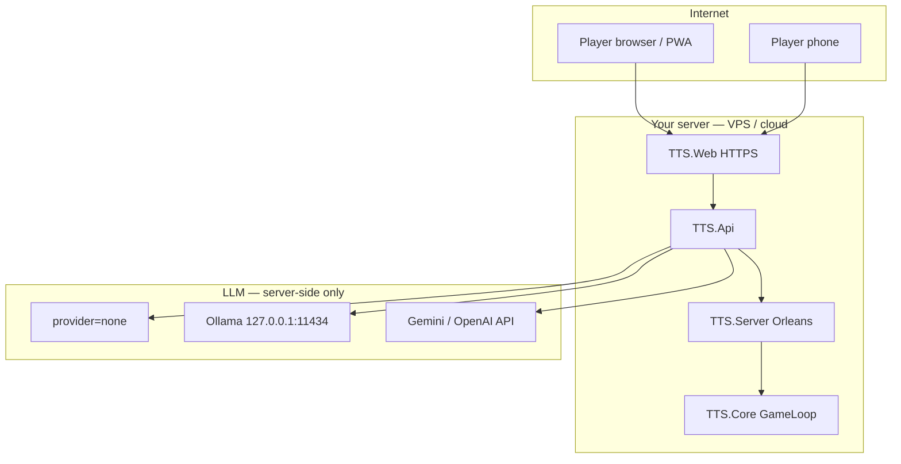
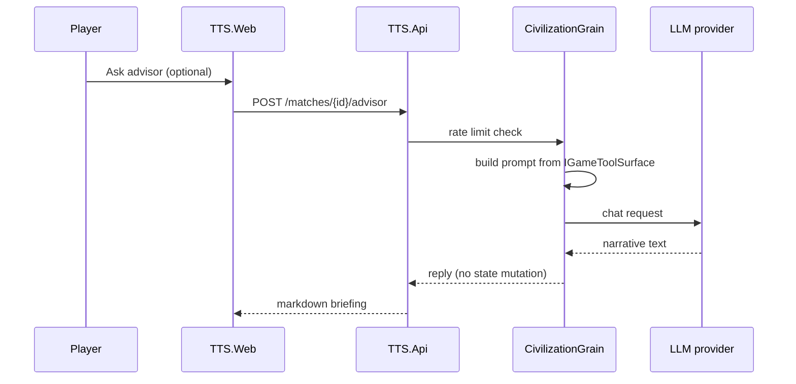
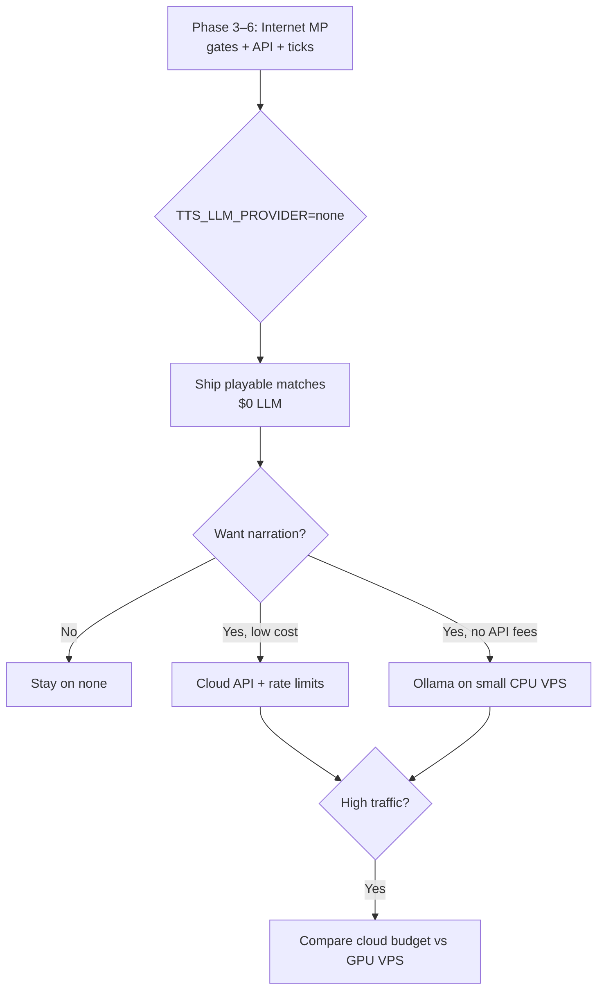

# LLM Deployment & Cost — Internet Multiplayer

**Project:** TTS — Technology Tier Simulation  
**Purpose:** Where Ollama / cloud LLMs run in dev vs public multiplayer, and what it costs  
**Status:** Design — LLM not wired into live matches yet (Phase 8)

**Related:**
- [ollama-scenarios.md](ollama-scenarios.md) — local Ollama CLI scenarios (implemented)
- [agent-framework-integration.md](agent-framework-integration.md) — MAF provider strategy
- [match-modes.md](match-modes.md) — 8h–48h async matches (low LLM frequency)
- [ui-design.md](ui-design.md) — advisor panel (optional LLM)
- [implementation-plan.md](implementation-plan.md) — Phase 7–8

---

## 1. Summary

| Question | Answer |
|----------|--------|
| **Do internet matches need an LLM?** | **No** — ticks, policy, gates work without it |
| **Can Ollama run on my Mac for public players?** | **Not recommended** — home uptime, bandwidth, no auth on `:11434` |
| **Cheapest public beta?** | **No LLM** or **cloud API with rate limits** |
| **When is server Ollama worth it?** | Privacy, no API fees, steady load — accept **fixed VPS cost** |
| **Who calls the LLM?** | **`TTS.Api` / server only** — never the browser |

> **Rule:** `TTS.Core` stays authoritative. LLM produces **text** (briefings, advisor chat). All actions pass through validation and `DecisionGate` resolution.

---

## 2. Today vs target

| Surface | LLM today | Phase 8 target |
|---------|-----------|----------------|
| `TTS.Agents` CLI | Ollama on `localhost` | Unchanged — dev tool |
| `TTS.Game` | None | None |
| `TTS.Api` + matches | None | Optional narration / advisor |
| `TTS.Web` UI | None | Calls API only — no direct Ollama |

---

## 3. Architecture — internet multiplayer

Players never contact Ollama. Only your backend does.



### Sequence — optional advisor call



---

## 4. Deployment options

### 4.1 Local dev (your Mac)

```
Ollama (:11434) + TTS.Agents + TTS.Game
```

| Pros | Cons |
|------|------|
| Free API usage | Not internet-facing |
| Fast iteration | Mac must be on for scenarios |

```bash
ollama serve
ollama pull llama3.2
export OLLAMA_BASE_URL=http://localhost:11434
export OLLAMA_MODEL=llama3.2
dotnet run --project src/TTS.Agents -- ping
```

---

### 4.2 Internet beta — no LLM (recommended first ship)

```
TTS.Web → TTS.Api → Orleans → TTS.Core
TTS_LLM_PROVIDER=none
```

| Pros | Cons |
|------|------|
| **$0 LLM cost** | Static crisis / gate copy |
| Simplest ops | Less “TTS 5+” flavor |

Use template strings for gate briefings and away summary. Matches are fully playable.

---

### 4.3 Internet beta — cloud LLM (recommended for narration)

```
TTS.Api → Gemini / OpenAI (HTTPS)
TTS_LLM_PROVIDER=gemini | openai
```

| Pros | Cons |
|------|------|
| Low beta cost (often **&lt;$5/mo**) | Per-token billing |
| No GPU server | Needs API key on server |
| Always-on without your Mac | Vendor lock-in (mitigated by provider factory) |

**Best for:** public internet, few matches, optional advisor + crisis flavor.

---

### 4.4 Internet beta — Ollama on same VPS

```
TTS.Api → http://127.0.0.1:11434 (Ollama on VPS)
TTS_LLM_PROVIDER=ollama
```

| Pros | Cons |
|------|------|
| No API fees | **Fixed monthly server cost** |
| Data stays on your box | CPU-only = slow; GPU VPS = **$50–200+/mo** |
| Predictable if load is steady | You operate Ollama (updates, disk, crashes) |

**Do not** expose port `11434` to the public internet — no built-in auth.

---

### 4.5 Home Mac Ollama + cloud-hosted game (not recommended)

```
Internet players → VPS (API) → your home IP:11434 ???
```

| Issue | Why |
|-------|-----|
| Security | Ollama has no auth |
| Uptime | Mac sleep = LLM down |
| Latency | Home upload / NAT |
| Ops | Dynamic IP, firewall |

Use home Ollama for **dev only**, not production relay.

---

## 5. Cost comparison

Async matches use LLM **sparingly** — not every tick.

### Estimated LLM calls (Sprint 8h, 4 players)

| Call type | Per match | Notes |
|-----------|-----------|-------|
| Crisis briefing | 0–2 per player | Optional rewrite of gate text |
| Advisor chat | 0–5 per player | **Opt-in** — rate limited |
| Rival narration | 0–2 | TTS 5+ only |
| **Ticks / research** | **0** | Classical AI — no LLM |

**~10–40 short calls per 8h match** if players use advisor lightly.

### Monthly cost scenarios (rough)

| Scale | No LLM | Cloud (Gemini Flash / mini) | Ollama CPU VPS | Ollama GPU VPS |
|-------|--------|------------------------------|----------------|----------------|
| **Dev (you)** | $0 | $0 (local) | $0 (Mac) | — |
| **10 matches/mo** | $0 | **$0–3** | **$5–15** fixed | Overkill |
| **100 matches/mo** | $0 | **$5–25** | **$10–20** fixed | **$50–100+** if you need speed |
| **24/7 public** | $0 | **Budget cap** recommended | Fixed + ops time | Fixed + ops time |

### Why deployed Ollama can cost *more* than cloud at small scale

| Ollama on VPS | Cloud API |
|---------------|-----------|
| Pay **24/7** for server even with zero matches | Pay **per use** |
| GPU for comfort = **$50+/mo** | Beta often **&lt;$5/mo** |
| Your time: updates, monitoring | Vendor handles model hosting |

### Why cloud can cost *more* at large scale

| Risk | Mitigation |
|------|------------|
| Advisor spam | Rate limit (e.g. 5 questions / hour / player) |
| LLM every tick | **Forbidden** by design |
| Runaway bills | Daily budget cap; fallback to `none` |

---

## 6. What uses LLM in multiplayer (Phase 8)

| Feature | LLM? | Match works without it? |
|---------|------|-------------------------|
| Scheduled ticks | No | Yes |
| Auto policy / research | No | Yes |
| Decision gates A/B/C | Optional briefing text | Yes — fixed options always |
| Away summary | No (templates) | Yes |
| Crime perspective | No | Yes |
| Advisor panel (UI) | Yes | Yes — panel hidden or disabled |
| AI rival research choice | No (ClassicalAi / stub) | Yes |

**LLM is enrichment, not infrastructure.**

---

## 7. Provider configuration (planned)

Server-side environment variables only — **never** in frontend or git.

```bash
# Provider selection
TTS_LLM_PROVIDER=none          # none | ollama | gemini | openai

# Ollama (same machine as API)
OLLAMA_BASE_URL=http://127.0.0.1:11434
OLLAMA_MODEL=llama3.2          # or smaller: llama3.2:1b, phi3

# Google Gemini
GEMINI_API_KEY=...
GEMINI_MODEL=gemini-2.0-flash

# OpenAI
OPENAI_API_KEY=sk-...
OPENAI_MODEL=gpt-4o-mini

# Cost / safety guards
TTS_LLM_DAILY_BUDGET_USD=5
TTS_LLM_MAX_CALLS_PER_PLAYER_PER_HOUR=5
TTS_LLM_MAX_TOKENS_PER_REQUEST=1024
```

### Fallback chain (Phase 8)

```
1. Try configured provider
2. On timeout / error / budget exceeded → template text
3. Game ticks and gates never fail because LLM failed
```

---

## 8. Security checklist (internet)

| Do | Don't |
|----|--------|
| HTTPS on `TTS.Web` / `TTS.Api` | Publish Ollama `:11434` publicly |
| LLM keys only on server | Put `OLLAMA_BASE_URL` in browser JS |
| Rate-limit `/advisor` and narration endpoints | Unlimited LLM per tick |
| Log token usage per match | Log full prompts with PII in prod |
| `TTS_LLM_PROVIDER=none` as safe default | Block match progress on LLM errors |

---

## 9. Recommended path by stage



| Stage | LLM strategy | Est. LLM cost |
|-------|--------------|---------------|
| **1 — Local dev** | Ollama on Mac + `TTS.Agents` | $0 |
| **2 — Friends beta (internet)** | `none` or cloud + limits | $0–5/mo |
| **3 — Public beta** | Cloud default; Ollama optional on VPS | $5–25/mo |
| **4 — Scale** | Budget caps; evaluate GPU Ollama vs cloud | Case by case |

---

## 10. VPS sizing (if you choose server Ollama)

| Tier | Spec (indicative) | Model | Est. cost |
|------|-------------------|-------|-----------|
| **Minimal** | 2 vCPU, 4–8 GB RAM | `llama3.2:1b`, `phi3:mini` | **$5–12/mo** |
| **Comfort CPU** | 4 vCPU, 16 GB RAM | `llama3.2` | **$15–25/mo** |
| **GPU** | 1× consumer GPU cloud | `llama3.2`, larger | **$50–200+/mo** |

For Sprint 8h matches with **sparse** advisor use, **minimal CPU + small model** is enough for a friends beta.

### Docker compose sketch (future)

```yaml
# Conceptual — not in repo yet
services:
  api:
    image: tts-api
    environment:
      TTS_LLM_PROVIDER: ollama
      OLLAMA_BASE_URL: http://ollama:11434
  ollama:
    image: ollama/ollama
    volumes:
      - ollama_data:/root/.ollama
    # ports: DO NOT publish 11434 to 0.0.0.0
```

---

## 11. UI interaction

From [ui-design.md](ui-design.md):

| UI element | LLM backend |
|------------|-------------|
| Decision gate A/B/C | Options fixed in `TTS.Core`; LLM may rewrite briefing |
| Advisor chat | `POST /matches/{id}/advisor` → server → LLM |
| Away summary | Template — no LLM |
| Tech / policy panels | No LLM |

Browser **only** calls `https://your-game.com/api/*`.

---

## 12. Implementation checklist

| Item | Phase | Status |
|------|-------|--------|
| `TTS.Agents` + Ollama local | 7 | Done |
| `TTS_LLM_PROVIDER` factory | 8 | Planned |
| Narration on gate open (optional) | 8 | Planned |
| Advisor API + rate limits | 8 | Planned |
| Budget cap + fallback templates | 8 | Planned |
| Ops runbook (this doc) | — | This file |

---

## 13. Quick decision guide

| Your situation | Choose |
|----------------|--------|
| Building MP first, minimize cost | **`none`** |
| Public beta, want advisor/crisis flavor | **Cloud + rate limits** |
| No API keys, small friend group on one VPS | **Ollama on VPS (CPU + small model)** |
| Developing prompts locally | **Ollama on Mac** + `TTS.Agents` |
| Worried about deployed Ollama cost | **Cloud is usually cheaper at low volume** |

---

## 14. References

| Doc | Topic |
|-----|-------|
| [ollama-scenarios.md](ollama-scenarios.md) | Local CLI, `OllamaClient`, env vars |
| [agent-framework-integration.md §3.1](agent-framework-integration.md) | MAF provider matrix |
| [match-modes.md](match-modes.md) | Why LLM frequency stays low |
| [ui-design.md](ui-design.md) | Advisor panel |
| [implementation-plan.md § Phase 8](implementation-plan.md) | In-game MAF wiring |

**Bottom line:** Ship internet multiplayer **without** LLM first. Add narration when it matters — **cloud + caps** for cheap beta, **server Ollama** when you want fixed cost and control, **never** home Mac Ollama for public players.
