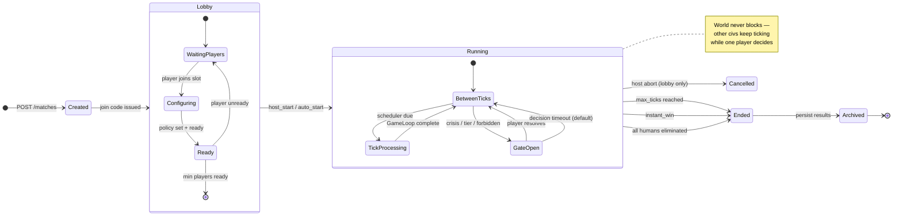
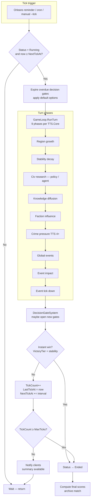
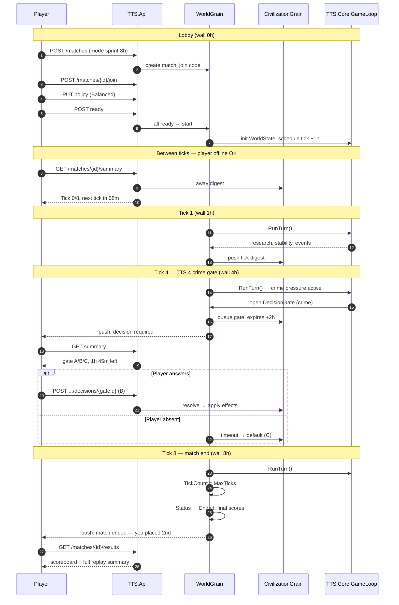

# Match Modes — Async Multiplayer

**Project:** TTS — Technology Tier Simulation  
**Purpose:** Preset match lengths for real-player games (8h–48h)  
**Status:** `MatchConfig` + `MatchHost` + CLI implemented (Phase 4)

**Related:**
- [async-multiplayer-gameplay.md](async-multiplayer-gameplay.md) — async MP concept, gates, away summary
- [implementation-plan.md](implementation-plan.md) — Phases 3–6 (gates, ticks, API, Orleans)
- [README.md](README.md) — core game design

---

## 1. Overview

TTS multiplayer is organized as **matches** (game rounds), not endless worlds. Each match has:

- A fixed **wall-clock duration** (8–48 hours)
- Scheduled **ticks** (simulation steps) on a real-time interval
- **2–8 human players** (4 recommended for first launch)
- **Decision gates** at high-impact moments (crises, tier jumps, forbidden tech)
- A clear **end state** — winner or scoreboard at final tick

> One match = one arc from early TTS to a climactic era, playable over an evening or a weekend.

Matches use the same `GameLoop` and rules as the console demo. Only **schedule**, **gate density**, and **victory target** change between modes.

---

## 2. Mode Summary

| Mode | ID | Wall clock | Ticks | Tick interval | Decision window | Best for |
|------|-----|------------|-------|---------------|-----------------|----------|
| **Sprint** | `sprint-8h` | **~8 hours** | 8 | 1 hour | 2 hours | One evening, 2–3 check-ins |
| **Blitz** | `blitz-24h` | ~24 hours | 6 | 4 hours | 8 hours | Single day, casual |
| **Standard** | `standard-36h` | ~36 hours | 12 | 3 hours | 12 hours | Default; weekend match |
| **Extended** | `extended-48h` | ~48 hours | 12 | 4 hours | 24 hours | Slower pace, more gates |

All modes: **offline progress on**, **world never blocks** on one absent player, **timeout defaults** apply on gates.

---

## 3. Sprint — 8 Hour Match

**Tagline:** *“One evening. One ascent.”*

### Schedule

```
Tick interval:     1 hour
Max ticks:         8
Wall clock:        ~8 hours
Decision window:   2 hours per gate
Expected gates:    1–2 per player
Recommended players: 2–4
```

### Timeline (example, 4 players)

| Wall time | Tick | Typical state |
|-----------|------|----------------|
| 0h | — | Lobby: join, set policy, ready |
| 1h | 1 | TTS 1–2, first auto-research |
| 2h | 2 | TTS 2–3 |
| 3h | 3 | TTS 3–4 |
| 4h | 4 | **TTS 4** — crime perspective unlocks; optional crime gate |
| 5h | 5 | TTS 4–5 |
| 6h | 6 | TTS 5 — rival may use agent runner |
| 7h | 7 | Optional alignment gate (1 per match) |
| 8h | 8 | **Match end** — scoring |

### Player experience

- **Check-ins:** 2–4 times over the evening (not every hour required)
- **Session length:** 5–10 minutes per visit (summary + optional gate)
- **Pressure:** Fast — decision window is short; defaults are harsher if you miss a gate
- **Tier ceiling:** Design for **TTS 5** victory; TTS 6 is stretch goal on perfect play

### Victory (Sprint)

| Condition | Rule |
|-----------|------|
| **Primary** | Highest **match score** at tick 8 |
| **Instant win** | Reach **TTS 5** with average stability ≥ 55 before tick 8 |
| **Elimination** | Stability ≤ 10 — civ out of contention (world keeps ticking) |

**Match score** (conceptual):

```
score = (int)CurrentTier * 100
      + ResearchedTechCount * 10
      + AverageStability * 0.5
      + GateBonus (good choices)
      - CollapsePenalty
```

### Sprint tuning notes

- Fewer technologies in pool or faster tier advancement — optional for MVP
- At most **1 global crisis** and **1 personal gate** per player
- Diffusion and crime still apply — TTS 4 identity must be felt even in 8h
- Good **onboarding mode** and **tournament format**

### Compressed local test

```
1 hour  → 60 seconds
8 hours → ~8 minutes total demo
```

---

## 4. Blitz — 24 Hour Match

**Tagline:** *“A full day in the ascent.”*

### Schedule

```
Tick interval:     4 hours
Max ticks:         6
Wall clock:        ~24 hours
Decision window:   8 hours
Expected gates:    2 per player
Recommended players: 4
```

### Timeline

| Wall time | Tick | Notes |
|-----------|------|-------|
| 0h | — | Lobby |
| 4h | 1 | Early research |
| 8h | 2 | Industrial era |
| 12h | 3 | Mid-day check-in; possible event |
| 16h | 4 | TTS 4 band; crime gate |
| 20h | 5 | TTS 5 approach |
| 24h | 6 | **Match end** |

### Victory (Blitz)

- **TTS 6** with stability ≥ 50, or highest score at tick 6
- Instant win at TTS 6 before final tick

### Compressed local test

```
4 hours → 2 minutes
24 hours → ~12 minutes
```

---

## 5. Standard — 36 Hour Match (default)

**Tagline:** *“A weekend governor.”*

### Schedule

```
Tick interval:     3 hours
Max ticks:         12
Wall clock:        ~36 hours
Decision window:   12 hours
Expected gates:    2–4 per player
Recommended players: 4
```

### Timeline

| Wall time | Tick | Notes |
|-----------|------|-------|
| 0h | — | Lobby |
| 3–12h | 1–4 | Rise through TTS 2–4 |
| 12h | 4 | Crime / information-age gate |
| 15–24h | 5–8 | Mid-match; diffusion, rival TTS 5 |
| 24h | 8 | AI alignment gate band |
| 27–36h | 9–12 | Race to TTS 6 or score win |

### Victory (Standard)

- **TTS 6** with stability ≥ 50 at any tick, or highest score at tick 12
- Designed to mirror the current **8-turn demo arc** stretched over 12 ticks

### Compressed local test

```
3 hours → 90 seconds
36 hours → ~18 minutes
```

---

## 6. Extended — 48 Hour Match

**Tagline:** *“Slow burn, full arc.”*

### Schedule

```
Tick interval:     4 hours
Max ticks:         12
Wall clock:        ~48 hours
Decision window:   24 hours
Expected gates:    3–4 per player
Recommended players: 4–8
```

Same tick count as Standard but **longer intervals** — more time to deliberate, closer to classic Bytro pacing in a **bounded** match.

### Victory (Extended)

- Same as Standard; optional **forbidden-tech gate** enabled only in this mode

### Compressed local test

```
4 hours → 2 minutes
48 hours → ~24 minutes
```

---

## 7. Match Lifecycle

### 7.1 State diagram (match status)

High-level states from creation to archive.



### 7.2 Flow diagram (one tick while match is running)

What the server does on each scheduled tick.



### 7.3 Sequence diagram (player journey — Sprint 8h example)

How one player interacts over an 8-hour match.



### 7.4 Timeline diagram (wall clock vs ticks)

Visual map of mode lengths on the same axis.

```mermaid
gantt
    title Match duration by mode (wall clock)
    dateFormat X
    axisFormat %Hh

    section Sprint 8h
    Lobby           :a1, 0, 0.5h
    Tick 1-4        :a2, 0.5h, 4h
    Tick 5-8        :a3, 4.5h, 4h

    section Blitz 24h
    Lobby           :b1, 0, 1h
    Ticks 1-6       :b2, 1h, 23h

    section Standard 36h
    Lobby           :c1, 0, 1h
    Ticks 1-12      :c2, 1h, 35h

    section Extended 48h
    Lobby           :d1, 0, 1h
    Ticks 1-12      :d2, 1h, 47h
```

### 7.5 Phase summary

| Phase | Duration | Player actions | Server |
|-------|----------|----------------|--------|
| **Created** | Seconds | — | Allocate match ID, join code |
| **Lobby** | Minutes | Join by code, pick slot, set `CivilizationPolicy`, ready up | Wait for min players |
| **Running** | 8–48h wall clock | Change policy, resolve gates, read away summary | Scheduled ticks, gate timeouts, notifications |
| **Ended** | Permanent | View scoreboard | Freeze state, compute winner |
| **Archived** | Permanent | Read-only replay | Long-term storage |

### Lobby rules (proposed)

- **Join code:** 6-character alphanumeric
- **Min players:** 2 (Sprint), 4 (Standard recommended)
- **Max players:** 8
- **Start:** Host starts when ≥ min ready; 60s grace for stragglers
- **No rejoin after abandon** — slot becomes AI-classical for remaining ticks (optional)

---

## 8. Decision Gates by Mode

Gates are **sparse** — not every tick. Density scales with match length.

| Gate type | Sprint 8h | Blitz 24h | Standard 36h | Extended 48h |
|-----------|-----------|-----------|--------------|--------------|
| Tier advancement | 0–1 | 1 | 1–2 | 2 |
| Global crisis | 0–1 | 1 | 1–2 | 2 |
| Crime / TTS 4 | 0–1 | 1 | 1 | 1 |
| Forbidden tech | 0 | 0–1 | 1 | 1 |
| AI alignment (TTS 5+) | 0–1 | 1 | 1 | 1–2 |
| Faction crisis | 0 | 0–1 | 1 | 1 |

**Timeout behavior:** World keeps ticking; only the gated action uses default. See [async-multiplayer-gameplay.md §6](async-multiplayer-gameplay.md#6-decision-gates).

---

## 9. `MatchConfig` Reference (implementation)

Proposed model for `TTS.Core` (Phase 4):

```csharp
public sealed class MatchConfig
{
    public string ModeId { get; init; }           // sprint-8h, blitz-24h, ...
    public string DisplayName { get; init; }      // "Sprint (8h)"
    public int MaxTicks { get; init; }
    public TimeSpan TickInterval { get; init; }
    public TimeSpan DecisionWindow { get; init; }
    public int MinPlayers { get; init; }
    public int MaxPlayers { get; init; }
    public TechTier VictoryTier { get; init; }
    public double VictoryStabilityMin { get; init; }
    public bool EnableForbiddenTechGates { get; init; }
}
```

### Preset factory

```csharp
public static class MatchPresets
{
    public static MatchConfig Sprint8h => new()
    {
        ModeId = "sprint-8h",
        DisplayName = "Sprint (8h)",
        MaxTicks = 8,
        TickInterval = TimeSpan.FromHours(1),
        DecisionWindow = TimeSpan.FromHours(2),
        MinPlayers = 2,
        MaxPlayers = 4,
        VictoryTier = TechTier.EarlyAI,      // TTS 5
        VictoryStabilityMin = 55,
        EnableForbiddenTechGates = false
    };

    public static MatchConfig Blitz24h => new() { /* ... */ };
    public static MatchConfig Standard36h => new() { /* ... */ };
    public static MatchConfig Extended48h => new() { /* ... */ };
}
```

### `MatchState` (per running match)

| Field | Purpose |
|-------|---------|
| `MatchId` | UUID |
| `Config` | Preset reference |
| `Status` | Lobby / Running / Ended |
| `TickCount` | Current tick (0 before first) |
| `LastTickAt` | UTC timestamp |
| `NextTickAt` | `LastTickAt + TickInterval` |
| `StartedAt` / `EndedAt` | Wall-clock bounds |
| `JoinCode` | Lobby access |

---

## 10. Away Summary (per login)

Same format for all modes; tick count scales with mode.

```
Match: Sprint (8h) — Tick 4/8 — 4h elapsed
━━━━━━━━━━━━━━━━━━━━━━━━━━━━━━━━━━━━
While you were away (2 ticks):
  Research   Cybersecurity Systems (classical-ai)
             category Computing → branch computing, score 4.5
  Stability  68 → 64 (crime pressure, California 64.9)
  Event      None
  Rival      Iron Dominion reached TTS 4

Pending: 1 decision (expires in 1h 12m)
  [A] Regulate digital surveillance
  [B] Accelerate smart-city rollout
  [C] Isolate networks (default — stability +2, growth -1)

Next tick in 47 minutes.
```

---

## 11. Notifications (client / Phase 6+)

| Event | Sprint 8h | Standard 36h |
|-------|-----------|--------------|
| Match started | Yes | Yes |
| Your gate opened | Yes (urgent) | Yes |
| Gate expiring in 30m | Yes | Yes |
| Match ended | Yes | Yes |
| Every tick | Optional | Off by default |

Sprint should default to **gate + match end** notifications only — avoid hourly noise.

---

## 12. Mode Selection Guide

| Player situation | Recommended mode |
|------------------|------------------|
| Weeknight, 2–4 friends | **Sprint 8h** |
| Casual, one day | **Blitz 24h** |
| Default matchmaking | **Standard 36h** |
| Experienced, want deliberation | **Extended 48h** |
| Local dev / CI test | Any mode with **compressed interval** (see §13) |

---

## 13. Compressed Time (development)

For `TTS.Game` and integration tests, scale wall clock without changing tick count:

| Mode | Production interval | Dev compressed |
|------|---------------------|----------------|
| Sprint 8h | 1h | 60s |
| Blitz 24h | 4h | 120s |
| Standard 36h | 3h | 90s |
| Extended 48h | 4h | 120s |

```bash
# Future CLI (Phase 4)
dotnet run --project src/TTS.Game -- match --mode sprint-8h --compressed
dotnet run --project src/TTS.Game -- tick --match-id <id>   # single tick if due
```

---

## 14. Implementation Checklist

| Item | Phase | Status |
|------|-------|--------|
| `MatchConfig` + presets | 4 | Planned |
| `MatchState` + persistence | 4 | Planned |
| `TickScheduler` | 4 | Planned |
| `DecisionGate` + timeouts | 3 | Planned |
| `AwaySummaryBuilder` | 3 | Planned |
| Lobby + join API | 6 | Planned |
| Orleans `WorldGrain` + reminders | 5 | Planned |
| Push notifications | 6+ | Planned |

---

## 15. Summary

| Mode | One-line pitch |
|------|----------------|
| **Sprint 8h** | One evening; 8 hourly ticks; 1–2 big choices |
| **Blitz 24h** | One day; 6 ticks every 4h |
| **Standard 36h** | Default weekend match; full TTS 4–6 arc |
| **Extended 48h** | Slower deliberation; more gates |

TTS matches are **bounded async grand strategy** — not months-long MMO rounds. Pick a mode, set policy, answer crises when notified, return to a world that moved without you.

**Next code step:** Phase 3 (`DecisionGate`) + Phase 4 (`MatchConfig` with `Sprint8h` and `Standard36h` presets).
