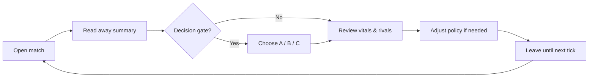
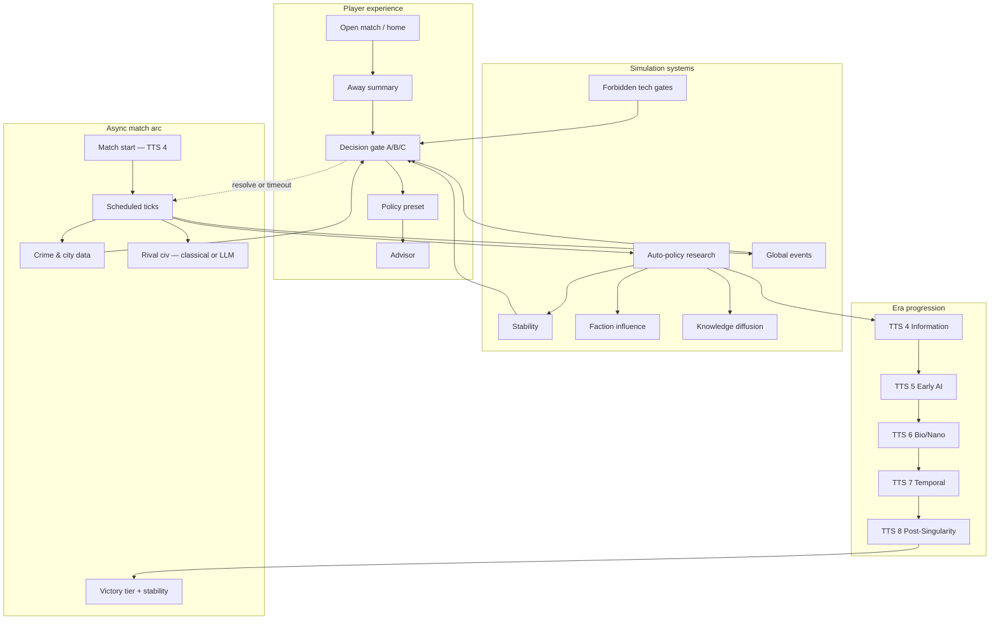
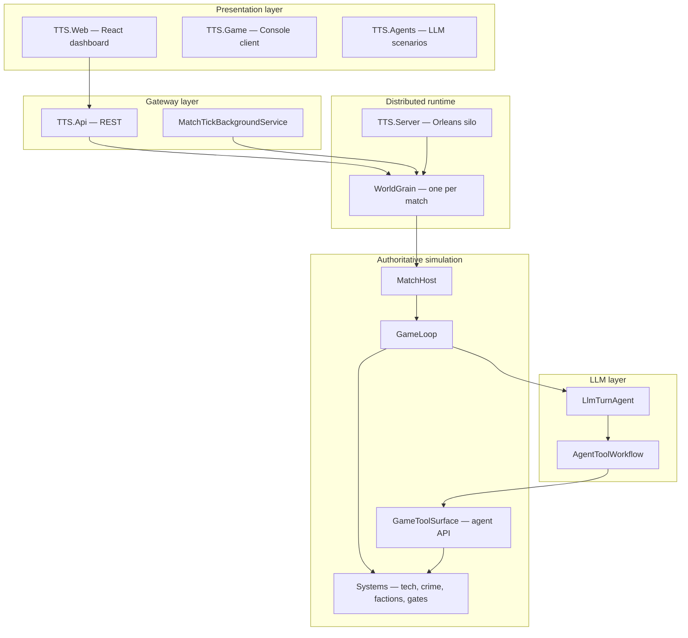

# From Stone to Ascension: Building a Civilization Sim Where Each Era Rewrites the Rules

*How we designed an async grand-strategy game where technology tiers don't just unlock units — they change what "winning" means.*

**Repository:** [github.com/PiotrZak/From-Stone-to-Ascension](https://github.com/PiotrZak/From-Stone-to-Ascension)

> **Note for Medium:** Attach `assets/architecture-technical-overview.png` for the technical architecture section. Other Mermaid diagrams can be exported at [mermaid.live](https://mermaid.live).

---

## The idea in one sentence

Most strategy games treat technology as a ladder: better swords, bigger cities, faster ships. **TTS (Technology Tier Simulation)** treats each era as a *different game* — where advancing from the Information Age to Early AI doesn't just add features, it changes the rules of economy, society, and even who makes decisions.

> *"Advancing technology doesn't just make you stronger — it changes what strength means."*

That's the north star behind [From-Stone-to-Ascension](https://github.com/PiotrZak/From-Stone-to-Ascension) — a grand-strategy civilization sandbox spanning TTS 1 (pre-industrial) through TTS 8+ (post-singularity), with a working .NET simulation engine, async multiplayer, a React governor dashboard, and LLM-powered rivals at higher tiers.

---

## Why another civilization game?

Civilization-style games excel at the long arc: explore, expand, exploit, exterminate. But tech trees are usually *incremental*. Research "Electricity" and you get +2 production. Research "Nuclear Fission" and you get a new unit.

TTS asks a different question: **what if each technological epoch introduced entirely new mechanics?**

| Tier | Era | What changes |
|------|-----|--------------|
| **TTS 1** | Pre-Industrial | Survival, agriculture, manual labor |
| **TTS 2** | Industrial | Production efficiency vs. social unrest |
| **TTS 3** | Early Electronics | Communication network control |
| **TTS 4** | Information Age | Data dominance, crime, digital economy |
| **TTS 5** | Early AI | Automation replaces labor value; LLM rivals |
| **TTS 6** | Bio/Nano | Species modification as policy |
| **TTS 7** | Temporal | Paradox stability, timeline branching |
| **TTS 8+** | Post-Singularity | Reality-level governance systems |

At TTS 4, you're not fighting barbarians — you're managing cybersecurity, regional crime data, and digital markets. At TTS 5, your rival civilization might literally be an LLM agent making research and diplomacy decisions through validated game tools.

The interface is designed to *evolve* with the era: earthy and analog at low tiers, neon and synthetic at high ones.

---

## The player experience: governor, not micromanager

TTS is built for **async play**. Matches run on real wall-clock schedules — an 8-hour sprint, a 36-hour standard game, a 48-hour extended arc. The world advances while you're away.

Your loop as governor:



Most check-ins take **2–5 minutes**. You're not clicking "build farm" every turn. Instead:

- **Away summary** — a headline and bullets: what happened while you were gone
- **Decision gates** — high-impact A/B/C choices with impact hints and countdowns
- **Policy presets** — Balanced, Tech Rush, Stability — your stance between visits
- **Auto-research** — the sim picks tech each tick based on your policy
- **Advisor** — classical analysis at TTS 4; LLM strategic briefing at TTS 5+

Modern match modes start at **TTS 4 (Information Age)** so the first dashboard load already feels contemporary — crime stats, digital tech trees, cybersecurity nodes. A legacy "From Stone (Classic)" mode still starts at TTS 1 for the full ascent.

**Design tension:** progress increases power but destabilizes society. Rush forbidden tech early and you might trigger collapse, AI rebellion, or paradox events.

---

## Gameplay architecture: systems that talk to each other

Under the hood, each scheduled tick runs a pipeline of interconnected systems:



**Entities in the world model:**

- **Civilizations** — tier, stability (political / economic / technological), researched techs, factions, pending gates
- **Regions / cities** — population, economy; TTS 4+ uses real crime/income CSV profiles (California, Louisiana 2015 in the demo)
- **Factions** — governments, corporations, religious groups, AI collectives — competing for research direction
- **Technology** — ~70 nodes across Core, Branch, Forbidden, and Fusion categories
- **Knowledge networks** — tech spreads via trade, espionage, open science — or gets classified, corrupted, lost

**Forbidden tech** is a deliberate risk/reward layer: unlock AI consciousness at TTS 3 or temporal research at TTS 5 and you gain power at the cost of instability.

---

## Technical architecture: one authoritative brain

The codebase follows a strict principle: **`TTS.Core` is always authoritative.** Web clients and LLMs never mutate game state directly. Everything flows through validated paths.



**Stack at a glance:**

| Layer | Technology | Role |
|-------|------------|------|
| Rules engine | .NET `TTS.Core` | Pure simulation — no HTTP, no Orleans |
| Multiplayer | Microsoft Orleans | One `WorldGrain` per match, tick scheduling |
| API | ASP.NET Core REST | Create/join matches, resolve gates, advisor |
| UI | React + Vite | Governor dashboard |
| AI rivals | MAF agent workflows | Ollama / OpenAI / Gemini via game tools |
| Data | JSON catalog + CSV | ~70 tech nodes, regional crime/income |

**Tick pipeline** (simplified):

```
Expire gates → Region growth → Stability decay → Civ turns
→ Knowledge diffusion → Faction influence → Economy → Crime
→ Global events → Scan for new gates → Win/loss check
```

Civilization turns use a **strategy chain**: at TTS 5+, the rival runs through an LLM agent with validated tools (`propose_research`, diplomacy, etc.); classical AI is the fallback. The player civ uses auto-policy — your agency is in gates and policy, not per-tick clicking.

---

## Async multiplayer: shared timeline, personal schedule

Match modes map wall clock to in-game progression:

| Mode | Duration | Victory target | Start tier |
|------|----------|----------------|------------|
| Sprint | ~8 hours | TTS 6 | TTS 4 |
| Blitz | ~24 hours | TTS 7 | TTS 4 |
| Standard | ~36 hours | TTS 7 | TTS 4 |
| Extended | ~48 hours | TTS 8 | TTS 4 |
| Dev blitz | ~3 minutes | TTS 5 | TTS 4 |

The demo pits **Aurora Collective** (player) against **Iron Dominion** (rival) across regions anchored to real socioeconomic data. Rivals are observable in away summaries and rival cards — and at TTS 5+, their LLM-driven turns become part of the story.

---

## LLM integration done right (we hope)

A common pitfall with LLM game agents: letting the model hallucinate state changes. TTS avoids this with a hard boundary:

- **Read path:** agents observe world state through structured DTOs
- **Write path:** only through `GameToolSurface` — validated, enum-defined tools
- **Orchestration:** LLM first, classical AI fallback if the agent fails or times out
- **Core rule:** `TTS.Core` never calls an LLM directly

At TTS 4, the advisor uses classical analysis. At TTS 5+, it upgrades to LLM strategic briefing. Rivals at TTS 5+ use the same tool surface for research and diplomacy — making them feel like adaptive opponents rather than scripted scripts.

Local development runs Ollama; production can target cloud providers.

---

## What's built today vs. what's ahead

**Shipped:**

- Full tick pipeline with stability, factions, crime, events, decision gates
- TTS 4 default start with Information Age tech spine
- React governor dashboard (away summary, gates, policy, tech tree, advisor)
- Orleans async multiplayer with JSON persistence
- LLM agent integration for rivals and advisor
- Unit test coverage across core systems

**On the horizon:**

- Deeper per-tier sub-trees and forbidden-tech consequences
- UI evolution per era (TTS 1 earthy → TTS 8 surreal)
- Campaign and experiment modes
- Space expansion, multiverse layers (TTS 9+ concepts)

---

## Why this matters for game design

TTS is an experiment in **rule evolution** as a core mechanic. Not "+10% damage" — but "the economy now runs on data networks" and "your rival is an LLM that negotiates treaties."

It's also an experiment in **respecting player time**: async ticks, 2–5 minute check-ins, policy presets instead of micromanagement — while keeping decisions that matter at crisis gates.

If you're building simulation games, the architectural lesson is simple: **keep one authoritative rules engine, push all intelligence (human UI, classical AI, LLM agents) to the edges.** TTS.Core doesn't know about HTTP or Orleans or Ollama. It just runs turns.

---

## Try it

```bash
./dev.sh
```

Or manually:

```bash
dotnet run --project src/TTS.Server    # Orleans silo
dotnet run --project src/TTS.Api       # REST API :5000
cd src/TTS.Web && npm run dev          # Dashboard :5173
```

**Repo:** [github.com/PiotrZak/From-Stone-to-Ascension](https://github.com/PiotrZak/From-Stone-to-Ascension)

---

*Questions, feedback, or want to contribute? Start with `architecture-overview.md` and `player-experience.md` in the repo. PRs welcome on match modes, tier systems, and agent scenarios.*
