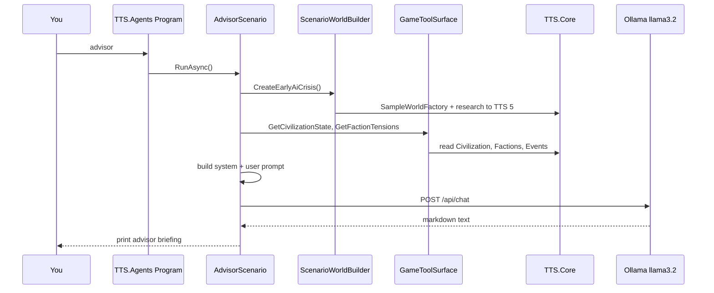

# Ollama Integration — How It Works

Run local LLM scenarios against live TTS game state. Uses your **Ollama** instance on `localhost` — **no API keys**, no cloud.

**Project:** `src/TTS.Agents`  
**Requires:** [Ollama](https://ollama.com) running with at least one model (e.g. `llama3.2`)

**Related:** [agent-framework-integration.md](agent-framework-integration.md) · [implementation-plan.md](implementation-plan.md) · [async-multiplayer-gameplay.md](async-multiplayer-gameplay.md)

---

## 1. Big picture

TTS has two ways to run AI today:

| App | LLM? | Purpose |
|-----|------|---------|
| **`TTS.Game`** | No | Turn-based simulation demo (classical AI + policy) |
| **`TTS.Agents`** | Yes (Ollama) | LLM scenarios — advisor, crises, lore, debates |

They share the same rules engine (`TTS.Core`) but run as **separate programs**. The game simulation does not call Ollama yet; scenarios are a **Phase 7 prototype** for TTS 5+ agent behavior.

```
┌─────────────────────────────────────────────────────────────────┐
│  TTS.Agents (console)                                           │
│  ┌──────────────┐    ┌─────────────────┐    ┌─────────────────┐ │
│  │   Scenario   │───▶│  GameToolSurface │───▶│   TTS.Core      │ │
│  │ (advisor,    │    │  (read state)    │    │  WorldState,    │ │
│  │  crisis, …)  │    └─────────────────┘    │  Civilization,  │ │
│  └──────┬───────┘                           │  TechTree, …    │ │
│         │ builds prompt from state          └─────────────────┘ │
│         ▼                                                         │
│  ┌──────────────┐    HTTP POST /api/chat                         │
│  │ OllamaClient │──────────────────────────▶  Ollama @ :11434    │
│  └──────────────┘    (llama3.2 on your Mac)                     │
│         │                                                         │
│         ▼                                                         │
│  Console output (narrative, choices, recommendations)             │
│  ⚠️  Does NOT write back to simulation yet                        │
└─────────────────────────────────────────────────────────────────┘
```

**Key rule:** `TTS.Core` is the **source of truth**. Ollama only reads state and produces text. In a future in-game integration (Phase 8), proposals will be **validated** by `TechTreeSystem`, `StabilitySystem`, etc. before applying.

---

## 2. Request flow (step by step)

What happens when you run `dotnet run --project src/TTS.Agents -- advisor`:



1. **CLI** — `Program.cs` picks scenario by name (`advisor`, `crisis`, …).
2. **World setup** — `ScenarioWorldBuilder` creates a world (often pre-advanced to TTS 5 with a crisis).
3. **Read state** — scenario calls `GameToolSurface` (same interface MAF will use later).
4. **Prompt** — scenario formats civ stats, events, techs into a `userPrompt`; sets a `systemPrompt` for role.
5. **Ollama** — `OllamaClient` sends JSON to `http://localhost:11434/api/chat`.
6. **Output** — response printed to console. **No game state is mutated.**

---

## 3. Project structure

```
src/TTS.Agents/
├── Program.cs                 # CLI entry — routes to scenarios
├── Ollama/
│   ├── OllamaSettings.cs      # OLLAMA_BASE_URL, OLLAMA_MODEL from env
│   └── OllamaClient.cs        # HTTP client for /api/tags and /api/chat
└── Scenarios/
    ├── IScenario.cs           # Id, Title, Description, RunAsync()
    ├── ScenarioWorldBuilder.cs # Demo worlds at TTS 5 + crisis
    ├── PingScenario.cs
    ├── AdvisorScenario.cs
    ├── CrisisScenario.cs
    ├── RivalTurnScenario.cs
    ├── TechLoreScenario.cs
    └── FactionDebateScenario.cs
```

`TTS.Agents` references **`TTS.Core` only** — no Orleans, no MAF package yet. Keeps the LLM layer thin and testable.

---

## 4. Ollama client

`OllamaClient` talks to the [Ollama HTTP API](https://github.com/ollama/ollama/blob/main/docs/api.md):

| Method | Endpoint | Purpose |
|--------|----------|---------|
| `IsReachableAsync()` | `GET /api/tags` | Health check |
| `ListModelsAsync()` | `GET /api/tags` | List installed models |
| `ChatAsync(system, user)` | `POST /api/chat` | Send chat, get reply |

**Chat request shape:**

```json
{
  "model": "llama3.2",
  "messages": [
    { "role": "system", "content": "You are a strategic advisor..." },
    { "role": "user", "content": "Civilization: Aurora Collective\nTier: TTS 5\n..." }
  ],
  "stream": false
}
```

**Model selection:**

1. If `OLLAMA_MODEL` (default `llama3.2`) is installed → use it.
2. Otherwise → use the **first** model from `ollama list`.
3. If no models → error with hint: `ollama pull llama3.2`.

---

## 5. Game state layer

### ScenarioWorldBuilder

Prepares worlds for scenarios that need more than a fresh start:

| Method | State |
|--------|-------|
| `CreateFreshWorld()` | Default 2-civ demo (TTS 1) |
| `CreateEarlyAiCrisis()` | Both civs researched to ML; TTS 5; low stability; **AI Alignment Crisis** active |

Most scenarios use `CreateEarlyAiCrisis()` so Ollama has rich TTS 5 context.

### GameToolSurface

Read-only API over `WorldState` — defined in `TTS.Core/Agents/IGameToolSurface.cs`:

| Tool | Used by scenarios |
|------|-------------------|
| `GetCivilizationState(civId)` | advisor, crisis, rival-turn |
| `GetFactionTensions(civId)` | advisor, faction-debate |
| `GetGlobalEvents(activeOnly)` | advisor, crisis |
| `GetTechTreeLayer(tier)` | (future) |
| `SetResearchPriority`, `EmitGlobalEvent`, … | **not used yet** — write tools for Phase 8 |

Scenarios **read** through tools; they do not call `TechTreeSystem.Research()` after Ollama responds (except `ScenarioWorldBuilder` during setup).

---

## 6. Scenarios in detail

| ID | System prompt role | User prompt data | Output shape |
|----|-------------------|------------------|--------------|
| **ping** | — | connectivity test | Model list + one-line chat |
| **advisor** | Strategic advisor | Civ snapshot, factions, events, policy | Briefing + recommendation |
| **crisis** | Crisis narrator | Event name/severity, player civ stability | Briefing + choices A/B/C + impacts |
| **rival-turn** | AI civ governor | Iron Dominion policy, available tech list | `CHOICE: <id>` + `REASON:` |
| **tech-lore** | Tech designer | Parent tech fusion (AI + biology) | NAME, TIER, RISK, DESCRIPTION, EVENT_HOOK |
| **faction-debate** | Dialogue writer | Faction list, forbidden AI issue | Debate lines per faction |

### Example: crisis scenario

**Input to Ollama (built from game state):**

- Event: AI Alignment Crisis, severity 3
- Player: Aurora Collective, TTS 5, technological stability ~45

**Output (from your run):**

- Dramatic briefing
- A) Regulate, B) Accelerate, C) Isolate
- Stability impact per choice

**In Phase 3**, those choices become `DecisionGate` objects the player (or timeout default) resolves in `TTS.Core`.

### Example: rival-turn caveat

Ollama may pick a tech **not** in the available list (e.g. `tech-agriculture` when already past that). That is expected LLM behavior. In-game (Phase 8):

1. Parse `CHOICE:` from response
2. `TechTreeSystem.CanResearch()` validates
3. On reject → fallback to `ClassicalAiSystem` or retry

---

## 7. TTS.Game vs TTS.Agents

| | TTS.Game | TTS.Agents |
|---|----------|------------|
| **Loop** | `GameLoop.RunTurn()` × 8 | Single scenario, no turns |
| **AI below TTS 5** | `ClassicalAiSystem` + policy | N/A |
| **AI at TTS 5+** | `AgentOrchestrator` stub (highest-risk tech) | Ollama via scenarios |
| **Player** | Aurora auto-researches by policy | Ollama advises Aurora in `advisor` only |
| **Mutates state** | Yes | No (read-only prototype) |

Running both is normal:

```bash
dotnet run --project src/TTS.Game      # deterministic sim
dotnet run --project src/TTS.Agents -- crisis   # LLM narrative layer
```

---

## 8. Environment variables

| Variable | Default | Description |
|----------|---------|-------------|
| `OLLAMA_BASE_URL` | `http://localhost:11434` | Ollama server URL |
| `OLLAMA_MODEL` | `llama3.2` | Preferred model name |

No `TTS_LLM_PROVIDER` in scenarios yet — `TTS.Agents` always uses Ollama when you run it. The env var will matter when Ollama is wired into `AgentOrchestrator` in Phase 8.

**Secrets:** None required. Do not commit `.env` if you add other keys later.

---

## 9. Quick start

```bash
# 1. Pull a model (first time only)
ollama pull llama3.2

# 2. Verify connection
dotnet run --project src/TTS.Agents -- ping

# 3. Run one scenario
dotnet run --project src/TTS.Agents -- advisor

# 4. Run all narrative scenarios
dotnet run --project src/TTS.Agents -- all

# 5. Help
dotnet run --project src/TTS.Agents -- list
```

---

## 10. Where this goes next

| Phase | What | Ollama role |
|-------|------|-------------|
| **Now (7 partial)** | Offline scenarios | Demo advisor, crisis, lore |
| **Phase 3** | Decision gates | Crisis A/B/C become real `DecisionGate` choices |
| **Phase 8** | In-game `AgentOrchestrator` | `rival-turn` logic inside `GameLoop` at TTS 5+ |
| **Phase 6+** | Orleans + API | Ollama runs inside `CivilizationGrain` on scheduled ticks |

Future in-game flow:

```
WorldGrain tick → CivilizationGrain (TTS 5+)
    → OllamaClient or MAF wrapper
    → parse + validate via TTS.Core
    → apply research / event / stability change
    → if Ollama down → ClassicalAiSystem fallback
```

---

## 11. Troubleshooting

| Problem | Fix |
|---------|-----|
| `Cannot reach Ollama` | Start Ollama app or `ollama serve` |
| `No models installed` | `ollama pull llama3.2` |
| First chat very slow | Model loading into RAM (~2 GB for llama3.2) — normal |
| Wrong tech in rival-turn | LLM hallucination — validation in Phase 8 |
| `"I am a cloud-based AI"` in ping | Model quirk — ignore; chat still works |
| Out of memory | Use smaller model: `ollama pull qwen2.5:3b` |

---

## 12. Related docs

| Doc | Topic |
|-----|-------|
| [agent-framework-integration.md](agent-framework-integration.md) §3.1 | Provider strategy (Ollama vs OpenAI vs Gemini) |
| [implementation-plan.md](implementation-plan.md) | Phase 7–8 roadmap |
| [async-multiplayer-gameplay.md](async-multiplayer-gameplay.md) | Decision gates, auto policy |
| `src/TTS.Core/Agents/IGameToolSurface.cs` | Tool contract source |
