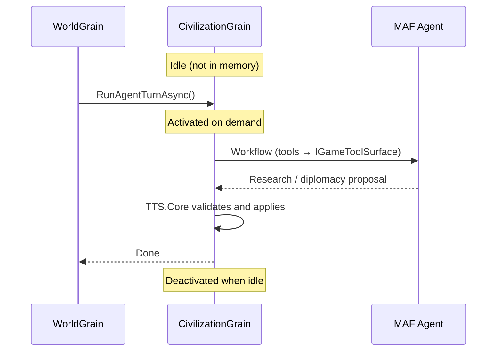
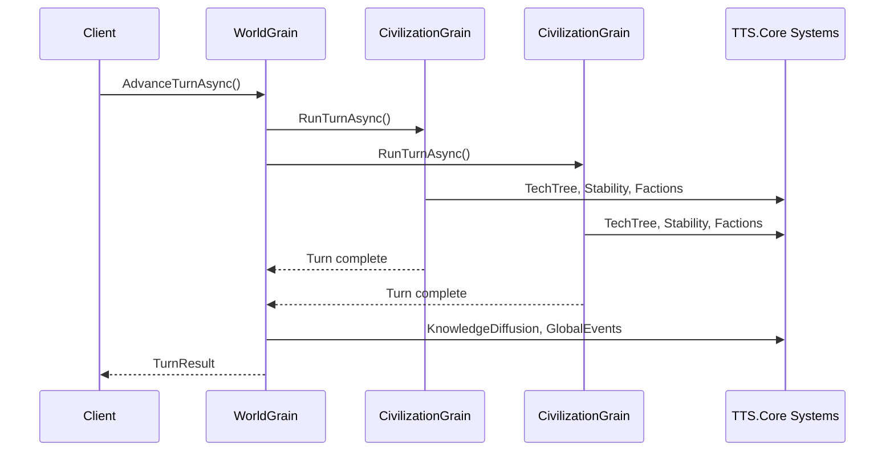

# Microsoft Orleans Integration

**Project:** TTS — Technology Tier Simulation  
**Framework:** [Microsoft Orleans](https://github.com/dotnet/orleans)  
**Status:** Design document — simulation runs in-process today (`TTS.Game` console host)

**Related:** [agent-framework-integration.md](agent-framework-integration.md) (MAF intelligence layer)

---

## 1. Purpose

This document describes how [Microsoft Orleans](https://github.com/dotnet/orleans) can host and scale the TTS simulation server. It maps Orleans **grains** (virtual actors) to game entities in `README.md` and the existing `TTS.Core` models, and explains how Orleans fits alongside `TTS.Core` and Microsoft Agent Framework (MAF).

Orleans is **not** a game engine, rendering layer, or AI reasoning framework. It is a **distributed .NET runtime** for building scalable, stateful, fault-tolerant server applications.

---

## 2. Full Stack (How the Pieces Fit)

```
┌─────────────────────────────────────────────────────────────────┐
│  Game Client (future: Unity, web, etc.)                         │
└────────────────────────────┬────────────────────────────────────┘
                             │ HTTP / WebSocket / SignalR
┌────────────────────────────▼────────────────────────────────────┐
│  TTS.Server (Orleans silo)                                      │
│  ┌─────────────┐  ┌──────────────────┐  ┌──────────────────┐  │
│  │ WorldGrain  │  │ CivilizationGrain│  │ RegionGrain      │  │
│  │ (per match) │  │ (per civ)        │  │ (per territory)  │  │
│  └──────┬──────┘  └────────┬─────────┘  └──────────────────┘  │
│         │                  │                                     │
│         └──────────────────┼─────────────────────────────────────┤
│                            ▼                                     │
│                   TTS.Core (rules engine)                        │
│                   Systems, GameLoop, models                      │
│                            │                                     │
│                            ▼ (TTS 5+ only)                       │
│                   TTS.Agents (MAF workflows)                       │
└─────────────────────────────────────────────────────────────────┘
```

| Layer | Responsibility | Needed now? |
|-------|----------------|-------------|
| **TTS.Core** | Deterministic rules, stability, tech tree, win/loss | Yes |
| **Orleans** | Host, scale, persist, coordinate sim entities | No (until multiplayer / cloud) |
| **MAF** | LLM agents for TTS 5+ civ intelligence | Later |

**Principle:** `TTS.Core` stays the rules engine. Orleans moves *where* state lives and *how* it scales. MAF adds *how* smart civs reason — inside grains, not instead of them.

---

## 3. What Orleans Is — and Is Not

### Orleans provides

- **Grains** — virtual actors with stable identity, state, and managed lifecycle
- **Automatic activation** — grains load on demand, unload when idle
- **Location transparency** — call a grain by ID; runtime handles placement
- **Clustering** — scale from one silo to many servers
- **Persistence** — optional durable grain state (SQL, Azure, etc.)
- **Reminders & timers** — scheduled turn ticks, event expiry
- **Streams** — pub/sub for global events, knowledge diffusion

### Orleans does not replace

- `TTS.Core` simulation logic (`TechTreeSystem`, `StabilitySystem`, etc.)
- Game client or UI
- MAF / LLM orchestration
- Classical game AI algorithms

### Orleans vs MAF (common confusion)

| | Orleans | MAF |
|---|---------|-----|
| **Problem solved** | Distributed stateful server at scale | LLM agent workflows |
| **Unit of work** | Grain (civ, region, world) | Agent (diplomat, researcher, narrator) |
| **Analogy** | The city infrastructure | The experts who work in the city |
| **TTS use** | Multiplayer world host | TTS 5+ civilization intelligence |

They complement each other: a `CivilizationGrain` can invoke MAF when `CurrentTier >= EarlyAI`.

---

## 4. Agentic Grain Lifecycle (Activate on Demand)

Orleans grains are **activated on demand** and **deactivated when idle**. This lifecycle is an especially strong fit for **agentic solutions** (MAF) in TTS.

### What the lifecycle means

1. Grain **does not sit in memory** until something calls it
2. On call, Orleans **activates** the grain and loads its state (memory or persistence)
3. Grain runs logic — including MAF agent workflows at TTS 5+
4. After idle timeout, grain **deactivates** and frees server resources
5. Next call **reactivates** the same grain by ID with restored state

You write code as if every civilization agent is always available; Orleans only keeps it hot when needed.

### Why this matches agentic AI

| Factor | Benefit |
|--------|---------|
| **Many agents, few active** | 20 civs in a match, maybe 2–3 need LLM reasoning per turn — idle grains cost nothing |
| **Wake → think → sleep** | Turn-based play: activate grain → MAF workflow → persist → deactivate until next turn |
| **Stable agent identity** | Grain ID (`civ-rival`) anchors civ state and optional MAF conversation history |
| **Heavy agent context** | LLM context is memory-expensive; unloading idle grains saves RAM |
| **Async MAF calls** | Long LLM work runs inside one grain without blocking other civ grains |
| **Player disconnect** | Grain persists state; agent “remembers” the civ when player returns |

### Agentic turn flow (TTS 5+)



**Below TTS 5:** same grain runs classical AI in `RunTurnAsync()` — still benefits from idle lifecycle.  
**At TTS 5+:** same grain invokes MAF in `RunAgentTurnAsync()` — LLM runs only when this civ must decide.

### What must be persisted

Grain deactivation clears in-memory state unless persisted. For agentic continuity, save:

| Data | Persist? |
|------|----------|
| Civ tier, stability, researched techs | Yes |
| Faction influence | Yes |
| MAF workflow checkpoint / conversation | Yes (if agent should remember prior turns) |
| Temporary scratch during one LLM call | No |

Use Orleans grain persistence and/or MAF checkpointing. Without persistence, re-activation feels like a new agent each time.

### Orleans + MAF vs MAF-only hosting

| Approach | Best when |
|----------|-----------|
| **MAF inside Orleans grains** | Agent tied to live game entity (civ, world); multiplayer; shared sim state |
| **MAF hosted alone** | Offline tools (tech tree generator, content pipeline) |
| **Both** | Grains own game truth; MAF runs workflows; tools call `IGameToolSurface` |

For TTS multiplayer: Orleans decides **when and where** an agent wakes; MAF decides **how** it reasons.

### When lifecycle matters most

**High value:** many civs, sporadic player activity, long matches, cloud hosting, event-driven agent calls.  
**Lower value:** single always-on chatbot, local single-player demo (`TTS.Game`), dev-only content tools.

---

## 5. When Orleans Makes Sense for TTS

### Strong fit

| Game feature (`README.md`) | Orleans benefit |
|----------------------------|-----------------|
| **Multiplayer mode** — competing civs on one timeline | One silo cluster, many player grains |
| **Persistent worlds** — save across sessions | Grain state persistence |
| **Many civilizations / regions** | Independent grains scale in parallel |
| **Factions** — dynamic internal politics | `FactionGrain` or faction state inside civ grain |
| **Knowledge diffusion** — trade, espionage, AI networks | Grain-to-grain messaging |
| **Global events** — crises spanning civs | `WorldGrain` broadcasts via streams |
| **TTS 5+ async agent turns** | Long MAF calls don't block entire sim |

### Weak fit (skip Orleans)

| Scenario | Better approach |
|----------|-----------------|
| Single-player console demo (current) | `TTS.Game` in-process `GameLoop` |
| Local-only sandbox, one machine | Plain `TTS.Core` |
| Small world (2 civs, few regions) | Single `WorldState` object |
| Deterministic turn batch on one thread | No distribution overhead needed |

**Rule of thumb:** Introduce Orleans when you need **multiplayer**, **cloud-hosted worlds**, or **parallel processing of many entities** — not when prototyping core rules.

---

## 6. Grain Design

Map existing `TTS.Core` models to grains. Grain IDs use the same string keys already in models (`civ-player`, `reg-a`, etc.).

### 6.1 WorldGrain (one per match / save)

**Key:** `world-{matchId}`  
**Owns:** turn counter, global tech catalog, active events, match settings

```csharp
// Future — TTS.Server/Grains/IWorldGrain.cs
public interface IWorldGrain : IGrainWithStringKey
{
    Task<WorldSummary> GetSummary();
    Task<TurnResult> AdvanceTurnAsync();
    Task<IReadOnlyList<GlobalEvent>> GetActiveEvents();
    Task EmitEventAsync(GlobalEvent globalEvent);
}
```

Wraps `GameLoop.RunTurn()` orchestration. Coordinates all `CivilizationGrain` instances for a turn.

### 6.2 CivilizationGrain (one per civ)

**Key:** civilization `Id` (e.g. `civ-player`)  
**Owns:** `Civilization` state, factions, researched techs, stability

```csharp
// Future — TTS.Server/Grains/ICivilizationGrain.cs
public interface ICivilizationGrain : IGrainWithStringKey
{
    Task<CivilizationStateSnapshot> GetState();
    Task<ResearchResult> ResearchAsync(string technologyId);
    Task<ActionResult> SetResearchPriority(string branch, double weight);
    Task RunTurnAsync();           // classical AI below TTS 5
    Task RunAgentTurnAsync();      // MAF via AgentOrchestrator at TTS 5+
}
```

Delegates to `TTS.Core.Systems` and `IGameToolSurface` — same contracts as today.

### 6.3 RegionGrain (one per territory)

**Key:** region `Id` (e.g. `reg-a`)  
**Owns:** population, resources, infrastructure, controlling civ

```csharp
public interface IRegionGrain : IGrainWithStringKey
{
    Task<RegionSnapshot> GetState();
    Task TickResourcesAsync();
}
```

Useful when regions need independent simulation at scale. For early multiplayer, region state can live inside `CivilizationGrain` instead.

### 6.4 Optional grains (later)

| Grain | Key | When |
|-------|-----|------|
| `FactionGrain` | `faction-{id}` | Heavy faction simulation, split/merge dynamics |
| `KnowledgeLinkGrain` | `{source}:{target}` | Explicit diffusion channels |
| `EventGrain` | `event-{id}` | Long-running crises with own lifecycle |

Start with **WorldGrain + CivilizationGrain** only.

---

## 7. Turn Flow (Multiplayer)



**Player-controlled civs:** client sends `ResearchAsync(techId)` between turns; grain validates via `TechTreeSystem`.

**AI civs below TTS 5:** `RunTurnAsync()` — classical AI (to be implemented).

**AI civs at TTS 5+:** `RunAgentTurnAsync()` — `AgentOrchestrator` + MAF, non-blocking inside grain.

---

## 8. Mapping to Current Code

Existing `TTS.Core` types map directly to grain state:

| `TTS.Core` type | Orleans home |
|-----------------|--------------|
| `WorldState` | `WorldGrain` persistent state |
| `Civilization` | `CivilizationGrain` state |
| `Region` | `RegionGrain` or embedded in civ grain |
| `Faction` | List inside `CivilizationGrain` |
| `KnowledgeNetwork` | `WorldGrain` registry or link grains |
| `Technology` | `WorldGrain` shared catalog (read-only per match) |
| `GameLoop` | Called by `WorldGrain.AdvanceTurnAsync()` |
| `IGameToolSurface` | Used inside `CivilizationGrain` for MAF tools |

**No rewrite of rules required.** Grains are thin hosts that call existing systems.

---

## 9. Project Structure (Future)

```
From-Stone-to-Ascension/
├── src/
│   ├── TTS.Core/              # Unchanged — rules engine (no Orleans reference)
│   ├── TTS.Agents/            # MAF workflows (optional Orleans reference)
│   ├── TTS.Server/            # NEW — Orleans silo host
│   │   ├── Grains/
│   │   │   ├── IWorldGrain.cs
│   │   │   ├── WorldGrain.cs
│   │   │   ├── ICivilizationGrain.cs
│   │   │   └── CivilizationGrain.cs
│   │   ├── Program.cs         # Silo builder
│   │   └── TTS.Server.csproj
│   ├── TTS.Api/               # NEW (optional) — REST/SignalR gateway to grains
│   ├── TTS.Game/              # Local single-player (keep for dev/demo)
│   └── TTS.Tests/
├── agent-framework-integration.md
└── orleans-integration.md
```

`TTS.Core` must **not** reference Orleans — keeps rules testable without a silo.

---

## 10. Persistence

Orleans grain persistence stores match state across restarts.

| Data | Persist? | Notes |
|------|----------|-------|
| Civilization state | Yes | Tier, stability, researched techs |
| World turn / events | Yes | Active `GlobalEvent` list |
| Technology catalog | Optional | Usually static per match version |
| MAF conversation history | Optional | Separate store; scope per civ |

**Single-player today:** `SampleWorldFactory` + in-memory `WorldState` is enough.

**Cloud multiplayer:** `CivilizationGrain` + `WorldGrain` with ADO.NET or Azure Storage persistence provider.

---

## 11. What to Avoid

| Anti-pattern | Why |
|--------------|-----|
| Putting game rules inside grain classes | Duplicates `TTS.Core`; hard to test |
| Orleans in `TTS.Core` | Couples rules to infrastructure |
| One giant grain for the whole world | Serialization bottleneck; no parallelism |
| Orleans for local solo prototype | Unnecessary silo/cluster complexity |
| Blocking grain on MAF LLM calls without timeout | Holds grain activation; use async + timeout |
| Grain calls from client without validation | Client proposes; grain validates via `TTS.Core` |

---

## 12. Implementation Roadmap

### Phase 0 — Local simulation (current)

- [x] `TTS.Core` models and systems
- [x] `GameLoop` in-process
- [x] `TTS.Game` console demo
- [x] Orleans strategy documented (this file)

### Phase 1 — Classical AI (before Orleans)

1. Implement rival civ research below TTS 5 in `GameLoop`
2. Keep everything in `TTS.Game` — no silo yet

### Phase 2 — Orleans local silo

1. Add `TTS.Server` with `Microsoft.Orleans.Server`
2. Implement `WorldGrain` + `CivilizationGrain` wrapping `TTS.Core`
3. Run single silo locally; `TTS.Game` becomes Orleans client
4. Verify same 8-turn demo output via grains

```bash
# Future local dev
dotnet run --project src/TTS.Server    # start silo
dotnet run --project src/TTS.Game      # client connects to localhost
```

### Phase 3 — Multiplayer slice

1. Add `TTS.Api` gateway (minimal REST or SignalR)
2. Player actions → `CivilizationGrain` → `TechTreeSystem`
3. `WorldGrain.AdvanceTurnAsync()` when all players ready (or timer)
4. Match creation: `world-{guid}` grain per game

### Phase 4 — Cloud + MAF inside grains

1. Orleans cluster (Azure Container Apps, AKS, or local cluster)
2. Grain persistence for saved worlds
3. `CivilizationGrain.RunAgentTurnAsync()` wires MAF at TTS 5+
4. Rate limits and observability (OpenTelemetry across silo + MAF)

---

## 13. Getting Started (When Ready)

### Packages

```bash
dotnet add src/TTS.Server package Microsoft.Orleans.Server
dotnet add src/TTS.Server package Microsoft.Orleans.Sdk
# Optional persistence:
dotnet add src/TTS.Server package Microsoft.Orleans.Persistence.AdoNet
```

### Minimal silo host (sketch)

```csharp
// Future — TTS.Server/Program.cs
var builder = Host.CreateApplicationBuilder(args);
builder.UseOrleans(silo =>
{
    silo.UseLocalhostClustering();
});
await builder.Build().RunAsync();
```

### Grain implementation (sketch)

```csharp
// Future — CivilizationGrain delegates to TTS.Core
public class CivilizationGrain : Grain, ICivilizationGrain
{
    private Civilization _state = null!;
    private readonly TechTreeSystem _techTree = new();
    private readonly ForbiddenTechSystem _forbidden = new();

    public override Task OnActivateAsync(CancellationToken ct)
    {
        _state = new Civilization(this.GetPrimaryKeyString(), "Unknown");
        return base.OnActivateAsync(ct);
    }

    public Task<CivilizationStateSnapshot> GetState() =>
        Task.FromResult(new CivilizationStateSnapshot(
            _state.Id, _state.Name, _state.CurrentTier,
            _state.PoliticalStability, _state.EconomicStability,
            _state.TechnologicalStability,
            _state.ResearchedTechnologyIds.ToList(),
            _state.ControlledRegionIds.ToList()));
}
```

---

## 14. References

| Resource | URL |
|----------|-----|
| Microsoft Orleans | https://github.com/dotnet/orleans |
| Orleans documentation | https://learn.microsoft.com/dotnet/orleans/ |
| MAF integration (this project) | [agent-framework-integration.md](agent-framework-integration.md) |
| Game design | [README.md](README.md) |
| Tech tree design | [tech-tree.md](tech-tree.md) |
| Current models | `src/TTS.Core/Models/` |
| Agent tool surface | `src/TTS.Core/Agents/IGameToolSurface.cs` |

---

## 15. Summary

Orleans fits TTS as the **simulation server runtime** — not as game rules or AI.

- **Use Orleans** when you need multiplayer, persistent cloud worlds, or parallel civ/region processing.
- **Keep `TTS.Core`** as the authoritative rules engine, with or without Orleans.
- **Run MAF inside `CivilizationGrain`** at TTS 5+ for agentic civ behavior.
- **Activate-on-demand / idle deactivation** is especially valuable for agentic AI: many civ brains, few active at once, wake only for turns and events.
- **Do not add Orleans now** for the console demo — design for grains, implement when multiplayer becomes a real milestone.

The current in-process `GameLoop` is the right choice for Phase 0–1. Orleans becomes valuable when the game leaves a single machine.
