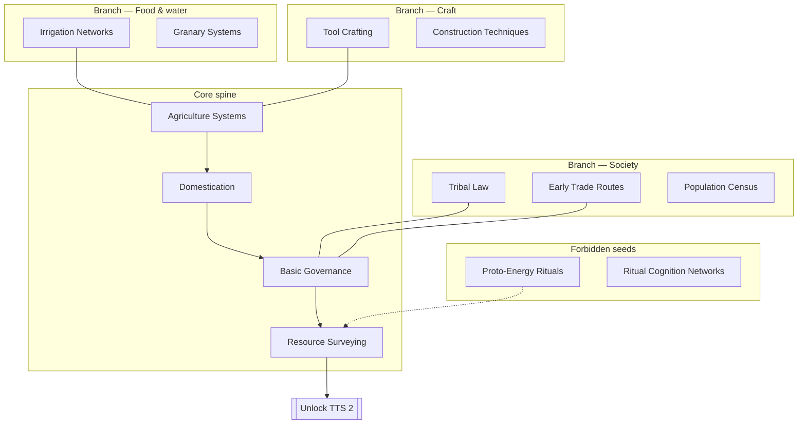
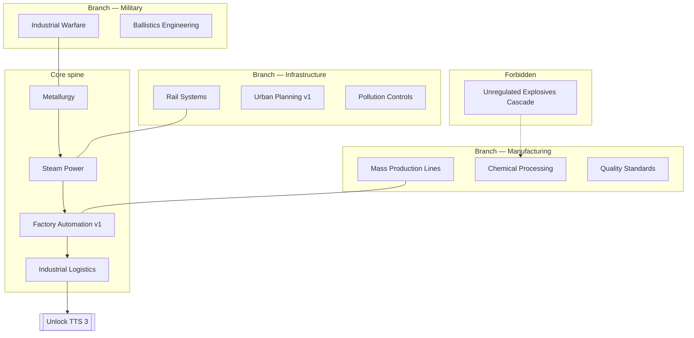
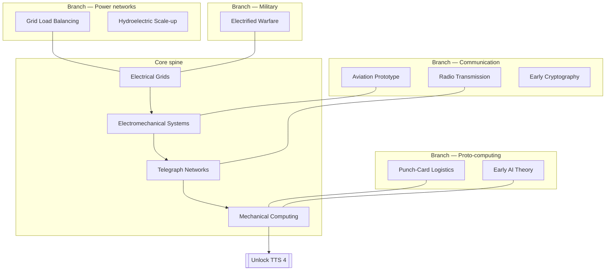
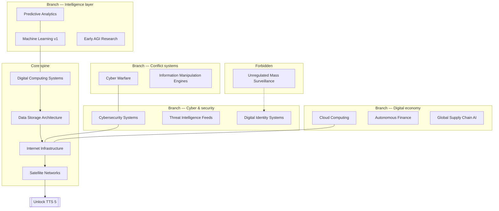
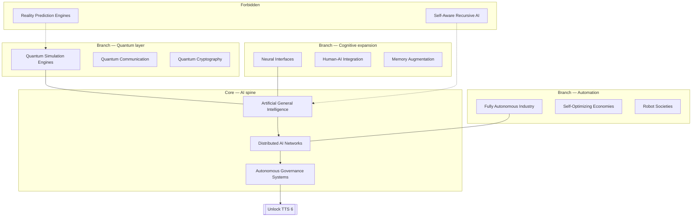
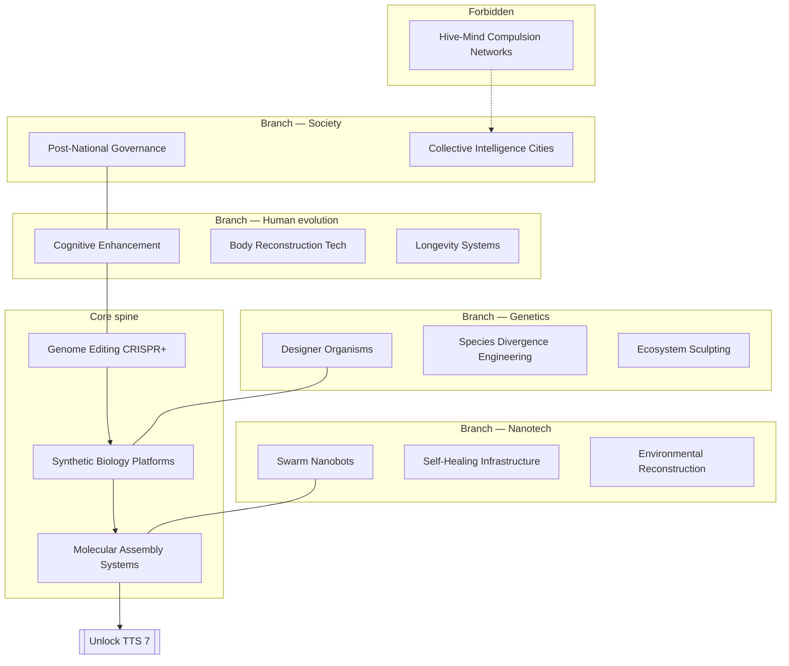
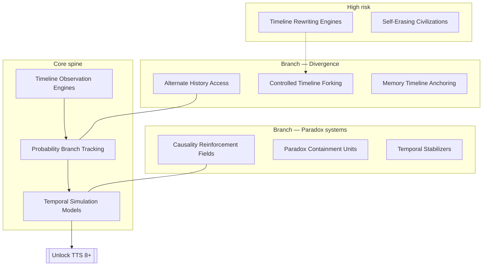
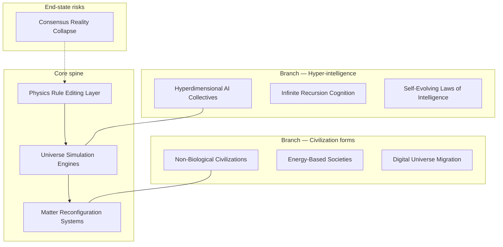

# Technology Sub-Trees by TTS

**Project:** TTS — Technology Tier Simulation  
**Implements:** [README.md §6.1](README.md) — each TTS has its own sub-tree  
**Companion:** [tech-tree.md](tech-tree.md) — CTUT universe overview + fusion rules  
**Code:** `TechTier`, `TechCategory`, `Technology` in `TTS.Core`  
**Data:** `src/data/tech/catalog.json` — loaded by `TechTreeCatalog` in `TTS.Core/Systems/`

---

## 1. Design principle

Instead of one flat tree, each **Technology Tier (TTS)** is a **layer** with its own sub-tree:

```
TTS 1 sub-tree ──unlock──▶ TTS 2 sub-tree ──unlock──▶ … ──▶ TTS 8+ sub-tree
     │                           │
     ├── Core (required spine)   ├── new categories appear
     ├── Branches (optional)     ├── prior tiers stay researchable
     ├── Forbidden (risk)        └── fusion tags cross layers
     └── Fusion hooks
```

| Rule | Meaning |
|------|---------|
| **Layer gate** | You cannot research TTS *N* nodes until civ reaches tier *N* (with `TechTreeSystem` +1 lookahead) |
| **Spine** | 3–5 **core** nodes per tier unlock tier advancement |
| **Branches** | 2–4 optional specializations per tier |
| **Categories** | Each tier introduces **new** `TechCategory` branches |
| **Forbidden** | High risk; early unlock triggers stability / gate events |
| **Fusion** | Tags from two tiers combine → nodes in higher tier ([tech-tree.md § Fusion](tech-tree.md)) |

### Node template (for data / procedural gen)

```json
{
  "id": "tech-electrical-grids",
  "name": "Electrical Grids",
  "tier": 3,
  "category": "energy",
  "branch": "power-networks",
  "prerequisites": ["tech-steam-power"],
  "risk_level": 5,
  "is_forbidden": false,
  "fusion_tags": ["energy", "grid"],
  "role": "core"
}
```

### Roles

| Role | Count/tier (target) | Purpose |
|------|---------------------|---------|
| `core` | 4–6 | Mandatory spine to exit tier |
| `branch` | 8–15 | Specialization |
| `forbidden` | 1–3 | Risk / narrative |
| `fusion` | 2–5 | Cross-tier unlocks |

---

## 2. Master map — tier → sub-tree theme

| TTS | Enum | Sub-tree name | New categories unlocked | Game mechanic |
|-----|------|---------------|-------------------------|---------------|
| **1** | `PreIndustrial` | **Foundation** | Agriculture, basic governance | Survival, expansion |
| **2** | `Industrial` | **Mechanization** | Manufacturing, energy (steam) | Production vs unrest |
| **3** | `EarlyElectronics` | **Electrification** | Communication, early computing | Network control |
| **4** | `InformationAge` | **Digital civilization** | Computing (deep), cyber | Data dominance |
| **5** | `EarlyAI` | **Cognition & quantum** | AI, quantum layer | Automation vs labor |
| **6** | `BioNano` | **Biological rewriting** | Biology, nanotechnology | Species policy |
| **7** | `Temporal` | **Timeline engineering** | Temporal manipulation | Paradox stability |
| **8+** | `PostSingularity` | **Reality architecture** | Reality engineering | Reality permissions |

---

## 3. TTS 1 — Foundation (Pre-Industrial)

**Theme:** Land, food, tribe → kingdom  
**Target nodes:** ~20  
**Tier gate to TTS 2:** Research ≥3 core + ≥2 branch

### Sub-tree diagram



### Node table (representative)

| ID | Name | Role | Category | Prerequisites |
|----|------|------|----------|---------------|
| `tech-agriculture` | Agriculture Systems | core | Agriculture | — |
| `tech-domestication` | Domestication | core | Agriculture | agriculture |
| `tech-governance` | Basic Governance | core | Agriculture | agriculture |
| `tech-resource-survey` | Resource Surveying | core | Agriculture | governance |
| `tech-irrigation` | Irrigation Networks | branch | Agriculture | agriculture |
| `tech-tribal-law` | Tribal Law Systems | branch | Agriculture | governance |
| `tech-tool-crafting` | Tool Crafting | branch | Manufacturing | agriculture |
| `tech-proto-energy` | Proto-Energy Harnessing | forbidden | Energy | resource-survey |

**Implemented in demo:** `tech-agriculture`, `tech-governance` ✓

---

## 4. TTS 2 — Mechanization (Industrial)

**Theme:** Steam, factories, rails, pollution  
**Target nodes:** ~25  
**Tier gate to TTS 3:** Core spine + manufacturing branch depth ≥2

### Sub-tree diagram



### Node table (representative)

| ID | Name | Role | Category | Prerequisites |
|----|------|------|----------|---------------|
| `tech-metallurgy` | Metallurgy | core | Manufacturing | governance (TTS1) |
| `tech-steam` | Steam Power | core | Energy | metallurgy |
| `tech-factory-v1` | Factory Automation v1 | core | Manufacturing | steam |
| `tech-rail` | Rail Systems | branch | Manufacturing | steam |
| `tech-pollution-ctrl` | Pollution Controls | branch | Energy | factory-v1 |
| `tech-ballistics` | Ballistics Engineering | branch | Military | metallurgy |

**Implemented in demo:** `tech-metallurgy`, `tech-steam` ✓

---

## 5. TTS 3 — Electrification (Early Electronics)

**Theme:** Grids, wires, waves, mechanical mind  
**Sub-tree name:** **Electronics tree** (README §6.1)  
**Target nodes:** ~30  
**New mechanic:** Communication network control

### Sub-tree diagram



### Node table (representative)

| ID | Name | Role | Category | Prerequisites |
|----|------|------|----------|---------------|
| `tech-electrical` | Electrical Grids | core | Energy | steam (TTS2) |
| `tech-telegraph` | Telegraph Networks | core | Communication | electrical |
| `tech-mech-computing` | Mechanical Computing | core | Computing | telegraph |
| `tech-radio` | Radio Transmission | branch | Communication | telegraph |
| `tech-aviation` | Aviation Prototype | branch | Manufacturing | electromechanical |
| `tech-early-ai-theory` | Early AI Theory | branch | ArtificialIntelligence | mech-computing |

**Implemented in demo:** `tech-electrical` ✓

---

## 6. TTS 4 — Digital Civilization (Information Age)

**Theme:** Internet, data, cyber, global systems  
**Target nodes:** ~40  
**New mechanic:** Data dominance; **crime perspective** ([crime-data.md](crime-data.md))

### Sub-tree diagram



### Node table (representative)

| ID | Name | Role | Category | Fusion tags |
|----|------|------|----------|---------------|
| `tech-computing` | Digital Computing | core | Computing | computing |
| `tech-cybersecurity` | Cybersecurity Systems | branch | Computing | cyber, crime |
| `tech-ml` | Machine Learning v1 | branch | Computing | ai, ml |
| `tech-internet` | Internet Infrastructure | core | Communication | data-storage |
| `tech-cyber-warfare` | Cyber Warfare | branch | Military | cyber |

**Implemented in demo:** `tech-computing`, `tech-cybersecurity`, `tech-ml` ✓

---

## 7. TTS 5 — Cognition & Quantum (Early AI Age)

**Theme:** AGI, distributed mind, quantum substrate  
**Sub-tree name:** **AI cognition tree** (README §6.1)  
**Target nodes:** ~50  
**New mechanic:** Automation replaces labor value; **agent runner** at this tier in sim

### Sub-tree diagram



### Node table (representative)

| ID | Name | Role | Risk | Notes |
|----|------|------|------|-------|
| `tech-agi` | AGI | core | 25 | Alignment gates |
| `tech-distributed-ai` | Distributed AI Networks | core | 20 | |
| `tech-quantum-sim` | Quantum Simulation Engines | branch | 30 | |
| `tech-recursive-ai` | Self-aware Recursive AI | forbidden | 60 | Demo ✓ |

**Implemented in demo:** `tech-agi`, `tech-recursive-ai` ✓

---

## 8. TTS 6 — Biological Rewriting (Bio/Nano)

**Theme:** Edit life, molecular machines, post-human policy  
**Sub-tree name:** **Biological rewriting tree** (README §6.1)  
**Target nodes:** ~60  
**New mechanic:** Species modification as policy

### Sub-tree diagram



### Representative fusion hooks (from TTS 5)

| Fusion | Child tier | Example node |
|--------|------------|--------------|
| `ai` + `biology` | TTS 6 | Synthetic Sentient Organisms |
| `nano` + `energy` | TTS 6 | Self-Building Power Lattice |

---

## 9. TTS 7 — Timeline Engineering (Temporal)

**Theme:** Observe, branch, contain paradox  
**Target nodes:** ~70  
**New mechanic:** Paradox Stability Index

### Sub-tree diagram



---

## 10. TTS 8+ — Reality Architecture (Post-Singularity)

**Theme:** Edit physics, migrate consciousness, new civ forms  
**Target nodes:** ~80+  
**New mechanic:** Reality editing permissions

### Sub-tree diagram



### TTS 9+ (design horizon — not in `TechTier` enum yet)

| Layer | Theme | Example nodes |
|-------|-------|-----------------|
| **Omni** | Multiverse | Multiverse Linking, Simulation Nesting |
| **God-level** | Consciousness infra | Reality Consensus Engines |
| **End-state** | Narrative terminals | Observer Collapse, Exit from Simulation |

See [tech-tree.md § TTS 9+](tech-tree.md).

---

## 11. Cross-tier spine (minimum path)

Linear **demo path** matching `SampleWorldFactory`:


| Step | Tier | Node | Unlocks |
|------|------|------|---------|
| 1 | TTS 1 | Agriculture → Governance | TTS 2 access |
| 2 | TTS 2 | Metallurgy → Steam | TTS 3 access |
| 3 | TTS 3 | Electrical Grids | TTS 4 access |
| 4 | TTS 4 | Computing → ML | TTS 5 access |
| 5 | TTS 5 | AGI | TTS 6 access |

Full matches require **branch depth** on the tier, not spine alone (tunable in `TechTreeSystem.TryAdvanceTier`).

---

## 12. Branch weights ↔ policy

`AutoPolicySystem` maps categories to policy branches ([`TechBranchMapping`](src/TTS.Core/Systems/TechBranchMapping.cs)):

| Policy branch key | Typical TTS | Example nodes |
|-------------------|-------------|---------------|
| `agriculture` | 1 | Irrigation, domestication |
| `manufacturing` | 2 | Factory, rail |
| `energy` | 2–3 | Steam, electrical |
| `communication` | 3–4 | Telegraph, internet |
| `computing` | 3–4 | Mech computing, ML |
| `ai` | 4–5 | AGI, distributed AI |
| `biology` | 6 | CRISPR, designer organisms |
| `nano` | 6 | Swarm bots, molecular assembly |
| `temporal` | 7 | Timeline observation |
| `reality` | 8+ | Physics editing |

---

## 13. Research rules per tier (sim)

| Rule | Implementation |
|------|----------------|
| Layer visibility | `GetTechTreeLayer(tier)` on tool surface |
| Can research | Prerequisites + tier cap in `TechTreeSystem` |
| Tier advance | Count-based today; target: core spine + branch quota |
| Forbidden early | `ForbiddenTechSystem` + decision gate |
| Fusion unlock | Phase 7 procedural workflow |

---

## 14. Procedural expansion (per tier)

From [tech-tree.md § Procedural rule](tech-tree.md):

For each **core** node in tier *N*:
- Generate 3 **child** branch nodes at tier *N*
- Generate 1 **forbidden** sibling (optional)
- For each pair of `fusion_tags` across tiers *N* and *N−1*, generate 1–2 fusion nodes at tier *N*

**Target node counts:**

| TTS | Core | Branches | Forbidden | Fusion | Total |
|-----|------|----------|-----------|--------|-------|
| 1 | 4 | 12 | 2 | 0 | ~20 |
| 2 | 4 | 15 | 2 | 2 | ~25 |
| 3 | 4 | 18 | 2 | 3 | ~30 |
| 4 | 5 | 22 | 3 | 5 | ~40 |
| 5 | 5 | 28 | 3 | 8 | ~50 |
| 6 | 5 | 35 | 4 | 10 | ~60 |
| 7 | 5 | 40 | 5 | 12 | ~70 |
| 8+ | 5 | 45 | 5 | 15 | ~80+ |

---

## 15. Implementation checklist

| Item | Status |
|------|--------|
| `TechTier` enum | Done |
| `TechCategory` enum | Done |
| Demo spine TTS 1–5 (10 nodes) | Done |
| Per-tier sub-tree JSON catalog | Done — `src/data/tech/catalog.json` |
| `TechTreeCatalog` loader | Done — `TTS.Core/Systems/TechTreeCatalog.cs` |
| `SampleWorldFactory` uses catalog | Done |
| Tier advance = core + branch rules | Planned |
| Fusion generator | Planned (Phase 7 MAF) |
| UI tech panel per layer | [ui-design.md](ui-design.md) |

---

## 16. Summary

| TTS | Sub-tree | Key branches |
|-----|----------|--------------|
| **1** | Foundation | Food, society, craft |
| **2** | Mechanization | Manufacturing, rails, pollution |
| **3** | **Electronics** | Power, comms, proto-computing |
| **4** | Digital | Cyber, ML, digital economy |
| **5** | **AI cognition** | AGI, quantum, automation |
| **6** | **Biological rewriting** | Genetics, nano, human upgrade |
| **7** | Timeline | Divergence, paradox containment |
| **8+** | Reality | Physics edit, new civ forms |

Each tier is a **self-contained sub-tree** that **unlocks** the next layer’s categories — not a single list of 500 nodes.

**Next:** Split catalog into per-tier files when procedural fusion generator lands (Phase 7 MAF).
