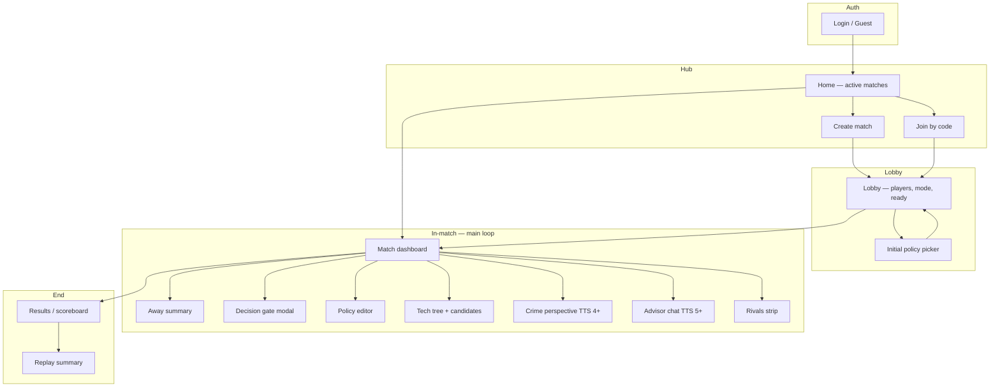
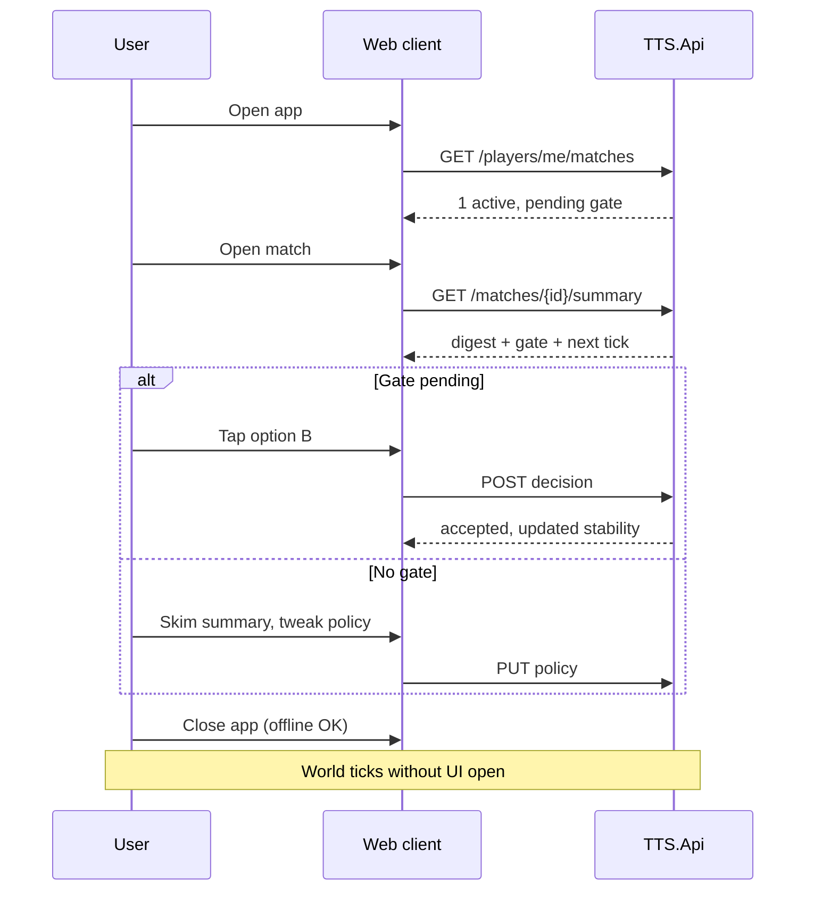

# UI Design — Async Match Client

**Project:** TTS — Technology Tier Simulation  
**Purpose:** Client screens and UX for 8h–48h async matches  
**Status:** MVP in progress — `TTS.Web` (React) + `TTS.Api` (REST) wired to Orleans

**Related:**
- [assets/match-ui-stitch.md](assets/match-ui-stitch.md) — Stitch / AI UI design brief for match dashboard
- [match-modes.md](match-modes.md) — match lengths, lifecycle diagrams
- [async-multiplayer-gameplay.md](async-multiplayer-gameplay.md) — governor gameplay, away summary
- [implementation-plan.md](implementation-plan.md) — Phase 6 API, Phase 9 polish
- [llm-deployment.md](llm-deployment.md) — Ollama vs cloud for internet MP + cost

---

## 1. UI principle

TTS is **not** a map-clicking RTS. The client is a **governor dashboard**:

> Log in → read what happened → answer a crisis if needed → adjust policy → leave.

Most visits are **2–5 minutes**. The UI optimizes for **away summary** and **decision gates**, not continuous map control.

| Optimize for | De-prioritize |
|--------------|---------------|
| Away digest readability | Real-time animation |
| Big, clear gate buttons (A/B/C) | Micromanaging every building |
| Policy sliders / presets | Full 4X map on day one |
| “Next tick in 47m” countdown | WebSocket tick stream |
| Mobile-friendly check-ins | Desktop-only grand map |

---

## 2. What exists today

| Surface | Role | Status |
|---------|------|--------|
| `TTS.Game` console | Dev demo, verbose sim logs | Done |
| `TTS.Agents` CLI | Ollama scenario testing | Done |
| `TTS.Web` React | Player-facing match UI | **MVP** — home, join, dashboard |
| `TTS.Api` REST | Orleans client + match registry | **MVP** |

**Rule:** UI talks to **`TTS.Api`** only. It never embeds `TTS.Core` rules. Same boundary as `IGameToolSurface`.

---

## 3. Recommended stack (phased)

### MVP — thin web app (Phase 6)

| Layer | Choice | Why |
|-------|--------|-----|
| Framework | **React** or **Blazor WASM** | Fast dashboard; team knows .NET → Blazor fits |
| Styling | Tailwind or simple CSS | Governor panels, not heavy game UI |
| API | REST (`TTS.Api`) | Match summary, policy, gate resolve |
| Push | Poll on open + optional web push later | Async genre doesn’t need live sockets |
| Auth | Magic link / OAuth (Steam later) | Low friction for friend matches |

### Later — richer client (Phase 9+)

| Addition | When |
|----------|------|
| WebSocket for gate notifications | After REST MVP stable |
| PWA / mobile wrap | Sprint 8h players on phones |
| 2D map / region view | When regions matter tactically |
| Unity / Godot | Only if tactical map becomes core — **not MVP** |

**Bytro precedent:** HTML5 client across browser + mobile with one account. TTS can follow the same path with a **dashboard-first** shell.

---

## 4. Screen map



---

## 5. Core screens (MVP)

### 5.1 Home

**Purpose:** See all your matches at a glance.

```
┌─────────────────────────────────────────────┐
│  TTS — Technology Tier Simulation           │
├─────────────────────────────────────────────┤
│  [ + Create match ]    [ Join with code ]   │
│                                             │
│  ACTIVE                                     │
│  ┌─────────────────────────────────────┐   │
│  │ Sprint 8h · Tick 4/8 · 4h elapsed    │   │
│  │ Aurora Collective · TTS 4            │   │
│  │ ⚠ 1 decision pending (1h 12m left)   │   │
│  │ [ Open match ]                       │   │
│  └─────────────────────────────────────┘   │
│                                             │
│  ENDED                                      │
│  Standard 36h — 2nd place — [ Results ]    │
└─────────────────────────────────────────────┘
```

**API:** `GET /players/me/matches`

---

### 5.2 Lobby

**Purpose:** Join, pick slot, set policy, ready up.

| Element | Behavior |
|---------|----------|
| Mode badge | Sprint 8h / Standard 36h |
| Player slots | 2–8, empty slots visible |
| Join code | Copy/share |
| Policy preset | Balanced, TechRush, StabilityFirst, … |
| Branch weights | Collapsed “Advanced” panel |
| Ready toggle | Host starts when min ready |

**API:** `POST /matches`, `POST /matches/{id}/join`, `PUT .../policy`, `POST .../ready`

---

### 5.3 Match dashboard (main screen)

**Purpose:** Single screen for 90% of check-ins.

```
┌─────────────────────────────────────────────┐
│ Sprint 8h          Tick 4/8    ⏱ 47m to tick │
├─────────────────────────────────────────────┤
│  Aurora Collective · TTS 4 · Stability 64  │
│  ████████░░ Political  ██████░░ Economic     │
│                                             │
│  ⚠ DECISION REQUIRED          expires 1:12  │
│  ┌─────────────────────────────────────┐   │
│  │ Crime & digital governance (TTS 4)  │   │
│  │ [A] Regulate surveillance           │   │
│  │ [B] Accelerate smart cities         │   │
│  │ [C] Isolate networks (default)      │   │
│  └─────────────────────────────────────┘   │
│                                             │
│  WHILE YOU WERE AWAY (2 ticks)        [▼]   │
│  · Researched: Digital Computing            │
│  · Crime pressure: 64.9 (California)        │
│  · Iron Dominion reached TTS 4              │
│                                             │
│  [ Policy ]  [ Tech tree ]  [ Rivals ]      │
└─────────────────────────────────────────────┘
```

**Priority layout:**
1. **Pending gate** — top, impossible to miss
2. **Away summary** — collapsed/expanded
3. **Civ vitals** — tier, stability bars
4. **Next tick** — countdown
5. **Secondary tabs** — policy, tech, rivals, advisor

**API:** `GET /matches/{id}/summary` (includes gate + digest)

---

### 5.4 Decision gate (modal or inline)

**Purpose:** Structured choices only — no free text.

| Field | UI |
|-------|-----|
| Title | Crisis name |
| Briefing | 2–3 sentences (LLM narration optional Phase 8) |
| Options | Large buttons A / B / C |
| Impact hint | One line per option (“stability +3, risk +1”) |
| Timer | Countdown to default |
| Default badge | Mark which option applies on timeout |

**API:** `POST /matches/{id}/civs/{civId}/decisions/{gateId}`

---

### 5.5 Policy editor

**Purpose:** Governance stance between crises.

| Control | Maps to |
|---------|---------|
| Preset dropdown | `CivilizationPolicy` factory |
| Research stance | Balanced / TechRush / StabilityFirst / Expansionist |
| Risk tolerance | Low / Medium / High |
| Branch weights | Sliders: ai, computing, agriculture, … |

Show **recommended next tech** from `GetPolicyResearchAnalysis` with branch/score breakdown (already in tool surface).

**API:** `PUT /matches/{id}/civs/{civId}/policy`

---

### 5.6 Tech tree (read-heavy)

**Purpose:** Understand path, not click every node.

| Element | Behavior |
|---------|----------|
| Tier columns | TTS 1 → 6 for match scope |
| Researched | Filled nodes |
| Available | Highlighted + “recommended” badge |
| Locked | Grayed prerequisites |
| Detail drawer | Category → branch, fusion tags, risk |

Player **does not** click to research manually in MVP — policy auto-picks. Optional later: “pin this branch” override.

**API:** `GET .../tech-tree`, analysis from tool surface

---

### 5.7 Crime perspective (TTS 4+)

**Purpose:** Surface `crime-data.md` in UI.

| Element | Source |
|---------|--------|
| Region cards | Green Basin → California 2015 |
| Pressure gauge | `CrimePressureIndex` |
| Poverty / violent rate | CSV fields |
| Cybersecurity badge | Mitigation if researched |

Links naturally to **crime decision gate**.

---

### 5.8 Rivals strip

**Purpose:** Multiplayer awareness without full diplomacy UI.

```
Iron Dominion   TTS 4   stability 61   TechRush
Silent Lattice  TTS 3   stability 58   (AI)
```

Diffusion leaks shown in away summary: “Leaked: Digital Computing → Iron Dominion”.

---

### 5.9 Advisor (TTS 5+, Phase 8)

**Purpose:** Ollama/MAF narration — read-only chat.

- Suggested questions: “What should I research?” “Explain the crisis.”
- Replies **never** apply actions without gate/API validation
- Optional: “Propose policy shift” → confirmation dialog

---

### 5.10 Results

**Purpose:** Match end scoreboard.

| Element | Content |
|---------|---------|
| Placement | 1st / 2nd / … |
| Final tier & tech count | Per civ |
| Gate history | Choices vs defaults |
| Timeline | Key ticks recap |
| Rematch CTA | New lobby same mode |

---

## 6. Navigation flow (player)



---

## 7. Notifications (outside the app)

| Channel | When | MVP |
|---------|------|-----|
| **In-app badge** | Pending gate | Yes |
| **Web push** | Gate opened, 30m to expire | Phase 6+ |
| **Email** | Gate + match end | Optional |
| **Webhook** | Civ VI-style custom integrations | Later |

Sprint 8h: **gate + match end only** — not every tick.

---

## 8. Visual direction

| Aspect | Direction |
|--------|-----------|
| **Tone** | Clean sci-fi governance — not medieval Civ |
| **Density** | Card-based dashboard, not cluttered map |
| **Era identity** | Subtle TTS band color shift (TTS 4 cyan data, TTS 5 neural accent) |
| **Typography** | Readable at phone size — numbers matter |
| **Dark mode** | Default — matches “command terminal” fantasy |

Avoid building a **3D galaxy** or **hex map** until gameplay needs territorial clicks.

---

## 9. MVP scope vs later

| MVP (ship with Phase 6 API) | Later |
|-----------------------------|-------|
| Home, lobby, dashboard | 2D region map |
| Gate modal | Real-time WebSocket feed |
| Policy editor | Manual tech pin |
| Simple tech list by tier | Full graph visualization |
| Away summary | Animated turn replay |
| Results screen | Steam login, alliances |
| Mobile-responsive CSS | Native iOS/Android |

**Target:** 5–7 screens, one primary dashboard, shippable in weeks not months.

---

## 10. Project layout (proposed)

```
src/
├── TTS.Core/          # rules (existing)
├── TTS.Api/           # REST (Phase 6)
├── TTS.Web/           # NEW — Blazor WASM or React SPA
│   ├── pages/
│   │   Home.tsx
│   │   Lobby.tsx
│   │   MatchDashboard.tsx
│   │   Results.tsx
│   └── components/
│       AwaySummary.tsx
│       DecisionGate.tsx
│       PolicyEditor.tsx
│       TechTreePanel.tsx
│       StabilityBars.tsx
└── TTS.Game/          # console dev host (keep)
```

Alternative: `TTS.Web` as Vite + React in same solution, deployed as static site to Azure SWA / Cloudflare Pages.

---

## 11. Implementation order

| Step | Depends on | Delivers |
|------|------------|----------|
| 1 | Phase 3–4 | Fake dashboard with mock JSON |
| 2 | Phase 6 API | Real match summary + gate POST |
| 3 | Lobby + create/join | Friend matches |
| 4 | Policy + tech panels | Governor loop complete |
| 5 | Push notifications | Sprint 8h usability |
| 6 | Advisor panel | Phase 8 MAF |

**Do not block API on UI** — mock first, wire when `GET /summary` exists.

---

## 12. Summary

| Question | Answer |
|----------|--------|
| **What is the UI?** | Governor **dashboard**, not RTS map |
| **Main screen?** | Match dashboard — gate + away summary + countdown |
| **Mobile?** | Yes — responsive web first; native wrap later |
| **Unity?** | Not for MVP — API + thin web proves the match loop |
| **When to build?** | After Phase 3 gates + Phase 4 match config; parallel mock UI OK now |

The UI’s job: make **8h–48h matches** feel like “open app, decide, leave” — same rhythm as Supremacy mobile check-ins, with TTS era cards and crime/AI panels as differentiators.
