# TTS v2 — Design Exploration & Implementation Status

Planning documents for the next evolution of *From Stone to Ascension*: procedural content, optional spatial gameplay, agent-forward pacing, era remigration, and **decision-gate-first** governor UX.

**Last reviewed:** 2026-06 (post M3 / match UI / gate advisor work)

---

## Document index

| Document | Topic | Status |
|----------|-------|--------|
| [decision-gates.md](decision-gates.md) | **Gate gameplay, advisor counsel, LLM fables, v2 roadmap** | **Partial — core shipped, enhancements planned** |
| [agent-integration.md](agent-integration.md) | MAF agents in ticks, advisor API, tools | **Shipped** (TTS 5+ rivals + advisor) |
| [tts4-start.md](tts4-start.md) | Default matches at TTS 4 (Information Age) | **Mostly shipped** — see gaps below |
| [procedural-generation.md](procedural-generation.md) | Seeded worlds, names, regions | **Partial — generator + seed live** |
| [hex-map.md](hex-map.md) | Hex grid, territory, procedural terrain | **Partial — M3 foundation, light gameplay** |
| [architecture-overview.md](../architecture-overview.md) | Technical + gameplay diagrams | Reference |
| [player-experience.md](../player-experience.md) | Async governor UX | Reference (UI largely aligned) |
| [current-state.md](../current-state.md) | Day-to-day dev commands | May lag behind test count |

---

## v2 implementation snapshot

High-level view of what landed in code versus what remains design-only.

```mermaid
flowchart LR
    subgraph shipped [Shipped in repo]
        A1[DecisionGateSystem]
        A2[TTS 4 default start]
        A3[ProceduralWorldGenerator]
        A4[Hex map M3]
        A5[Gate advisor + UI]
        A6[MAF rivals + advisor]
        A7[Orleans + JSON persistence]
    end

    subgraph partial [Partial / in progress]
        P1[Gate fables in UI]
        P2[Region-scoped gate effects]
        P3[Territorial gameplay weight]
        P4[Procedural gate copy]
    end

    subgraph planned [Planned]
        PL1[Gate chains]
        PL2[Hex border gates]
        PL3[LLM gate variants]
        PL4[Multiplayer gate notify]
    end

    shipped --> partial --> planned
```



### By theme

| Theme | Shipped | Partial | Planned |
|-------|---------|---------|---------|
| **Decision gates** | 6 gate types, blocking research, timeout defaults, hero UI, gate counsel advisor, API resolve | Fables in hero card, region crime wiring, gate queue UX | Chains, hex gates, procedural crises, diplomacy gates |
| **TTS 4 start** | Default modes at TTS 4, `InformationAgeTechSpine`, prior-era tech grant, crime from tick 0 | UI “historical tiers collapsed” in tech tree | Tutorial TTS 1 onboarding mode polish |
| **Procedural worlds** | `WorldSeed`, `ProceduralWorldGenerator`, seeded names/regions/factions | Crime CSV still anchored to state pools | Fusion tech gen, procedural events (Phase 7) |
| **Hex map** | Models, generator, bootstrap, claim API, `HexMapView`, left panel | Biome legend, selection meta | Yield → economy, border gates, victory hooks |
| **Agents / LLM** | Rival turns TTS 5+, advisor, gate fables (Ollama), rate limits | Cloud provider prod path | Narrative pipelines for procedural gates |
| **Multiplayer / ops** | Orleans grain, recovery service, atomic saves, `./dev.sh` | Match list perf tuned | Cluster persistence, OTel |

---

## Suggested reading order

1. **[decision-gates.md](decision-gates.md)** — primary agency loop and what to build next  
2. **[agent-integration.md](agent-integration.md)** — how LLM sits outside the sim  
3. **[tts4-start.md](tts4-start.md)** — why matches begin in the Information Age  
4. **[procedural-generation.md](procedural-generation.md)** — seeded worlds (update: much of §1 is now superseded by `ProceduralWorldGenerator`)  
5. **[hex-map.md](hex-map.md)** — spatial layer (update: §1 “no map” is outdated — see M3)  

---

## Quick dev entry

```bash
./dev.sh
# UI http://localhost:5173 — create match, resolve demo crime gate, open gate counsel advisor
dotnet test src/TTS.Tests/TTS.Tests.csproj --filter "FullyQualifiedName~Gate"
```

---

## Notes for doc maintainers

- When a v2 doc’s **Status** header disagrees with this README, prefer **code** and update the doc header.  
- `procedural-generation.md` and `hex-map.md` still describe pre-M3 reality in places — cross-link here for current status until those files are refreshed.  
- Gate gameplay details live in **[decision-gates.md](decision-gates.md)** — keep that file authoritative for gates.
