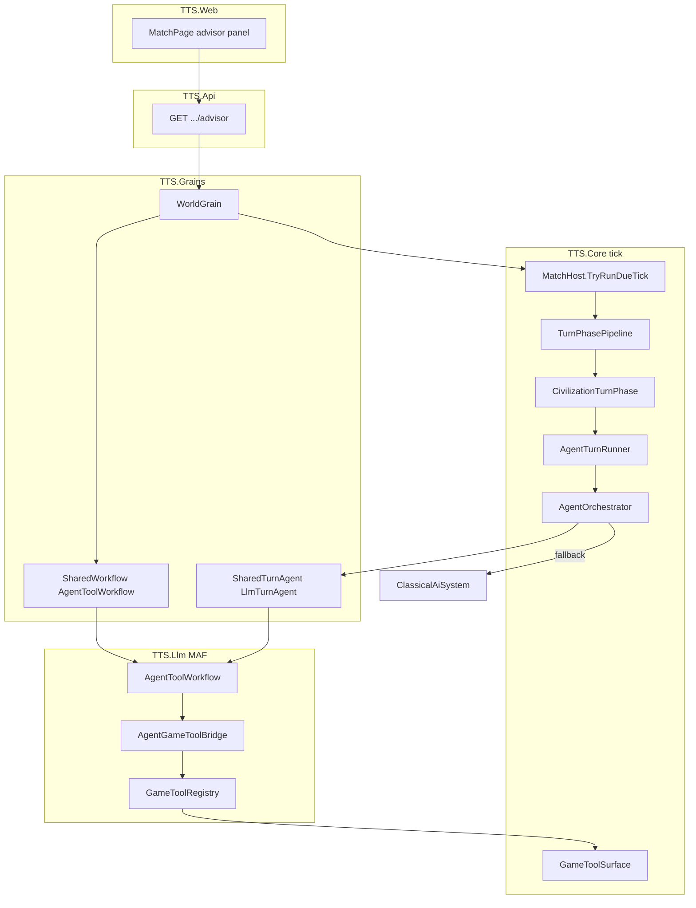

# LLM Agent Integration — Gameplay Architecture

**Project:** TTS — Technology Tier Simulation  
**Status:** Implemented (live in `TTS.Llm` + `WorldGrain`)  
**Related:** [agent-framework-integration.md](../agent-framework-integration.md) · [ollama-scenarios.md](../ollama-scenarios.md) · [llm-deployment.md](../llm-deployment.md) · [tts4-start.md](tts4-start.md)

---

## Executive summary

LLM agents are **not** the simulation. `TTS.Core` stays authoritative: all state changes go through `GameToolSurface` → validation → systems. Microsoft Agent Framework (MAF) runs **tool loops** that read game state and propose actions; the engine accepts or rejects them.

Agents integrate in **two gameplay paths**:

| Path | Trigger | Who | Tier gate |
|------|---------|-----|-----------|
| **Rival auto-turn** | Match tick (async timer) | Non-player civs | TTS 5+ |
| **Strategic advisor** | Player clicks Refresh | Player civ | TTS 5+ |

Narrative-only LLM (gate fables, crisis flavor) uses simple `OllamaClient` chat — **no tools** — and is out of scope for this document.

---

## 1. Stack overview



### Key files

| Layer | File | Role |
|-------|------|------|
| Provider wiring | `src/TTS.Llm/AgentProviderFactory.cs` | Creates `LlmTurnAgent` + `AgentToolWorkflow` from `TTS_LLM_PROVIDER` |
| MAF workflow | `src/TTS.Llm/AgentToolWorkflow.cs` | Rival turn + advisor sessions via `ChatClientAgent` |
| Tool bridge | `src/TTS.Llm/AgentGameToolBridge.cs` | `GameTool` enum → MAF `AIFunction` |
| Tool registry | `src/TTS.Llm/Tools/GameToolRegistry.cs` | Schemas + dispatch to `IGameToolSurface` |
| Simulation API | `src/TTS.Core/Agents/GameToolSurface.cs` | Authoritative read/write surface |
| Turn orchestration | `src/TTS.Core/Agents/AgentOrchestrator.cs` | LLM first, classical fallback |
| Tick runner | `src/TTS.Core/Simulation/AgentTurnRunner.cs` | Non-player civs at TTS 5+ |
| Turn pipeline | `src/TTS.Core/Simulation/TurnPhases.cs` | `CivilizationTurnPhase` picks runner |
| Grain | `src/TTS.Grains/WorldGrain.cs` | Injects agent into match; advisor endpoint |
| API | `src/TTS.Api/Program.cs` | `GET /api/matches/{id}/civs/{civId}/advisor` |
| UI | `src/TTS.Web/src/pages/MatchPage.tsx` | Advisor panel at TTS 5+ |
| Offline test | `src/TTS.Agents/Scenarios/*.cs` | Same workflows without a live match |

---

## 2. Rival auto-turn (tick integration)

### When it runs

Each due tick: `WorldGrain.AdvanceTickIfDueAsync` → `MatchHost.TryRunDueTick` → `TurnPhasePipeline.CreateDefault` → phases in order. **`CivilizationTurnPhase`** runs once per civilization.

### Runner selection

Two `ICivilizationTurnRunner` implementations are registered (order matters — first match wins):

| Runner | `CanHandle` |
|--------|-------------|
| `AgentTurnRunner` | `!IsPlayerControlled` **and** `CurrentTier >= EarlyAI` (TTS 5) |
| `ClassicalAiTurnRunner` | `IsPlayerControlled` **or** `CurrentTier < TTS 5` |

So **Iron Dominion** uses the agent path at TTS 5+; **Aurora Collective** (player) always uses classical auto-policy on ticks.

### Agent turn flow

1. `AgentOrchestrator.RunTurn` checks tier and `ILlmTurnAgent.IsEnabled`.
2. `LlmTurnAgent.TryRunTurn` applies **rate limit** (`AgentRateLimiter`) and **timeout** (`AgentSessionLimits`).
3. `AgentToolWorkflow.RunCivilizationTurnAsync` builds MAF agent with game tools.
4. Model calls tools in two phases (prompted): optional diplomacy → required research.
5. `propose_research` / `propose_diplomatic_action` mutate world through `GameToolSurface` if valid.
6. On failure, timeout, rate limit, or `TTS_LLM_PROVIDER=none` → **classical AI** researches by policy.

### What changes in the match

- Rival may **research a technology** (visible in away summary, rival card, tech progress).
- Rival may **queue diplomacy** toward player or other civs.
- Turn history records research decisions (`TurnResearchDecision`).

### What blocks agents

- **Pending decision gates** — `CivilizationTurnPhase` skips research for that civ until the gate is resolved.
- **Per-tick LLM cap** — default 2 calls per match per tick (shared with advisor).

---

## 3. Strategic advisor (player integration)

### When it runs

On demand — not on ticks. Player at **TTS 5+** opens match dashboard → **Strategic advisor** → **Refresh**.

### Request path

```
MatchPage → GET /api/matches/{matchId}/civs/{civId}/advisor
         → WorldGrain.GetAdvisorBriefingAsync
         → AgentToolWorkflow.RunAdvisorBriefingAsync (read-only tools)
```

### Tool mode

`GameToolRegistry` is constructed with `readOnly: true` — write tools (`propose_research`, diplomacy, etc.) are excluded from the schema.

### Response sources (`GrainAdvisorBriefing.source`)

| Source | Meaning |
|--------|---------|
| `system` | Below TTS 5 — panel locked |
| `classical` | LLM disabled — policy analysis text only |
| `rate-limit` | Too many LLM calls this tick |
| `llm-tools` | MAF advisor succeeded |
| `fallback` | LLM call failed |

Advisor text is **flavor and guidance only** — it does not advance the match.

---

## 4. Game tools (agent ↔ simulation contract)

Defined in `GameTool` enum (`src/TTS.Core/Agents/GameTool.cs`):

| Tool | Read/Write | Gameplay effect |
|------|------------|-----------------|
| `get_civilization_state` | Read | Stability, tier, tech list |
| `get_faction_tensions` | Read | Internal politics |
| `get_available_technologies` | Read | Valid research options |
| `get_policy_research_analysis` | Read | Ranked candidates vs policy |
| `get_global_events` | Read | Active crises |
| `get_pending_decisions` | Read | Blocking gates |
| `propose_research` | Write | Research if valid (once per turn) |
| `propose_diplomatic_action` | Write | Queue diplomacy |
| `set_research_priority` | Write | Branch weights (TTS 5+) |

The simulation **always** validates writes. Agents cannot invent tech IDs or bypass gates.

---

## 5. Configuration (dev & deploy)

Set in `dev.sh` or process environment (never commit secrets):

| Variable | Default | Purpose |
|----------|---------|---------|
| `TTS_LLM_PROVIDER` | `ollama` | `ollama` \| `openai` \| `gemini` \| `none` |
| `OLLAMA_BASE_URL` | `http://localhost:11434` | MAF uses `/v1` OpenAI-compatible path |
| `OLLAMA_MODEL` | `llama3.2` | Model id |
| `OPENAI_API_KEY` / `GEMINI_API_KEY` | — | Cloud providers |
| `TTS_LLM_TURN_TIMEOUT_SEC` | `20` | Rival turn timeout |
| `TTS_LLM_ADVISOR_TIMEOUT_SEC` | `25` | Advisor timeout |
| `TTS_LLM_MAX_TOOL_ROUNDS` | `5` | MAF tool iterations |
| `TTS_LLM_MAX_TOOL_CALLS` | `12` | Tools per session |
| `TTS_LLM_MAX_CALLS_PER_TICK` | `2` | Rate limit per match tick |

`WorldGrain` reads env at activation and passes `LlmTurnAgent` into `MatchHost.CreateNew` / `Load`.

---

## 6. Testing without a full match

With Ollama running:

```bash
export TTS_LLM_PROVIDER=ollama
dotnet run --project src/TTS.Agents -- rival-turn   # diplomacy + research tools
dotnet run --project src/TTS.Agents -- advisor     # read-only advisor
dotnet run --project src/TTS.Agents -- list
```

Scenarios use `ScenarioWorldBuilder.CreateEarlyAiCrisis()` — pre-loaded at TTS 5.

In-game: create match → research to TTS 5 → advance ticks (rivals) or Refresh advisor (player).

---

## 7. Design rules (do not break)

1. **Core never calls LLM** — only `TTS.Llm` / `WorldGrain` advisor path.
2. **Tools are the only write path** for agent actions.
3. **Classical fallback** must work when LLM is off (MP cost, offline dev).
4. **Player civ** is not LLM-auto on ticks today — player uses gates, policy, and UI; advisor is optional.
5. **Rate limits** protect tick latency in async multiplayer.

---

## 8. Future (v2 alignment)

See [tts4-start.md](tts4-start.md): starting matches at **TTS 4** would put players one tier away from advisor + rival agents, making agent integration visible within the first few ticks of a sprint match instead of after a long TTS 1→5 climb.
