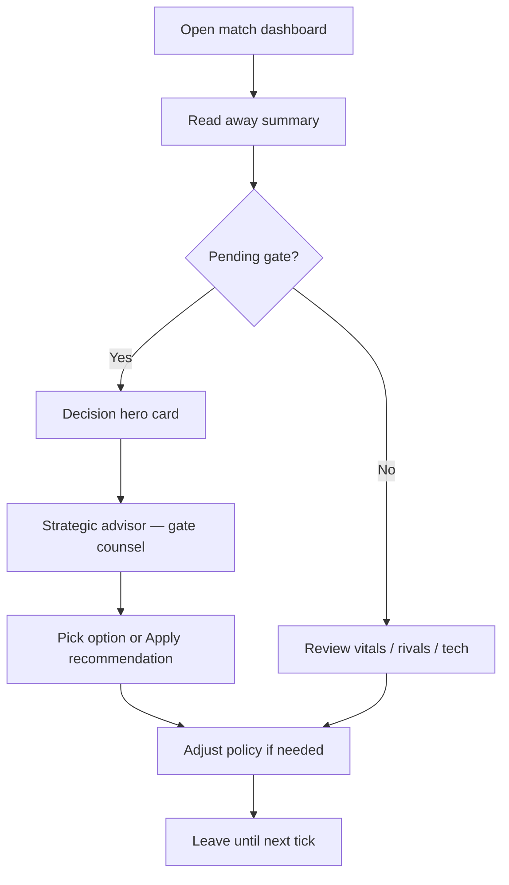
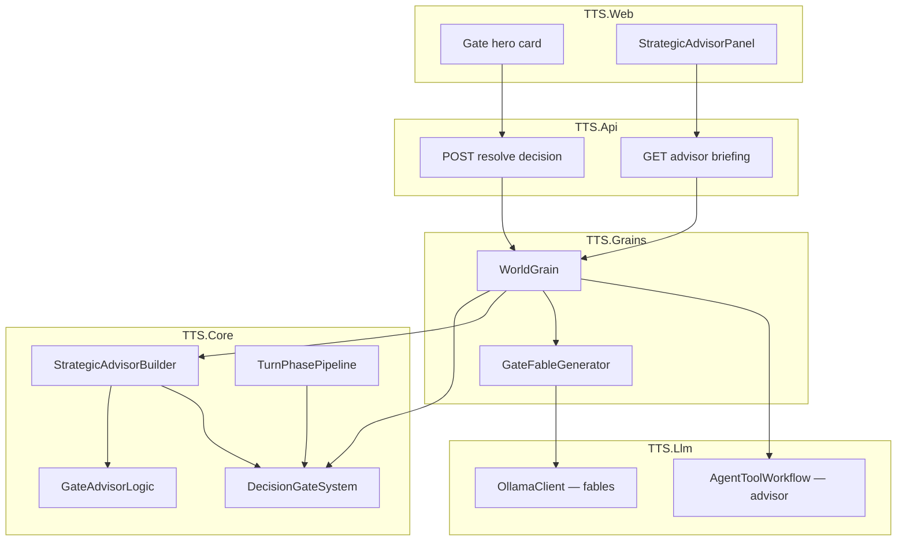

# Decision Gates — Gameplay Design & v2 Status

**Project:** TTS — Technology Tier Simulation  
**Status:** Core loop **shipped** · v2 enhancements **in progress / planned**  
**Related:** [async-multiplayer-gameplay.md](../async-multiplayer-gameplay.md) · [player-experience.md](../player-experience.md) · [agent-integration.md](agent-integration.md) · [tts4-start.md](tts4-start.md) · [procedural-generation.md](procedural-generation.md) · [hex-map.md](hex-map.md) · [assets/match-ui-stitch.md](../assets/match-ui-stitch.md)

---

## Executive summary

**Decision gates** are the primary moment of player agency in TTS. Matches run on a schedule while the governor is away; when you return, gates are the questions that only you can answer. Everything else — research, diffusion, crime drift, rival turns — runs through policy and systems.

The v2 direction is to make gates **more visible, more narratively rich, and more tightly coupled to counsel** (classical + LLM advisor), while expanding *when* and *where* gates fire (regions, hex tiles, procedural crises) without turning the game into per-tick micromanagement.

---

## 1. Design pillars

| Pillar | Meaning for gates |
|--------|-------------------|
| **Async governor loop** | One gate check-in should take seconds; deadline creates urgency |
| **Progress vs stability** | Options trade short-term calm for long-term power (and vice versa) |
| **Era identity** | Crime / alignment gates at TTS 4+; faction gates at lower tiers |
| **Simulation authority** | Gates apply deterministic effects in `TTS.Core`; LLM adds flavor only |
| **Blocking research** | An unresolved gate pauses auto-research for that civ — stakes are real |

### Player loop (gates highlighted)



---

## 2. Gate types (authoritative)

Defined in `GateType` (`src/TTS.Core/Models/DecisionGate.cs`). Opened by `DecisionGateSystem.ScanAfterTurn` after each tick (one new gate per civ per scan, priority order below).

| Type | Typical trigger | Options (template) | Blocks research |
|------|-----------------|-------------------|---------------|
| **ForbiddenTech** | Forbidden tech available, config enabled | Pursue / Ban / Delay | Yes |
| **TierAdvancement** | Civ reached new TTS band | Embrace / Regulate / Delay | Yes |
| **GlobalCrisis** | Active global event impacts civ | Regulate / Accelerate / Isolate | Yes |
| **FactionCrisis** | Faction tension ≥ threshold | Appease / Suppress / Reform | Yes |
| **CrimePressure** | Region crime pressure ≥ 65 (TTS 4+) | Invest / Ignore / Crackdown | Yes |
| **AiAlignment** | TTS 5+ alignment pressure | Align / Contain / Merge | Yes |

**Scan priority** (first match wins): Forbidden → Tier → Global crisis → Faction → Crime.

**Timeout:** `MatchConfig.DecisionWindow` (e.g. 12h standard, 2m dev). Overdue gates auto-resolve with `DefaultOptionId` at tick start (`ExpireGates`).

---

## 3. What is implemented today

### 3.1 Core simulation ✅

| Capability | Location | Notes |
|------------|----------|-------|
| Gate model + options | `DecisionGate.cs`, `GateOptionTemplates.cs` | Immutable option prototypes |
| Open / resolve / expire | `DecisionGateSystem.cs` | Stability effects per option |
| Research block | `TurnPhases.cs` → `CivilizationTurnPhase` | Skips auto-research while gate pending |
| API resolve | `POST .../decisions/resolve` | Via `WorldGrain` / `MatchHost` |
| Persistence | `MatchPersistence.cs` | Pending gates saved per civ |
| Away summary | `AwaySummaryBuilder.cs` | Missed gates listed with defaults applied |
| Demo gate on create | `SampleWorldFactory.AttachDemoGate` | Crime gate at TTS 4 start; faction gate at TTS 1 |

### 3.2 TTS 4 default start ✅ (v2 remigration)

Modern modes start at **Information Age** with prior-era tech pre-researched and a curated TTS 4 spine. Demo gates are **crime / digital governance** flavored, aligned with CSV city data.

See [tts4-start.md](tts4-start.md) · `InformationAgeTechSpine.cs`.

### 3.3 UI ✅

| Surface | Location | Role |
|---------|----------|------|
| **Decision hero card** | `MatchPage.tsx`, `match-ui.css` | Amber gradient, countdown, 3-column actions |
| **Gate counsel panel** | `StrategicAdvisorPanel.tsx` | Gate-first advisor when pending |
| **Apply recommendation** | Same panel | One-click resolve via advisor pick |
| Layout priority | [match-ui-stitch.md](../assets/match-ui-stitch.md) | Gates above command strip |

### 3.4 LLM narrative (flavor only) ✅

| Feature | Location | Notes |
|---------|----------|-------|
| Gate fables | `GateFableGenerator.cs`, `WorldGrain` | Ollama rewrites briefing text; era-aware tone |
| Enrichment rules | `GateFableGenerator.ShouldEnrich` | Crime gates from TTS 4+; tier-aware sci-fi vs historical |
| Not in hot path | Removed from `GetStatusAsync` | Prevents API timeouts; enrich async/on-demand |

LLM **never** applies gate outcomes — only `DecisionGateSystem.Resolve`.

### 3.5 Strategic advisor ↔ gates ✅

| Feature | Location | Notes |
|---------|----------|-------|
| Gate-focused classical counsel | `GateAdvisorLogic.cs` | Recommends option from policy + stability + crime |
| Briefing structure | `StrategicAdvisorBriefing` + API `gateFocus` | Per-option stance: recommended / caution / neutral |
| LLM advisor prompt | `AgentToolWorkflow.cs` | Requires pending-gate analysis at TTS 5+ |
| Tests | `GateAdvisorLogicTests.cs` | Crime demo gate → Invest under stability-first |

---

## 4. Gameplay effects (current)

Effects are **direct stability adjustments** (and forbidden-tech pursue/ban). They do not yet modify region crime scalars, hex ownership, or faction stance enums in all paths — see v2 gaps below.

**Example — CrimePressure:**

| Option | Effect (today) |
|--------|----------------|
| Invest | Econ −2, Tech +3 |
| Ignore | Pol −3 |
| Crackdown | Pol +2, Econ −2 |

**Example — ForbiddenTech pursue:** runs full `ResearchExecutor` on the gated technology (may trigger forbidden instability).

---

## 5. v2 vision — improving gates & gameplay

### 5.1 Near term (next slices)

| Initiative | Gameplay impact | Status |
|------------|-----------------|--------|
| **Region-scoped crime gates** | Title names the city; Invest reduces *that* region's crime pressure | Planned — gate opens with region context; `ApplyCrimePressure` still civ-wide |
| **Fable in UI** | Show LLM `gate.Fable` in hero card when present | Partial — model field exists; UI often shows `description` only |
| **Gate history log** | Match log lines per resolution with option + auto-resolve flag | Partial — `GateResolutionRecord` recorded; UI log could surface more |
| **Multiple gate queue UX** | Clear “1 of N pending” when backlog exists | Planned — system allows list; scan opens one per tick |
| **Rival gate visibility** | Spectator / intel panel: “Iron Dominion faces alignment crisis” | Planned |

### 5.2 Medium term (procedural + narrative)

| Initiative | Gameplay impact | Depends on |
|------------|-----------------|------------|
| **Procedural gate titles** | Seeded crises tied to world seed, civ name, region | [procedural-generation.md](procedural-generation.md) |
| **LLM gate variants** | Generate option *flavor* and impact hints; engine still validates IDs | MAF content pipeline (Phase 7) |
| **Gate chains** | “Delay” on forbidden tech → stronger gate later | `OfferedGateKeys` + new scan rules |
| **Policy ↔ gate synergy** | Stability-first policy shifts advisor default on faction gates | Extend `GateAdvisorLogic` |

### 5.3 Long term (spatial + multiplayer)

| Initiative | Gameplay impact | Depends on |
|------------|-----------------|------------|
| **Hex-adjacent claim gates** | “Border incident — escalate or cede?” | [hex-map.md](hex-map.md) territorial weight |
| **Multiplayer gate timing** | Per-player decision windows; notify via push/email (product) | Orleans + registry |
| **Diplomatic gates** | Joint decisions between civs (trade, non-aggression) | Agent tools + new `GateType` |

### 5.4 Explicit non-goals (v2)

- Gates that require map micro every tick  
- LLM choosing outcomes without passing through `Resolve`  
- More than three options per gate (keep A/B/C readable on mobile)

---

## 6. Architecture



**Rule:** `TTS.Core` owns truth. Advisor recommends; player (or timeout) resolves.

---

## 7. Key files

| Area | Path |
|------|------|
| Gate model | `src/TTS.Core/Models/DecisionGate.cs` |
| System | `src/TTS.Core/Systems/DecisionGateSystem.cs` |
| Option templates | `src/TTS.Core/Systems/GateOptionTemplates.cs` |
| Advisor logic | `src/TTS.Core/Systems/GateAdvisorLogic.cs` |
| Briefing builder | `src/TTS.Core/Systems/StrategicAdvisorBuilder.cs` |
| Fables | `src/TTS.Llm/GateFableGenerator.cs` |
| Grain | `src/TTS.Grains/WorldGrain.cs` |
| UI | `src/TTS.Web/src/pages/MatchPage.tsx`, `StrategicAdvisorPanel.tsx` |
| Tests | `src/TTS.Tests/DecisionGateTests.cs`, `GateAdvisorLogicTests.cs`, `GateFableTests.cs` |

---

## 8. Suggested implementation order

1. **Surface fables in hero card** — use `DisplayText` / fable field when enriched  
2. **Wire crime gates to region crime scalar** — context already in gate title for TTS 4+  
3. **Gate queue indicator** — `pendingGates.length` in HUD + advisor  
4. **Procedural gate copy** — seed-driven titles from `WorldGenerationOptions`  
5. **Hex border gates** — only after territorial mechanics affect stability/economy  

---

## 9. Testing

```bash
dotnet test src/TTS.Tests/TTS.Tests.csproj --filter "FullyQualifiedName~Gate"
```

Covers resolution, templates, fable enrichment rules, advisor gate focus, and demo gate attachment.

---

## 10. Document map

| Question | Read |
|----------|------|
| Why gates exist in async MP | [async-multiplayer-gameplay.md](../async-multiplayer-gameplay.md) |
| Check-in priority | [player-experience.md](../player-experience.md) |
| LLM rival turns vs advisor | [agent-integration.md](agent-integration.md) |
| TTS 4 start + crime gates | [tts4-start.md](tts4-start.md) |
| UI wireframe | [match-ui-stitch.md](../assets/match-ui-stitch.md) |
