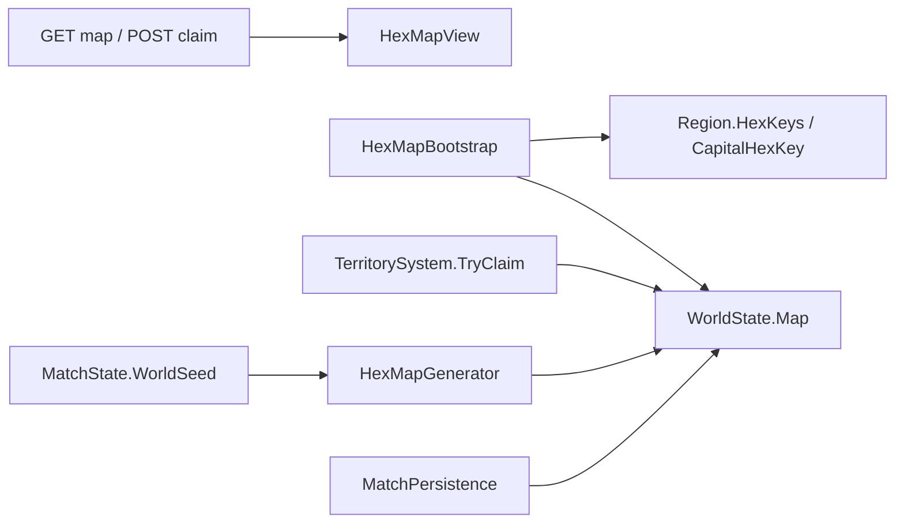
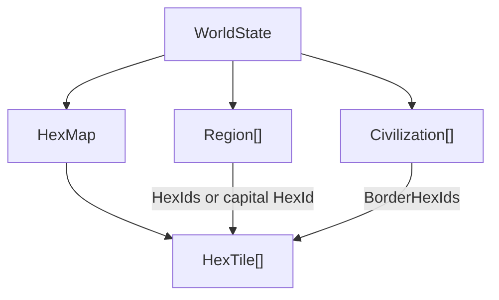
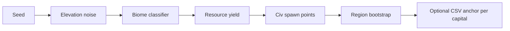
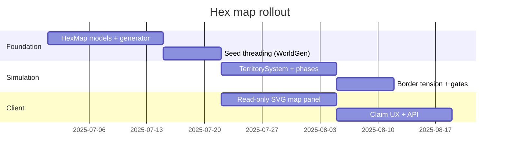

# Hex Map — Design & Integration

**Project:** TTS — Technology Tier Simulation  
**Status:** **Partial — M3 foundation shipped (v2b/v2c lite)** · economy/victory hooks still planned  
**Related:** [procedural-generation.md](procedural-generation.md) · [README.md](README.md) · [ui-design.md](../ui-design.md) · [economy.md](../economy.md) · [orleans-integration.md](../orleans-integration.md)

---

## Executive summary

**Shipped (M3):** Every new match gets a **seeded hex planet** (`HexMapGenerator` + value noise biomes). Civs spawn with **4-hex capital clusters** linked to existing `Region` records (`CapitalHexKey`, `HexKeys`). The match UI shows an interactive **`HexMapView`** in the left territory panel; players can **claim adjacent neutral land** via `TerritorySystem` and `POST /api/matches/{id}/territory/claim`. Map state persists in match saves.

**Still light:** Tile `ResourceYield` nudges region `Resources` at bootstrap only — it does **not** drive per-tick economy or victory. No units, fog, border gates, or territorial win conditions. Regions remain the **simulation unit** for crime, growth, and gates; the map is geography + expansion clicks.

**Historical note:** Pre-M3, TTS had no spatial layer (city cards only). §1 below describes that baseline and why a map was deferred.

---

## 0. Shipped (M3 / current)

| Capability | Location | Notes |
|------------|----------|-------|
| `HexMap`, `HexTile`, `Biome`, axial coords | `Models/HexMap.cs` | `Q,R` keys; 9 biomes |
| Value-noise terrain | `Systems/HexMapGenerator.cs` | Elevation + moisture → biome + yield |
| Map size | `HexMapGenerationOptions.ForMatch` | 18×14 (dev blitz), 24×18 (≤4 players), 30×22 (larger) |
| Bootstrap | `Simulation/HexMapBootstrap.cs` | Called from `SampleWorldFactory`; uses `MatchState.WorldSeed` |
| Region linkage | `Region.CapitalHexKey`, `Region.HexKeys` | Capital cluster avg yield → initial `Resources` |
| `WorldState.Map` | `WorldState` | Serialized in match persistence |
| Territory claims | `TerritorySystem` | Adjacent to owned land; land only; updates tile + region hex list |
| API | `GET /api/matches/{id}/map`, `POST .../territory/claim` | DTOs in `MatchDtos.cs` |
| UI | `HexMapView.tsx`, `MatchPage.tsx` territory panel | Select hex, claim, biome legend, capital markers |

### Current data flow



### Gameplay scope today

| Works | Not yet |
|-------|---------|
| View owned vs neutral hexes | Yield → per-tick economy |
| Claim one hex at a time (adjacency rule) | Border conflict / military |
| Biome + yield in tile tooltip | Decision gates for disputes |
| Persist claims across reload | Territorial victory |
| Dashboard + map side-by-side | Replace region cards with map-only UX |

### Key files

| File | Role |
|------|------|
| `HexMapGenerator.cs` | Procedural planet from seed |
| `HexMapBootstrap.cs` | Spawn clusters per civ, wire regions |
| `TerritorySystem.cs` | Claim validation + ownership |
| `MatchHost.ClaimTerritory` | Host entry; saves after claim |
| `WorldGrain.GetHexMapAsync` / `ClaimTerritoryAsync` | Orleans surface |
| `HexMapTests.cs`, `MatchFlowTests.ClaimTerritory_PersistsAcrossReload` | Adjacency + persistence |

---

## 1. Pre-M3 baseline (historical)

### Domain model (before hex layer)

`Region` (`src/TTS.Core/Models/Region.cs`) has:

| Field | Purpose |
|-------|---------|
| `Id`, `Name` | Identity |
| `Population`, `Resources`, `Infrastructure` | 0–100 scalars |
| `ControllingCivilizationId` | Owner |
| `CrimeProfile` | TTS 4+ CSV-backed socioeconomic data |

**Missing before M3 (now partially addressed — see §0):** coordinates were absent; today tiles have `Q,R`, neighbors via `HexCoordKey`, biome, elevation, yield, owner.

### UI before M3

`TTS.Web` rendered regions as **city cards** only. **M3 adds** the territory panel + `HexMapView`; city cards remain on the dashboard.

### Design intent (unchanged)

| Doc | Position |
|-----|----------|
| `ui-design.md` | Dashboard-first; 2D region map is **Phase 9+** |
| `economy.md` | Cities are socioeconomic units; CSV anchors are explicit in UI |
| `async-multiplayer-gameplay.md` | "Expansionist" policy references "map pressure" conceptually — not implemented |
| `orleans-integration.md` | `RegionGrain` planned for scale; regions can live in civ grain early on |
| `company-sim.md` | Separate game explicitly has "No map — cards and numbers" |

### What would break if we added a map naively

- `SampleWorldFactory` assigns exactly 2 regions with fixed names and CSV anchors
- `EconomySystem` / `CrimeSystem` assume region scalars, not tile yields
- `MatchRegistry` hardcodes 2 civ slots
- Victory conditions are tier + stability — no territorial domination
- Agent tools (`GameToolSurface`) expose regions by ID, not by map position

---

## 2. When does a hex map earn its place?

Introduce a hex layer only when gameplay **requires territorial decisions** the dashboard cannot express:

| Trigger | Example gameplay |
|---------|------------------|
| **Expansion** | Claim neutral hexes, border friction between civs |
| **Resource geography** | Oil on desert tiles, rare metals in mountains — not abstract `Resources` scalar |
| **Military / conquest** | Units, sieges, chokepoints (even abstract "army strength per border") |
| **Infrastructure routing** | Roads/rails across tiles; TTS 3+ grid bonuses |
| **Environmental crises** | Floods, droughts, pollution spreading by tile |
| **Player expectation** | "Expansionist" stance needs a map to click |

**Do not add a hex map for:**

- Visual flair alone (dashboard cards suffice for TTS 1–4 governor loop)
- Replacing the async 2–5 minute check-in UX
- Duplicating Civ VI on day one

### Recommended tier gate

| Phase | Spatial layer | Status |
|-------|---------------|--------|
| **MVP** | None — city cards | Superseded for new matches |
| **v2a — Abstract graph** | `Region.NeighborIds` only | Not built |
| **v2b — Read-only hex map** | Generated planet, colored by owner | **Shipped (M3)** — `HexMapView` |
| **v2c — Territorial play** | Claim, expand, border conflict | **Partial (M3)** — claim API; no conflict gates |
| **v2d — Map drives sim** | Yield → economy, border events, victory | Planned |

Align **v2d** with economy integration and optional territorial win modes.

---

## 3. Proposed architecture

### 3.1 Layered model — map under regions

Keep `Region` as the **simulation unit** (city/economic hub). Add a separate **hex grid** that regions anchor to or aggregate from.



**Principle:** Hex tiles hold **geography** (biome, yield, owner, improvements). Regions hold **governance** (population, crime, infrastructure). A region may span multiple hexes; a hex may be unclaimed wilderness.

### 3.2 Types — **implemented** (see `Models/HexMap.cs`)

```csharp
public sealed class HexMap
{
    public int Width { get; init; }
    public int Height { get; init; }
    public int Seed { get; init; }
    public List<HexTile> Tiles { get; init; }
}

public sealed class HexTile
{
    public int Q { get; }
    public int R { get; }
    public Biome Biome { get; set; }
    public double Elevation { get; set; }
    public double ResourceYield { get; set; }
    public string? ControllingCivilizationId { get; set; }
    public string? RegionId { get; set; }
}

public readonly record struct HexCoord(int Q, int R);
// Neighbors via HexCoordKey.Neighbors(q, r)
```

### 3.3 Extend `Region` — **shipped**

```csharp
public string? CapitalHexKey { get; set; }   // "q,r"
public List<string> HexKeys { get; }         // controlled hexes in this region
```

Existing saves without hex data: `HexMap` is null; game runs as today.

### 3.4 Extend `WorldState`

```csharp
public HexMap? Map { get; set; }
```

`MatchPersistence` JSON already serializes the full world — new fields persist automatically.

---

## 4. Hex grid choice

### Axial coordinates (recommended)

Use **axial (q, r)** on a pointy-top or flat-top hex grid. Standard for strategy games; neighbor lookup is O(1).

| Direction | Delta (axial) |
|-----------|---------------|
| East | (+1, 0) |
| NE | (+1, -1) |
| NW | (0, -1) |
| West | (-1, 0) |
| SW | (-1, +1) |
| SE | (0, +1) |

**Storage:** flat array indexed by `r * Width + q` or dictionary keyed by `"q,r"`.

### Map size by match mode

| Mode | Suggested size | Hex count | Rationale |
|------|----------------|-----------|-----------|
| Sprint 8h (2–4 players) | 24×18 | ~432 | Readable on mobile |
| Standard 36h (2–8 players) | 36×27 | ~972 | Room for neutral buffer |
| Dev blitz | 12×9 | ~108 | Fast iteration |

Scale with `MatchConfig.MaxPlayers`, not tick count.

---

## 5. Procedural hex map generation

### 5.1 Pipeline



### 5.2 Elevation — Simplex / Perlin noise

1. Generate 2D noise field over (q, r) with seeded `Random` or dedicated noise lib
2. Normalize to 0–1
3. Thresholds drive biome and ocean mask (elevation < 0.35 → ocean)

**Libraries:** Implement lightweight Simplex in `TTS.Core` (no Unity dependency) or use a small NuGet like `FastNoiseLite`.

### 5.3 Biome assignment

| Elevation | Moisture (2nd noise layer) | Biome |
|-----------|---------------------------|-------|
| Low | High | Wetlands / Coast |
| Low | Low | Plains |
| Mid | High | Forest |
| Mid | Low | Desert |
| High | — | Hills / Mountains |
| Very high | — | Mountains (impassable or high cost) |

Moisture noise uses a **different seed offset** (`seed + 1`) for independence.

### 5.4 Resource yield

Map biome + elevation to base yield, then apply small per-tile jitter (seeded):

```
yield = biomeBase[biome] * (0.7 + 0.3 * elevation) + jitter(-5, +5)
```

Aggregate region `Resources` from owned hex yields (weighted mean) — bridges map to existing `EconomySystem`.

### 5.5 Civilization spawn points

1. Collect land tiles with yield in middle quartile (fair starts)
2. Run **Poisson disk** or greedy max-min distance placement for N civs
3. Assign each spawn a capital hex + 2–4 starting hexes → first `Region`
4. Remaining land = neutral (claimable later)

**Seed determinism:** Same seed + same `MaxPlayers` → same map and spawns.

### 5.6 Linking to crime CSV data (optional)

When `UseCrimeDataAnchors` is enabled ([procedural-generation.md](procedural-generation.md)):

- Pick a US state record per capital region (seeded)
- Set `Region.CrimeProfile`, `Population` from CSV
- Derive `Infrastructure` / `Resources` scalars from profile **or** blend with hex yields (70% map, 30% CSV)

UI shows: `Meridian Bay (source: California 2015)` on the region card even when the map is fictional.

### 5.7 `IHexMapGenerator` interface

```csharp
public interface IHexMapGenerator
{
    HexMap Generate(HexMapGenerationOptions options);
}

public sealed class HexMapGenerationOptions
{
    public required int Seed { get; init; }
    public required int Width { get; init; }
    public required int Height { get; init; }
    public required int CivilizationCount { get; init; }
    public bool UseCrimeDataAnchors { get; init; }
}
```

Hook: `ProceduralWorldGenerator` calls `IHexMapGenerator` then builds `Region` / `Civilization` from spawn results.

---

## 6. Gameplay systems on the hex layer

### 6.1 What stays dashboard-driven

These remain **non-spatial** in v2 (no change):

- Tech tree research and policy sliders
- Decision gates (crisis modals)
- Stability pillars and faction influence
- Knowledge diffusion between civs (graph, not distance — unless extended)
- LLM advisor at TTS 5+

### 6.2 New or extended systems

| System | Role |
|--------|------|
| `TerritorySystem` | Claim neutral hex, transfer ownership, compute borders |
| `BorderTensionSystem` | Adjacent rival hexes → stability / gate pressure |
| `MapEventSystem` | Drought, rich deposit, migration — tile or region scoped |
| `MovementSystem` (v2c) | Abstract army tokens or influence spread per turn |
| `InfrastructureNetworkSystem` (TTS 3+) | Road adjacency bonuses on hex graph |

### 6.3 Turn pipeline integration

Add optional phases after `RegionGrowthPhase`:

```
HexYieldPhase          → update region Resources from tile yields
TerritoryPhase         → apply pending claims / conquest
BorderTensionPhase     → stability modifiers, gate triggers
MapEventPhase          → seeded tile events (optional)
```

Gate behind `world.Map is not null` so legacy matches skip hex phases.

### 6.4 Victory extensions (optional match rules)

| Rule | Condition |
|------|-----------|
| Territorial dominance | Control ≥ 60% land hexes + `VictoryTier` |
| Hegemon | All rival capitals captured |
| Science (default) | Existing tier + stability win |

Add to `MatchConfig`: `VictoryMode` enum (`Science`, `Territory`, `Hybrid`).

---

## 7. UI — hex map in the dashboard shell

### 7.1 Design constraints (from `ui-design.md`)

- **Not** a full-screen RTS — map is a **panel** on the match dashboard
- Mobile-first: pinch-zoom SVG or Canvas; tap hex → region detail drawer
- Async-friendly: no real-time unit animation required
- Dark mode default; biome colors muted (governance terminal, not cartoon terrain)

### 7.2 MVP map panel (v2b — read-only)

| Element | Behavior |
|---------|----------|
| Hex canvas | Owner color by civ; neutral = dim gray |
| Capital marker | Icon on `Region.CapitalHexId` |
| Tap hex | Side panel: biome, yield, region name if assigned |
| Region list | Existing `CityCard` list — sync highlight with selected hex |

**Tech:** SVG hex paths (React) or `<canvas>` with hit-testing. No Unity/Godot for v2b.

### 7.3 Interactive map (v2c)

| Action | UX |
|--------|-----|
| Claim neutral hex | Tap → confirm → POST `/api/matches/{id}/territory/claim` |
| Border dispute | Surfaces as decision gate, not live combat |
| Away summary | "Iron Dominion claimed 3 hexes near Redstone Harbor" |

### 7.4 API — **shipped (M3)**

```
GET  /api/matches/{matchId}/map          → HexMapDto (tiles, owners, regions)  ✓
POST /api/matches/{matchId}/territory/claim  → { q, r }  ✓
```

**Still optional:** extend `MatchSummaryDto` with `mapSeed`, `mapWidth`, `mapHeight` for client cache without a full map fetch.

---

## 8. Orleans and persistence

### Grain model

Early v2: keep **monolithic `WorldGrain`** with `HexMap` inside `WorldState` (same as today).

At scale (`orleans-integration.md`):

| Grain | Hex responsibility |
|-------|-------------------|
| `WorldGrain` | Owns `HexMap` catalog, global map seed |
| `RegionGrain` | Owns hex IDs for that region |
| `CivilizationGrain` | Border hex list, claim queue |

Start embedded; split only when profiling demands it.

### Persistence

`MatchPersistence` saves `HexMap` + tile array as JSON. For large maps (~1000 hexes), consider:

- RLE compress ocean runs
- Store biome as byte enum
- Lazy-load map endpoint separate from match summary

---

## 9. Agent / LLM integration

### Game tools

Extend `IGameToolSurface` with map-aware queries:

| Tool | Description |
|------|-------------|
| `list_border_regions` | Regions adjacent to player territory |
| `describe_hex` | Biome, yield, owner at (q, r) |
| `territory_summary` | Land %, contested borders |

Rival LLM agents (TTS 5+) can reason about expansion without clicking the UI.

### Narrative

- Gate fables reference place names from region + biome ("floods in the wetland hexes east of Meridian Bay")
- `TechLoreScenario` EVENT_HOOK could target map events

---

## 10. Implementation roadmap



### Step-by-step

| Step | Delivers | Depends on |
|------|----------|------------|
| 1 | `HexCoord`, `HexTile`, `HexMap`, `IHexMapGenerator` | — |
| 2 | `SimplexHexMapGenerator` with seed + biome + yield | Step 1 |
| 3 | `WorldGenerationOptions.Seed` + spawn placement | [procedural-generation.md](procedural-generation.md) |
| 4 | `Region.CapitalHexId`, `HexIds`; bootstrap from generator | Steps 2–3 |
| 5 | `GET /map` DTO + read-only `MapPanel.tsx` | Step 4 |
| 6 | `TerritorySystem` + claim API | Step 5 |
| 7 | `BorderTensionPhase`, territorial gates | Step 6 |
| 8 | `VictoryMode.Territory`, match preset | Step 7 |

**Parallel track:** Steps 1–5 can ship as **spectator geography** without changing win conditions.

---

## 11. Risks and mitigations

| Risk | Mitigation |
|------|------------|
| Scope creep toward full 4X | Keep map panel subordinate to dashboard; no unit micro |
| Breaks async UX | Territorial actions resolve on tick boundaries, not real-time |
| Save file bloat | Compress ocean; cap map size per mode |
| Duplicates `Region.Resources` | Single source: hex yields aggregate into region scalars each tick |
| Mobile performance | &lt;1000 hexes SVG; virtualize rendering if needed |
| Design drift from TTS identity | Tier progression remains primary; map is pressure, not the core fantasy |

---

## 12. Relationship to procedural generation

| Concern | Owner doc |
|---------|-----------|
| Seeded civ/region/city bootstrap | [procedural-generation.md](procedural-generation.md) |
| Noise, biomes, spawn placement | This doc |
| Tech fusion, gate narrative | [procedural-generation.md](procedural-generation.md) |
| Crime CSV anchors on capitals | Both — generator picks state; map picks location |

Recommended **single seed** on `MatchState`:

```
matchSeed
  ├─ worldGenerator     → civs, factions, knowledge graph
  ├─ hexMapGenerator    → elevation, moisture, biomes
  └─ runtimeRandom      → GlobalEventSystem, diffusion
```

---

## 13. Summary

| Question | Answer |
|----------|--------|
| **Does TTS have a map today?** | No — abstract regions only |
| **Should v1 add a hex map?** | No — conflicts with dashboard-first MVP |
| **What is the v2 hex map for?** | Territorial expansion, border pressure, geographic flavor |
| **Does it replace regions?** | No — regions remain economic/governance hubs atop hex clusters |
| **How is it generated?** | Seeded Simplex noise → biomes → yields → Poisson spawns |
| **How does UI show it?** | Optional dashboard panel; city cards remain primary |
| **When to build?** | After seeded `IWorldGenerator`; read-only map before claim mechanics |

The hex map is an **optional spatial layer** for v2 match modes — not a prerequisite for procedural content. Implement [procedural-generation.md](procedural-generation.md) first (seeded regions from CSV pool); add hex geography when territorial gameplay is specified in a match preset or TTS 2+ expansion design.

---

## 14. File reference index

| Path | Relevance |
|------|-----------|
| `src/TTS.Core/Models/Region.cs` | Region model to extend |
| `src/TTS.Core/Models/WorldState.cs` | Aggregate root for `HexMap` |
| `src/TTS.Core/SampleWorldFactory.cs` | Current world bootstrap |
| `src/TTS.Core/Simulation/MatchPersistence.cs` | Save format |
| `src/TTS.Core/GameLoop.cs` | Turn phase hook point |
| `src/TTS.Web/src/pages/MatchPage.tsx` | City cards → map panel |
| `src/TTS.Api/Program.cs` | REST endpoints |
| `ui-design.md` | Dashboard-first UX constraints |
| `economy.md` | City/region economic model |
| `orleans-integration.md` | Future `RegionGrain` |
| `v2/procedural-generation.md` | Seeded world bootstrap |
