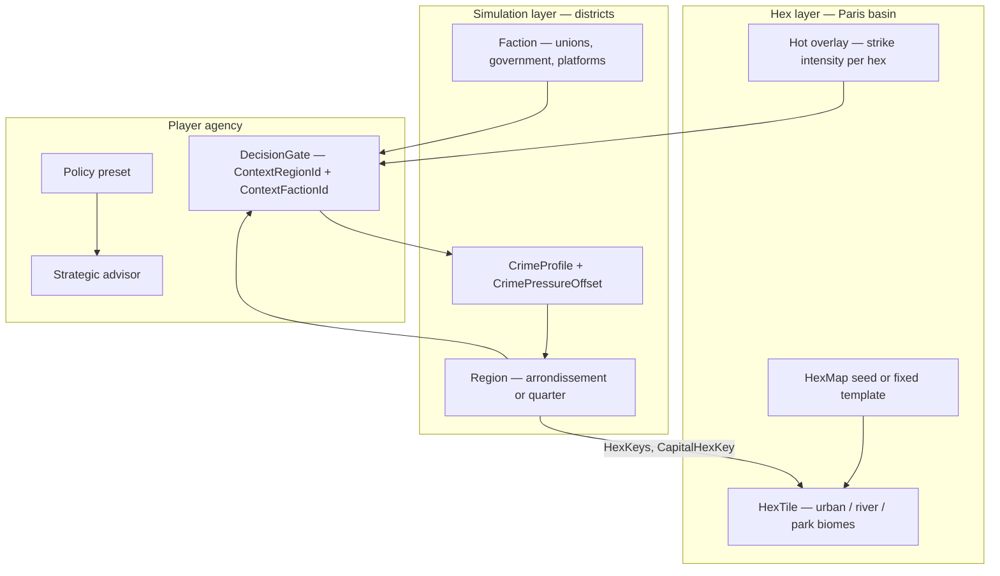
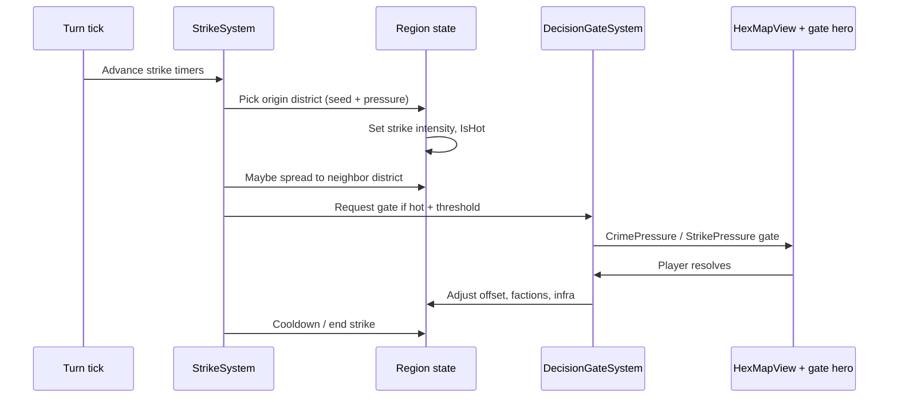

# Paris Map & Strike Hot Regions — Scenario Design

**Project:** TTS — Technology Tier Simulation  
**Status:** **Design proposal** · builds on shipped hex map, region-scoped gates, TTS 4 crime perspective  
**Related:** [hex-map.md](hex-map.md) · [decision-gates.md](decision-gates.md) · [procedural-generation.md](procedural-generation.md) · [player-experience.md](../player-experience.md) · [economy.md](../economy.md)

---

## Executive summary

**Paris Map** is a concrete **scenario template** for TTS 4+ matches: one civilization governs a **Paris-shaped territory** on the hex layer, subdivided into **district regions** (arrondissements or macro-quarters). **Strikes** (transport, public sector, platform workers) appear as **hot regions** — places where social pressure spikes, the map glows, and **decision gates** ask how far you will bend or hold the line.

The goal is not a GIS-accurate Paris simulator. It is a **recognizable governor fantasy**: async check-ins, a map you can read at a glance, and strikes that **localize agency** (“11th arrondissement metro walkout” vs abstract “crime pressure 72”).

---

## 1. Player fantasy

| Moment | What the player sees | What they do |
|--------|----------------------|--------------|
| **Open match** | Hex map centered on a dense urban cluster; capital marked; district names on city cards | Orient, claim fringe hexes if expansion mode is on |
| **Strike begins** | One or more districts turn **hot** on the map; away summary: “CGT-led strike spreads from Bastille corridor” | Read headline, open gate |
| **Gate check-in** | Hero card names **the district + faction**; advisor recommends negotiate / hold / reform | Pick option; optionally shift policy |
| **Aftermath** | Hot overlay cools; crime pressure offset and faction influence reflect the choice | Leave until next tick |

Design constraint from [player-experience.md](../player-experience.md): one strike gate should resolve in **seconds**, not a tactical strike mini-game.

---

## 2. Layered model — Paris on top of TTS

TTS already separates **simulation regions** (economy, crime, gates) from **hex geography** (terrain, ownership). Paris Map uses both:



**Principle:** Hex tiles show **where** unrest is visible. Regions hold **who** is affected and **what** changes when the governor decides.

---

## 3. What is a “hot region”?

A **hot region** is a district in strike-level unrest — not necessarily literal crime, but **social pressure** in the TTS 4 sense (poverty, inequality, legitimacy, service disruption).

### 3.1 Mechanical definition (proposed)

| Signal | Threshold (initial) | Source |
|--------|---------------------|--------|
| **Hot flag** | `RegionStrikeState.IsHot == true` | Strike system |
| **Pressure** | `CrimeProfile.CrimePressureIndex ≥ 65` **or** strike intensity ≥ 50 | Existing crime index + strike overlay |
| **Map** | Hexes in `Region.HexKeys` render with heat tint | UI overlay on `HexMapView` |
| **Gate trigger** | Hot region + faction tension → `CrimePressure` or new `StrikePressure` gate with `ContextRegionId` | [decision-gates.md](decision-gates.md) |

**Shipped today (partial fit):**

- Region-scoped crime gates with `ContextRegionId` and `CrimePressureOffset` ([decision-gates.md](decision-gates.md) §4)
- Hex ↔ region linkage via `HexKeys` / `CapitalHexKey` ([hex-map.md](hex-map.md) §0)
- Faction-scoped crisis gates with `ContextFactionId`

**Not yet shipped:** strike-specific type, heat overlay, Paris fixed template, strike propagation between adjacent districts.

### 3.2 Hot vs warm vs calm

| State | Map | City card | Gate risk |
|-------|-----|-----------|-----------|
| **Calm** | Normal biome colors | Stable | Low |
| **Warm** | Subtle amber edge on district hexes | Tension | Medium — advisor warning |
| **Hot** | Pulsing amber/red overlay | Crisis | High — gate within 1–2 ticks |

Only **one or two hot districts** at a time keeps the async loop readable (same cap philosophy as max 3 pending gates).

---

## 4. Paris Map — geography without micromanagement

### 4.1 Two implementation tiers

| Tier | Description | Effort |
|------|-------------|--------|
| **A — Narrative template** | Procedural hex planet + **renamed** capital region “Paris” and 4–8 district regions arranged in a ring; strike names from seed | Low — data + copy |
| **B — Fixed Paris basin** | Hand-authored hex layout: Seine corridor, dense core, suburban fringe; districts map to fixed hex sets | Medium — `MapTemplate` JSON |
| **C — Real-world anchor** | Crime/socio CSV row for **France** or **Île-de-France** on each district’s `CrimeProfile` | Low if CSV row exists; else synthetic |

Recommend **A → B**: prove strike gameplay on renamed procedural worlds, then lock a showcase `paris-metro` match mode.

### 4.2 District catalog (example)

Not exhaustive — enough for demos and docs:

| Region id (example) | Display name | Role | Typical strike flavor |
|---------------------|--------------|------|------------------------|
| `reg-paris-core` | Paris Centre | Capital, government | Pension reform protests |
| `reg-paris-east` | Bastille & Nation | Dense residential | Metro / RATP strikes |
| `reg-paris-north` | Gare du Nord corridor | Transport hub | SNCF walkout spillover |
| `reg-paris-west` | La Défense fringe | Business district | Platform / gig economy |
| `reg-paris-south` | Left Bank universities | Students + unions | Education sector |
| `reg-banlieue-n` | Seine–Saint-Denis | Suburban | Service deprivation, riots |
| `reg-banlieue-s` | Orly / logistics belt | Airports, warehouses | Air-traffic + logistics |

Each region owns a **hex cluster** (today: 4+ hexes from bootstrap; Paris template would assign 6–20 hexes per district in tier B).

### 4.3 Map UX (Paris mode)

Extend [hex-map.md](hex-map.md) UI notes:

| Element | Behavior |
|---------|----------|
| **Heat overlay** | Multiply tile fill by strike intensity (0–1); hot hexes pulse in CSS/SVG |
| **District boundary** | Soft outline connecting `Region.HexKeys` |
| **Selection tooltip** | “11e · Hot · CGT strike day 3 · Pressure 71” |
| **Capital marker** | Elysée / Hôtel de Ville analog — existing capital glyph |
| **Claim mode** | Optional off in pure Paris scenario (focus gates, not expansion) |

Territory panel title: **“Île-de-France”** or **“Paris metropolitan map”** instead of generic “Territory”.

---

## 5. Strikes — lifecycle

### 5.1 Strike as a world event



### 5.2 Origin triggers (deterministic)

| Trigger | Condition | Example gate title |
|---------|-----------|-------------------|
| **Pressure spike** | District crime index ≥ 65 after tick | “Crime spike in Bastille & Nation” (shipped pattern) |
| **Scheduled strike** | Match seed rolls strike week | “RATP unlimited strike — day 1” |
| **Global crisis** | Active `GlobalEvent` + urban civ | “Pension reform — national day of action” |
| **Faction ultimatum** | Union faction influence high, stability low | “CGT demands action” (shipped faction pattern) |
| **Rival proxy** | Multiplayer: rival policy increases diffusion unrest | “Blockade sympathy in Gare du Nord corridor” |

All rolls use **`MatchState.WorldSeed`** — same philosophy as [procedural-generation.md](procedural-generation.md).

### 5.3 Propagation (hot spreads)

Strikes spread along **adjacency**, not the whole map at once:

1. Build **district adjacency graph** (region A neighbor of B if any hex of A is adjacent to any hex of B).
2. Each tick, hot district has chance to raise **warm** on neighbors (intensity += seed-derived delta).
3. Warm → hot if faction stance + policy worsen; hot → warm → calm if player invests or negotiates.

Cap: **max 2 hot districts** per civ; excess becomes warm only.

### 5.4 Strike intensity (proposed field)

```csharp
// TTS.Core/Models/RegionStrikeState.cs — proposed
public sealed class RegionStrikeState
{
    public double Intensity { get; set; }      // 0–100
    public int DaysActive { get; set; }
    public string? LeadingFactionId { get; set; }
    public string? StrikeCause { get; set; }   // "transport", "pension", "platform"
    public bool IsHot => Intensity >= 50;
}
```

Persist on `Region` or nested object; drive overlay alpha = `Intensity / 100`.

---

## 6. Decision gates — strike choices

Reuse existing templates where possible; add strike copy in titles/descriptions.

### 6.1 Gate mapping

| Situation | Gate type | Options (flavor) | Effects (align with shipped) |
|-----------|-----------|------------------|------------------------------|
| Service walkout | `CrimePressure` | **Invest** (fund service / pay deal) · **Ignore** · **Crackdown** (minimum service law) | Region `CrimePressureOffset`, infra, stability |
| Union ultimatum | `FactionCrisis` | **Appease** · **Suppress** · **Reform** | Faction influence (shipped) |
| Pension / national day | `GlobalCrisis` | **Regulate** · **Accelerate** · **Isolate** | Civ-wide stability |
| Platform / AI dispatch | `ForbiddenTech` or `CrimePressure` | Ban gig algorithm / regulate / delay | Tech + region pressure |

**Context fields (shipped):** always set `ContextRegionId` to the hot district and `ContextFactionId` to union or government faction when relevant.

### 6.2 Example gate copy

**Title:** `Metro strike — Bastille & Nation`  
**Description:** `Unlimited RATP walkout enters day 4. Commuters stranded; platforms blame central funding.`  
**Context chips:** `Bastille & Nation` · `CGT Transport`  
**Invest impact hint:** `Stability +4 · strike intensity −15 · econ −2`

### 6.3 Advisor counsel

[GateAdvisorLogic](src/TTS.Core/Systems/GateAdvisorLogic.cs) already weighs stability-first vs tech-rush:

| Policy | Typical strike recommendation |
|--------|------------------------------|
| Stability-first | Invest / Appease |
| Tech-rush | Crackdown or Accelerate (risky) |
| Diplomatic | Reform / Isolate |
| Expansionist | Hold line + claim fringe hexes (future: border gates) |

LLM fables ([decision-gates.md](decision-gates.md) §3.4) rewrite gate text with Paris tone when `MapTemplateId == "paris-metro"`.

---

## 7. Away summary & narrative

Away digest should **name districts**, not only averages:

| Bad | Good |
|-----|------|
| “Crime pressure 68” | “Strike spread from Bastille to Gare du Nord corridor” |
| “Faction crisis” | “CGT Transport issued an ultimatum in Paris Centre” |
| “Gate expired” | “Metro strike gate auto-resolved: minimum service (default)” |

Bullets tie to **hot region list** from `StrikeSystem.GetHotRegions(civId)`.

---

## 8. Match mode — `paris-metro` (proposed)

| Config field | Value |
|--------------|-------|
| `ModeId` | `paris-metro` |
| `StartingTier` | TTS 4 (Information Age) |
| `MapTemplateId` | `paris-basin-v1` (tier B) or procedural + Paris names (tier A) |
| `MaxPlayers` | 1–2 (player + rival Île-de-France or EU neighbor) |
| `EnableTerritorialClaim` | false (scenario focus) or true on fringe only |
| `StrikeSystemEnabled` | true |
| `WithDemoGate` | true — demo crime gate renamed to “Data sovereignty in Paris Centre” |

Registry entry alongside `sprint-8h`, `dev-blitz-3m`, etc.

---

## 9. Implementation phases

| Phase | Deliverable | Depends on |
|-------|-------------|------------|
| **P0 — Doc + copy** | Paris district names on procedural world; gate titles mention districts | Shipped generators |
| **P1 — Heat UI** | `HexMapView` overlay from region intensity | Region strike state or crime offset proxy |
| **P2 — StrikeSystem** | Tick propagation, hot cap, away summary lines | District adjacency graph |
| **P3 — Map template** | Fixed `paris-basin-v1` hex layout + region hex assignment | [hex-map.md](hex-map.md) template loader |
| **P4 — StrikePressure gate** | Optional `GateType` if crime copy feels wrong | `DecisionGateSystem` |
| **P5 — Multiplayer intel** | Rival hot regions in spectator panel | Orleans + API |

**Quick win (P0 + partial P1):** Use existing `CrimePressureIndex` and `ContextRegionId`; color hexes where `CrimePressureIndex ≥ 65` amber in UI — no new backend type.

---

## 10. Data & content

| Data | Source |
|------|--------|
| Socioeconomic baseline | `state_crime_income_merged.csv` — France row if present, else California/Louisiana proxy with disclaimer in UI |
| Strike causes | Seed-picked table: `transport`, `pension`, `platform`, `education` |
| Faction names | Procedural or fixed: `CGT Transport`, `Platform Workers`, `Government`, `Municipal Council` |
| LLM tone | Era-aware fables: 2020s European urban unrest, not sci-fi unless TTS 5+ |

Keep **simulation authority** in Core; Paris flavor in names and overlays only unless a field is needed for mechanics.

---

## 11. Explicit non-goals

- Street-level tactical map or unit movement  
- Real-time strike simulation between ticks  
- Perfect geographic accuracy of arrondissements  
- Strikes as pure visual FX with no gate/economy effect  
- Replacing the governor dashboard with map-only UX  

---

## 12. Key files (current + proposed)

| Area | Current | Proposed |
|------|---------|----------|
| Regions | `Region.cs`, `RegionalCrimeProfile.cs` | `RegionStrikeState` |
| Map | `HexMapGenerator.cs`, `HexMapView.tsx` | Heat overlay, template loader |
| Gates | `DecisionGateSystem.cs`, `GateAdvisorLogic.cs` | Strike copy, optional `StrikePressure` |
| Scenarios | `SampleWorldFactory.cs`, `MatchPresets` | `ParisMetroWorldBuilder`, mode `paris-metro` |
| UI | `MatchPage.tsx`, city cards | Hot badge on cards + map sync |
| Docs | This file | [hex-map.md](hex-map.md), [decision-gates.md](decision-gates.md) cross-links |

---

## 13. Testing (when implemented)

```bash
dotnet test src/TTS.Tests/TTS.Tests.csproj --filter "FullyQualifiedName~Strike"
```

Suggested cases:

- Hot region opens gate with correct `ContextRegionId`  
- Propagation stops at max 2 hot districts  
- Invest reduces strike intensity and crime offset  
- Heat overlay hex list matches `Region.HexKeys`  
- Paris template: every district has ≥1 hex and CSV profile  

---

## 14. Summary diagram — one check-in

```
┌─────────────────────────────────────────────────────────────┐
│  MATCH: Paris Metro · TTS 4 · tick 12                       │
├──────────────────────┬──────────────────────────────────────┤
│  MAP (Territory)     │  GATE HERO                           │
│  · Seine + urban hex │  Metro strike — Bastille & Nation    │
│  · HOT: east cluster │  [Invest] [Ignore] [Crackdown]       │
│  · WARM: north hub   │  Advisor: Invest under stability-first│
├──────────────────────┴──────────────────────────────────────┤
│  CITY CARDS: Centre Stable · East HOT · North Warm          │
└─────────────────────────────────────────────────────────────┘
```

Paris Map gives the player **spatial context**; strike hot regions give **localized control** — the same gate-first loop as the rest of TTS, with a map that finally answers *where* the crisis is.
