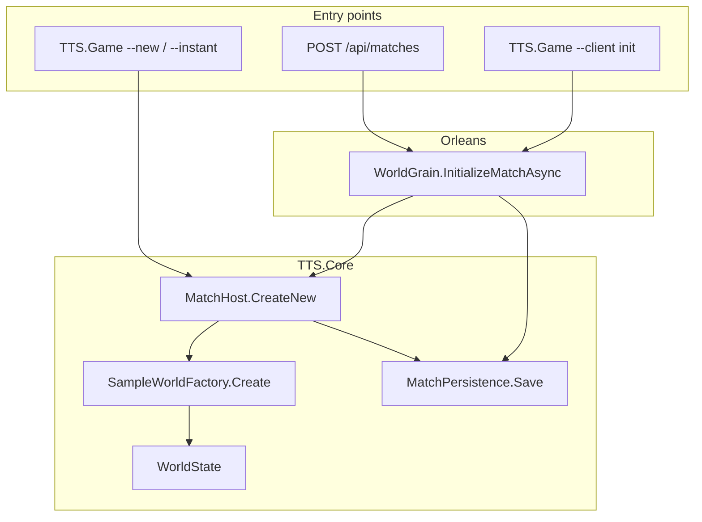
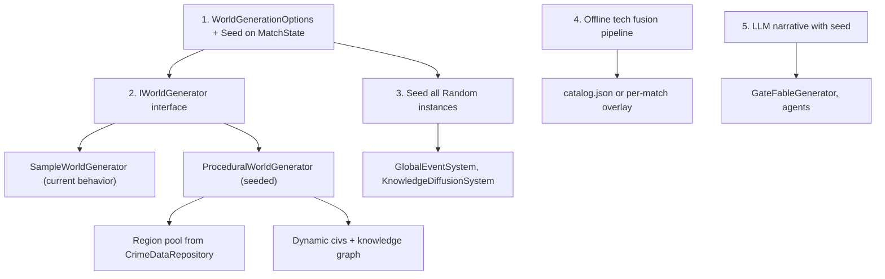

# Procedural Generation — Design & Integration

**Project:** TTS — Technology Tier Simulation  
**Status:** Exploration / v2 planning  
**Related:** [hex-map.md](hex-map.md) · [economy.md](../economy.md) · [tech-tree.md](../tech-tree.md) · [implementation-plan.md](../implementation-plan.md)

---

## Executive summary

The codebase is well-structured for procedural **content** (worlds, tech, events, narrative), but not for procedural **terrain**. Worlds are abstract graphs of **civilizations → regions (cities/territories) → scalar stats**, plus a shared **technology catalog**. All initial world state flows through a single hardcoded factory (`SampleWorldFactory`). Procedural/random behavior exists only in **runtime systems** (global events, knowledge diffusion) and **LLM narrative** (gate fables, offline tech-lore scenarios). There is **no seed parameter** anywhere in the C# codebase. Planned procedural work (Phase 7) targets **tech-tree expansion** and **MAF content pipelines**, not hex maps or noise-based terrain.

---

## 1. Current world creation flow



### Key files

| Layer | File | Role |
|-------|------|------|
| Factory | `src/TTS.Core/SampleWorldFactory.cs` | **Only** world bootstrap; creates civs, regions, techs, match, knowledge links |
| Match host | `src/TTS.Core/Simulation/MatchHost.cs` | `CreateNew()` → calls `SampleWorldFactory.Create()`; load/save/tick |
| Grain | `src/TTS.Grains/WorldGrain.cs` | `InitializeMatchAsync(modeId, withDemoGate)` → `MatchHost.CreateNew()` |
| Contract | `src/TTS.Contracts/IWorldGrain.cs` | Grain API surface |
| Persistence | `src/TTS.Core/Simulation/MatchPersistence.cs` | JSON save/load of full `WorldState` |
| CLI (local) | `src/TTS.Game/GameCli.cs` | `--new`, `--instant`, `--tick`, `--watch` |
| CLI (Orleans) | `src/TTS.Game/OrleansClientCli.cs` | `--client init` |
| HTTP API | `src/TTS.Api/Program.cs` | `POST /api/matches` → `OrleansMatchService.InitializeMatchAsync` |
| Lobby slots | `src/TTS.Api/Services/MatchRegistry.cs` | Hardcoded civ ID/name slots for join |
| Scenarios | `src/TTS.Agents/Scenarios/ScenarioWorldBuilder.cs` | Builds scenario worlds on top of `SampleWorldFactory` |

### What `SampleWorldFactory.Create()` does

- Creates 2 civilizations: Aurora Collective (player) and Iron Dominion (rival)
- Creates 2 regions: Meridian Bay and Redstone Harbor
- Anchors regions to real-world CSV data: California 2015, Louisiana 2015
- Loads ~70 technologies from `catalog.json` (fallback: 10-node spine)
- Adds fixed factions, knowledge networks, optional demo decision gate

`AttachCityProfile` pulls socioeconomic data from `CrimeDataRepository` and derives `Population`, `Infrastructure`, and `Resources` from CSV fields.

---

## 2. Game domain models

### `WorldState` (aggregate root)

```csharp
public class WorldState
{
    public int Turn { get; set; } = 1;
    public List<Civilization> Civilizations { get; } = [];
    public List<Region> Regions { get; } = [];
    public List<Technology> Technologies { get; } = [];
    public List<KnowledgeNetwork> KnowledgeNetworks { get; } = [];
    public List<GlobalEvent> ActiveEvents { get; } = [];
    public DateTimeOffset SimulatedNow { get; set; }
    public MatchState? Match { get; set; }
}
```

### `Region` — territory/city, not a tile

Regions have scalar stats and optional CSV-backed crime profiles. **No coordinates, adjacency, biome, or elevation.** Design docs (`economy.md`, `ui-design.md`) describe regions as **cities/hinterlands on one planet**, displayed as dashboard cards — not a tactical map.

| Model | Notes |
|-------|-------|
| `Civilization` | Stability pillars, policy, researched techs, factions, decision gates |
| `Faction` | Government, Corporation, AiCollective, etc. + stance |
| `Technology` | Tier, category, prerequisites, `FusionTags` for procedural expansion |
| `KnowledgeNetwork` | Trade/espionage diffusion links between civs |
| `GlobalEvent` | Tier-scoped crises with severity/duration |
| `DecisionGate` | Player/AI choice points; optional LLM `Fable` |
| `MatchConfig` / `MatchState` | Tick schedule, victory rules, player limits |

---

## 3. Hardcoded vs data-driven today

### Hardcoded (in code)

| Element | Where | Values |
|---------|-------|--------|
| Civilizations | `SampleWorldFactory` | 2 civs: Aurora Collective, Iron Dominion |
| Regions | `SampleWorldFactory` | 2 regions: Meridian Bay, Redstone Harbor |
| CSV anchors | `AttachCityProfile` | California 2015, Louisiana 2015 |
| Factions | `SampleWorldFactory` | 3 fixed factions with fixed types/stances |
| Knowledge networks | `SampleWorldFactory` | Player↔rival trade + espionage links |
| Demo decision gate | `AttachDemoGate` | Granary dispute (optional via `withDemoGate`) |
| Civ lobby slots | `MatchRegistry.Slots` | `civ-player` / `civ-rival` names |
| Match ID | `MatchRegistry.Create` | `Guid`-based, not seeded |
| Global event templates | `GlobalEventSystem` | 4 tier-based event types with fixed text |
| Turn growth | `RegionGrowthPhase` | Fixed +0.5 resources, +0.2 infrastructure per tick |

### Data-driven (external files)

| Element | Source | Loader |
|---------|--------|--------|
| Technology catalog (~70 nodes) | `src/data/tech/catalog.json` | `TechTreeCatalog` |
| Socioeconomic/crime data | `src/data/state_crime_income_merged.csv` | `CrimeDataRepository` |
| Match presets | `MatchPresets` in code | `sprint-8h`, `standard-36h`, `dev-blitz-3m`, etc. |
| Policy presets | `PolicyPresets` | Balanced, TechRush, etc. |

Fallback: if `catalog.json` is missing, `SampleWorldFactory.CreateFallbackTechnologies()` supplies a 10-node spine.

---

## 4. Existing procedural / random generation

### Runtime simulation (in-match)

**`GlobalEventSystem`** (`src/TTS.Core/Systems/GlobalEventSystem.cs`):
- Uses unseeded `Random()`
- Per-turn chance scales with max civ tier: `0.1 + tier * 0.02`
- Picks from a small fixed set: Resource Shortage, Industrial Boom, AI Alignment Crisis, Temporal Fracture
- Invoked in `GlobalEventGenerationPhase` during each tick

**`KnowledgeDiffusionSystem`** (`src/TTS.Core/Systems/KnowledgeDiffusionSystem.cs`):
- Unseeded `Random()` for probabilistic tech spread along knowledge links

**`DecisionGateSystem`** (`src/TTS.Core/Systems/DecisionGateSystem.cs`):
- Rule-driven gate creation after each turn (forbidden tech, tier advancement, global crisis, faction crisis, crime pressure)
- Not random, but **reactive** to world state

### LLM / offline content generation

| Component | File | Purpose |
|-----------|------|---------|
| `GateFableGenerator` | `src/TTS.Llm/GateFableGenerator.cs` | Procedural narrative for pending gates |
| `TechLoreScenario` | `src/TTS.Agents/Scenarios/TechLoreScenario.cs` | Offline Ollama fusion-tech generation prototype |
| Advisor / rival agents | `WorldGrain`, `AgentOrchestrator` | Runtime LLM decisions at TTS 5+ |

### Design docs (not yet implemented)

- **`tech-tree.md` § Procedural Expansion Rule**: generate child/fusion nodes from `fusion_tags`, prerequisites, risk
- **`tech-trees-by-tier.md` § 14**: per-tier procedural expansion targets (500+ nodes)
- **`economy.md`**: "Procedural city generation (Phase 7+)" — explicitly deferred
- **`implementation-plan.md` Phase 7**: MAF workflow `generate → validate → lore → export JSON`

### What does NOT exist

- No `seed`, `Seed`, or `Random(seed)` in C# source
- No noise functions, heightmaps, biomes, or tile grids
- No `IWorldGenerator`, `WorldGenerator`, or terrain factory
- No procedural civ/region naming

---

## 5. Architecture patterns

### Orleans grains

- **`WorldGrain`** holds the entire `MatchHost` (monolithic world per match ID)
- On activate: loads save from `matches/{matchId}.json` if present
- `InitializeMatchAsync` always creates a fresh world via `SampleWorldFactory`
- Future design (`orleans-integration.md`): `CivilizationGrain`, `RegionGrain` — not implemented

### Simulation loop

```
GameLoop.RunTurn()
  → TurnPhasePipeline (RegionGrowth → StabilityDecay → CivilizationTurn
     → KnowledgeDiffusion → FactionInfluence → Economy → CrimePressure
     → GlobalEventGeneration → EventImpact → EventTick)
  → DecisionGateSystem.ScanAfterTurn()
```

Systems are composed in `SimulationServices` — a clean place to inject new generation phases.

### Agents and scenarios

- **`AgentOrchestrator`**: LLM turn runner for TTS 5+ civs; falls back to `ClassicalAiSystem`
- **`ScenarioWorldBuilder`**: wraps `SampleWorldFactory` + `WorldAdvancer` for Ollama test scenarios
- Separation: `TTS.Core` has no LLM dependency; generation orchestration lives in `TTS.Llm` / `TTS.Agents`

---

## 6. Entry points where generation could hook in

### Primary (world bootstrap)

| Entry | Method | Current params | Suggested extension |
|-------|--------|----------------|---------------------|
| `SampleWorldFactory.Create` | Static factory | `MatchConfig`, `withDemoGate` | Add `WorldGenerationOptions` with seed, civ count, region count |
| `MatchHost.CreateNew` | Factory wrapper | Same + `savePath`, `llmTurnAgent` | Pass generation options through |
| `WorldGrain.InitializeMatchAsync` | Grain init | `modeId`, `withDemoGate` | Add `seed`, `worldTemplateId`, or `GenerationProfile` |
| `IWorldGrain` | Contract | — | Extend interface + DTOs |
| `POST /api/matches` | HTTP | `ModeId`, `WithDemoGate` | Add `Seed`, `WorldProfile` to `CreateMatchRequestDto` |
| `MatchRegistry.Join` | Player join | Hardcoded civ slots | Generate civs dynamically up to `MaxPlayers` |

### Secondary (runtime / per-tick generation)

| Hook | Use case |
|------|----------|
| New `ITurnPhase` in `TurnPhasePipeline` | Per-tick region events, resource shifts |
| `GlobalEventSystem.MaybeGenerateEvent` | Expand event pool; template + parametric generation |
| `DecisionGateSystem` gate factories | Procedural gate titles/options from region state |
| `WorldGrain.EnrichGateFablesAsync` | Already LLM-enriches gates |
| `TechTreeCatalog` load path | Merge procedurally generated nodes at match start or tier-up |
| `MatchPersistence` | Already serializes full world — generated content persists automatically |

### Tertiary (offline / pre-match pipelines)

| Hook | Use case |
|------|----------|
| `TTS.Agents` CLI (`generate-tech`) | Batch-generate catalog nodes (Phase 7 plan) |
| `TechLoreScenario` pattern | Fusion tech + event hooks before match |
| `ScenarioWorldBuilder` | Test harness for generated worlds |

---

## 7. What to procedurally generate (prioritized)

Given the **region-based, non-spatial** design, procedural generation should focus on **content variety and replayability**, not Civilization-style maps (see [hex-map.md](hex-map.md) for spatial layer).

### A. Regions / cities (highest impact)

**What:** N regions with names, population, resources, infrastructure, optional CSV profile anchor.

**How:**
- Introduce `IWorldGenerator` that picks N states from `CrimeDataRepository.Records` using seeded `Random`
- Generates fantasy names (name tables or LLM)
- Assigns regions to civs round-robin or by cluster
- Hook: `SampleWorldFactory.Create` → delegate to generator when `options.Seed != null`
- `EconomySystem` and `CrimeSystem` already consume `Region` scalars — no model changes needed

**Aligns with:** `economy.md` Phase 7+ procedural city generation

### B. Civilizations and factions

**What:** Civ count (2–8 per `MatchConfig.MaxPlayers`), names, starting policies, internal factions.

**How:**
- Generate civs in factory; assign `ControlledRegionIds`
- Procedural factions: pick from `FactionType` enum + stance distribution seeded per civ
- `MatchRegistry.Slots` must become dynamic — map join order to generated civ IDs

**Caution:** Player civ is currently hardcoded `civ-player`; first joiner should get `IsPlayerControlled = true`.

### C. Knowledge networks

**What:** Trade/espionage/OpenScience links between civ pairs with varied `Strength`.

**How:** After civ generation, create a clique or sparse graph from seed; `KnowledgeDiffusionSystem` already uses link strength.

### D. Technology tree (planned, strong schema support)

**What:** Fusion nodes, branch expansions beyond static catalog.

**How:**
- `Technology.FusionTags` + `tech-tree.md` procedural rule already define the schema
- Offline: MAF `generate → validate → export` into `catalog.json` or per-match overlay
- In-match: at tier-up, append validated nodes to `world.Technologies`
- `TechTreeSystem` / `ResearchExecutor` operate on `world.Technologies` — dynamic nodes work if IDs are valid

### E. Global events and decision gates

**What:** Varied crises tied to regions, tech, or factions.

**How:**
- Replace fixed strings in `GlobalEventSystem` with template library + parametric fill (region name, tech name)
- LLM path already exists for gate narrative (`GateFableGenerator`); extend to gate *creation*
- `DecisionGateSystem.TryOpenCrimePressureGate` already uses region crime data

### F. Agent / narrative content

**What:** Unique advisor briefings, rival strategies, faction debates.

**How:** Already partially wired via `AgentOrchestrator`, `GateFableGenerator`, Ollama scenarios. Seed could constrain LLM temperature/sampling for reproducibility.

---

## 8. Config and seed mechanisms

| Mechanism | Present? | Details |
|-----------|----------|---------|
| World seed | **No** | No env var, API field, or CLI flag |
| Match ID | `Guid` | `match-{Guid:N}` truncated — unique but not reproducible |
| `Random()` | Yes, unseeded | `GlobalEventSystem`, `KnowledgeDiffusionSystem` |
| `withDemoGate` | Yes | Only generation toggle today (`--demo-gate`, API `WithDemoGate`) |
| `MatchConfig` / `modeId` | Yes | Controls ticks, players, victory — not world layout |
| Data files | Yes | `catalog.json`, crime CSV — static, not seeded selection |
| Save files | Yes | `matches/{matchId}.json` — captures generated state after creation |

---

## 9. Recommended implementation path



### Concrete steps

1. **`WorldGenerationOptions`** in `TTS.Core` — `Seed`, `RegionCount`, `CivCount`, `UseCrimeDataAnchors`
2. **`IWorldGenerator`** — `SampleWorldGenerator` preserves current behavior; `ProceduralWorldGenerator` uses seeded selection from the crime CSV pool
3. **Thread through API** — add `Seed` / `WorldProfile` to `CreateMatchRequestDto` and `IWorldGrain.InitializeMatchAsync`
4. **Store seed on `MatchState`** — enables replay and deterministic debugging
5. **Region generation first** — reuses existing data and systems; aligns with `economy.md` Phase 7+ plan
6. **Tech fusion offline** — follow Phase 7 MAF workflow before scaling to 500+ nodes
7. **Defer spatial maps** until gameplay requires territorial tactics — see [hex-map.md](hex-map.md)

---

## 10. Summary

| Generate | Fits today? | Effort | Impact |
|----------|-------------|--------|--------|
| Regions from CSV pool | Yes | Low | High replayability |
| Civs / factions / knowledge links | Yes | Medium | Multiplayer scaling |
| Tech fusion nodes | Schema ready | Medium (offline) | Content depth |
| Global events / gates | Partial | Low–medium | Narrative variety |
| LLM fables / advisor content | Live | Low (extend) | Immersion |
| Terrain / hex maps | No | High | Low until territorial gameplay (v2) |

The codebase is well-structured for procedural **content** at the factory layer and procedural **events/narrative** in the systems/LLM layer. The main gap is a seeded `IWorldGenerator` replacing the hardcoded two-civ/two-city demo, plus expanding the small random event pool.

---

## 11. File reference index

| Path | Relevance |
|------|-----------|
| `src/TTS.Core/SampleWorldFactory.cs` | World creation hub |
| `src/TTS.Core/Simulation/MatchHost.cs` | Create/load/save/tick |
| `src/TTS.Grains/WorldGrain.cs` | Orleans entry, LLM fables |
| `src/TTS.Core/Models/*.cs` | Domain models |
| `src/TTS.Core/GameLoop.cs` + `TurnPhases.cs` | Simulation pipeline |
| `src/TTS.Core/Systems/GlobalEventSystem.cs` | Random events |
| `src/TTS.Core/Systems/CrimeDataRepository.cs` | Region data pool |
| `src/TTS.Core/Systems/TechTreeCatalog.cs` | Tech data |
| `src/TTS.Core/Simulation/MatchPersistence.cs` | Persistence schema |
| `src/TTS.Agents/Scenarios/ScenarioWorldBuilder.cs` | Scenario worlds |
| `src/TTS.Llm/GateFableGenerator.cs` | Procedural narrative |
| `src/data/tech/catalog.json` | Tech catalog |
| `src/data/state_crime_income_merged.csv` | Region socioeconomic data |
| `economy.md`, `tech-tree.md`, `implementation-plan.md` | Design intent for procedural gen |
