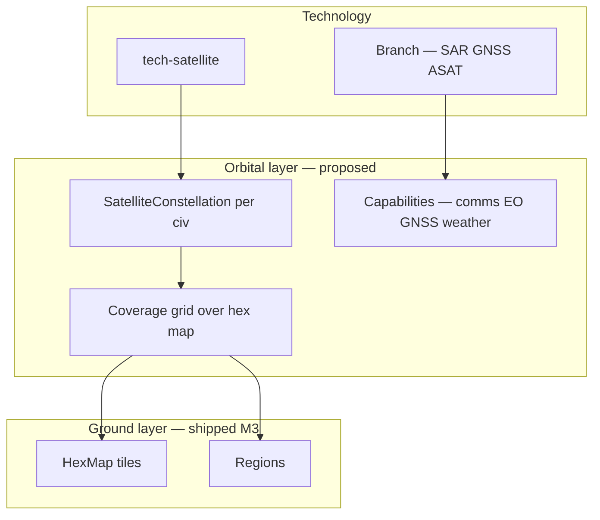

# Satellites — Map, Technology & Research

**Project:** TTS — Technology Tier Simulation  
**Status:** **Research / design proposal** · `tech-satellite` in catalog + TTS 4 spine; **no orbital map layer in code**  
**Related:** [hex-map.md](hex-map.md) · [tts4-start.md](tts4-start.md) · [tts5-exploring.md](tts5-exploring.md) · [paris-map-strikes.md](paris-map-strikes.md) · [decision-gates.md](decision-gates.md) · [tech-trees-by-tier.md](../tech-trees-by-tier.md) §6 · [crime-data.md](../crime-data.md)

---

## Executive summary

**Satellite Networks** (`tech-satellite`) is a **TTS 4 core node** on the communication spine: Internet → Satellite Networks → path toward TTS 5. It is granted in the **extended Information Age bootstrap** (`InformationAgeTechSpine.ExtendedTechIds`) but today has **no dedicated simulation hook** — no orbital layer, no map visibility change, no gate copy.

This document researches **why satellites matter** for TTS (2026 backdrop + governor fantasy) and proposes how they connect **technology research**, the **hex map**, **regions**, **crime/strike intel**, and **TTS 5+** escalation — without turning the game into Kerbal Space Program.

**Design thesis:** Satellites are the **overhead camera and nervous system** of the Information Age. They make the map **legible** (coverage, hot regions, rival movement) and make **forbidden surveillance** feel spatial, not abstract.

---

## 1. Shipped today (repo)

| Asset | Location | Notes |
|-------|----------|-------|
| `tech-satellite` | `src/data/tech/catalog.json` | TTS 4, Communication, core; prereq `tech-internet`; tag `satellite` |
| Extended TTS 4 spine | `InformationAgeTechSpine.cs` | Grants `tech-data-storage`, `tech-internet`, `tech-satellite` on bootstrap |
| Hex map | [hex-map.md](hex-map.md) §0 | Ground layer only — no orbit |
| Crime / regions | `CrimeSystem`, region gates | No satellite modifier |
| Knowledge links | `KnowledgeNetwork` (trade/espionage) | Abstract civ-to-civ; not map-scoped |

**Gap:** researching or inheriting satellites does not change gameplay yet.

---

## 2. Real-world research anchor (≈2026)

Use as **design reference**, not simulation of real operators.

### 2.1 Civil constellations

| Domain | Examples (2026 public narrative) | Gameplay hook |
|--------|--------------------------------|---------------|
| **Broadband LEO** | Starlink-class megaconstellations; rural backhaul | Remote region **infra + crime response**; claim speed on fringe hexes |
| **GNSS** | GPS, Galileo, BeiDou, GLONASS | **Precision** for yield surveys, logistics, military branch |
| **Earth observation** | Copernicus, Planet, commercial SAR | **Reveal** hot/strike regions before ground intel; flood/drought tiles |
| **Weather** | GOES, EUMETSAT | **GlobalCrisis** prediction — longer gate warning timers |
| **IoT / comms backbone** | Iridium, OneWeb | **KnowledgeNetwork** strength between distant regions |

### 2.2 Military & dual-use

| Domain | Examples | Gameplay hook |
|--------|----------|---------------|
| **ISR / recon sats** | Government imaging programs | Rival **hex activity** visible in border bands |
| **ASAT / debris events** | 2007 Fengyun test legacy; 2020s debris alarms | **GlobalCrisis** gate: “Kessler corridor” — coverage loss |
| **Jamming / cyber on space segment** | GPS spoofing, ground station hacks | Pairs with `tech-cybersecurity` — **coverage degradation** |
| **Mass surveillance from orbit** | Forbidden fiction adjacent to `tech-mass-surveillance` | **ForbiddenTech** gate with **map-wide** visibility penalty to stability |

### 2.3 2026 policy tensions (gate copy fuel)

- Launch licensing and **deorbit rules** (EU Space Act, FCC 5-year deorbit norms)  
- **Orbital traffic management** — who catalogs debris?  
- **Export controls** on imaging resolution  
- **Starlink / defense** contracts — dual-use backlash in urban regions ([paris-map-strikes.md](paris-map-strikes.md))  

---

## 3. Layered model — orbit above hex

Keep the **ground hex map** ([hex-map.md](hex-map.md)). Add an optional **orbital overlay** — not a second full map at first.



**Principle:** Satellites **modify what you see and how fast you know** — they do not replace territory claims or region economy as the simulation unit.

---

## 4. Technology tree

### 4.1 Existing spine (TTS 4)

```
Digital Computing → Data Storage → Internet → Satellite Networks → (TTS 5 gate)
```

Catalog: `tech-satellite` · fusion tag `satellite`.

### 4.2 Proposed branch nodes (design — not in catalog yet)

| ID (proposed) | Name | Tier | Role | Map / sim effect |
|---------------|------|------|------|------------------|
| `tech-leo-constellation` | LEO Broadband Constellation | 4 | branch | +coverage radius; fringe hex claim intel |
| `tech-gnss-precision` | GNSS Precision Layer | 4 | branch | +yield survey on owned hexes; logistics bonus |
| `tech-eo-optical` | Optical Earth Observation | 4 | branch | Reveal **warm/hot** regions (strikes) 1 tick early |
| `tech-sar-imaging` | SAR Imaging | 4 | branch | See through “cloud” tiles / night; military intel |
| `tech-ground-stations` | Ground Station Network | 4 | branch | Coverage only near **capital + coast** hexes unless researched |
| `tech-space-debris-mit` | Orbital Debris Mitigation | 4 | branch | Reduces crisis chance after ASAT events |
| `tech-asat-weapons` | Anti-Satellite Weapons | 4 | **forbidden** | **GlobalCrisis** + rival coverage wipe; stability hit |
| `tech-orbit-surveillance` | Orbital Mass Surveillance | 4 | **forbidden** | Full map visibility; **Pol −**, crime gate trigger |

### 4.3 Fusion into TTS 5+ ([tts5-exploring.md](tts5-exploring.md))

| Fusion | Result (design) | Effect |
|--------|-----------------|--------|
| `satellite` + `ai` | **Autonomous Tasking Constellation** | AI rivals prioritize imaging your hot regions |
| `satellite` + `quantum` | **Quantum-Linked Ground Stations** | Unspoofable GNSS; alignment gate option |
| `satellite` + `cyber` | **Space Segment Cyber Warfare** | Temporary blindness strips on rival border |

---

## 5. Map impact (hex + regions)

### 5.1 Coverage model (proposed)

Each civ with `tech-satellite` (or branches) maintains a **coverage score** per hex `0–100`:

| Factor | Source |
|--------|--------|
| Base | Owns `tech-satellite` → 40% global average |
| Ground stations | Capital hex + coast hexes +20 local |
| LEO constellation | +30 uniform; faster tick refresh on overlay |
| Rival jamming / ASAT | −20 to −80 zone or global |
| Debris crisis | Random band strips for N ticks |

**UI:** semi-transparent **blue grid** or **footprint rings** on `HexMapView`; toggle “Orbital view” in territory panel.

### 5.2 Visibility states (fog of war lite)

| State | Player sees | Requires |
|-------|-------------|----------|
| **Unknown** | Biome only, no owner | No coverage |
| **Surveyed** | Owner + biome + yield | GNSS / passive coverage |
| **Monitored** | + crime/strike heat hint | EO / SAR + TTS 4 crime tier |
| **Live** | Rival claim animation in away summary | Full constellation + cyber |

Start generous in **TTS 4 default** (most matches skip hard fog) — satellites matter as **upgrade path** and **crisis vector**, not mandatory obscurity.

### 5.3 Regional / strike intel ([paris-map-strikes.md](paris-map-strikes.md))

| Capability | Hot region play |
|------------|-----------------|
| **No satellites** | Strike gates fire with **short** decision window; map heat lags 1 tick |
| **EO branch** | **Warm** districts visible before **hot**; advisor warns earlier |
| **SAR + strike scenario** | Paris-map **heat overlay** matches ground truth even under “cloud” narrative |
| **Surveillance forbidden** | See all rival hot regions; **Pol −** and faction backlash in capital |

### 5.4 Territory claims

Satellites **do not** replace [TerritorySystem](src/TTS.Core/Systems/TerritorySystem.cs) adjacency rules. Optional bonuses:

- **GNSS:** highlight **best yield** neutral hexes within coverage  
- **LEO:** away summary lists “3 claimable high-yield hexes in coverage”  
- **Rival ASAT:** your claimed hexes still yours — you just **lose intel** until repair gate resolved  

---

## 6. Systems integration

### 6.1 Economy & resources

| System | Satellite hook |
|--------|----------------|
| `RegionGrowthPhase` | Precision GNSS → +infra on remote regions |
| `EconomySystem` | Logistics tag boost when coverage > 70% on region hexes |
| Tile `ResourceYield` | **Survey** action unlocks full yield display (design) |

### 6.2 Knowledge & diffusion

| System | Hook |
|--------|------|
| `KnowledgeNetwork` | **Satellite backhaul** channel type — higher strength, cyber-vulnerable |
| `KnowledgeDiffusionSystem` | Diffusion probability scales with overlapping coverage bands |
| Rival espionage | Stealing **ground station** tech reduces your coverage |

### 6.3 Decision gates ([decision-gates.md](decision-gates.md))

| Gate | Satellite-themed trigger |
|------|--------------------------|
| **GlobalCrisis** | Debris cascade; solar storm; launch failure |
| **ForbiddenTech** | ASAT test; orbital surveillance mandate |
| **CrimePressure** | “Starlink protest” in capital region — dual-use backlash |
| **AiAlignment** (TTS 5) | Autonomous satellite tasking without human-in-loop |
| **TierAdvancement** | “National space law — open sky vs sovereign orbit” |

Always set **`ContextRegionId`** when crisis is ground-linked (ground station city).

### 6.4 Agents ([agent-integration.md](agent-integration.md))

- **Advisor (TTS 4 classical):** “Your coverage is 62% — strike in east district not yet in EO footprint.”  
- **Rival MAF (TTS 5):** tools `get_coverage_summary`, `propose_imaging_priority` (design).  

---

## 7. Data model sketch (proposed)

```csharp
// TTS.Core/Models/SatelliteLayer.cs — not implemented

public sealed class SatelliteConstellation
{
    public string CivilizationId { get; init; }
    public bool HasBaselineNetwork { get; set; }  // tech-satellite
    public HashSet<string> BranchTechIds { get; } = [];
    public double GlobalCoverage { get; set; }    // 0–100
    public int DebrisRisk { get; set; }           // 0–100
}

public sealed class HexCoverage
{
    public int Q { get; init; }
    public int R { get; init; }
    public double Coverage { get; set; }          // per civ, keyed in overlay DTO
    public HexVisibility Visibility { get; set; }
}

public enum HexVisibility { Unknown, Surveyed, Monitored, Live }
```

Persist inside `WorldState` or embed coverage in map save v3. API: extend `HexMapDto` with optional `coverageByCivilizationId` or separate `GET .../orbital`.

---

## 8. UI proposals

| Surface | Change |
|---------|--------|
| **Territory panel** | Toggle **Ground / Orbital**; legend for coverage bands |
| **Hex tooltip** | Coverage %, visibility tier, “needs SAR” hint |
| **Tech tree** | Highlight `tech-satellite` as **map unlock** node at TTS 4 |
| **City cards** | “Ground station” badge on capital / coast regions |
| **Away summary** | “Satellite pass detected strike buildup in {region}” |
| **Gate hero** | Orbital debris or ASAT artwork on crisis gates |

Reuse [paris-map-strikes.md](paris-map-strikes.md) heat colors — **strike heat** vs **coverage blue** must be visually distinct.

---

## 9. Implementation phases

| Phase | Deliverable | Effort |
|-------|-------------|--------|
| **S0 — Doc + copy** | Gate/advisor strings reference coverage; tech tree tooltip | Low |
| **S1 — Passive bonus** | Owning `tech-satellite` → +tech stability, small diffusion boost | Low |
| **S2 — Coverage overlay** | Compute coarse global coverage; tint hexes in `HexMapView` | Medium |
| **S3 — Visibility tiers** | Unknown/surveyed/monitored for neutral hexes | Medium |
| **S4 — Branch techs** | Add 3–4 catalog nodes + effects | Medium |
| **S5 — Crises & gates** | Debris / ASAT / surveillance forbidden gates | Medium |
| **S6 — Paris / strike link** | EO reveals warm districts 1 tick early | Low–medium |
| **S7 — Rival orbital play** | MAF tools for imaging priority | High |

**Quick win:** S1 + S2 — players **see** why `tech-satellite` is on the TTS 4 spine.

---

## 10. Implementation status

| Item | Status |
|------|--------|
| Catalog node `tech-satellite` | **Shipped** |
| TTS 4 extended bootstrap includes satellite chain | **Shipped** |
| Orbital layer / coverage | **Not built** |
| Map visibility / fog | **Not built** |
| Satellite gates | **Not built** |
| Branch nodes in catalog | **Design only** |

---

## 11. Open research questions

1. **Separate orbital map** vs **overlay on hex** — overlay wins for async UX?  
2. Should **every TTS 4 start** inherit satellites (extended spine) or require a **policy choice** to launch?  
3. Hard **fog of war** vs **intel quality** only — which fits 2–5 minute check-ins?  
4. Do satellites affect **multiplayer** fairness if one civ loses ASAT war?  
5. Real vendor names (**Starlink**, etc.) in scenario modes only, or never?  
6. Tie **ground station** hexes to **coast** biome from `HexMapGenerator`?  

---

## 12. Suggested reading order

1. [hex-map.md](hex-map.md) — ground layer (M3)  
2. [tts4-start.md](tts4-start.md) — why satellite is on the extended spine  
3. [paris-map-strikes.md](paris-map-strikes.md) — hot regions satellites can reveal  
4. [tts5-exploring.md](tts5-exploring.md) — autonomous tasking at TTS 5  
5. [tech-trees-by-tier.md](../tech-trees-by-tier.md) §6 — TTS 4 communication spine  

---

## 13. Summary diagram

```
     [ ORBIT — proposed ]          [ GROUND — shipped M3 ]
   ┌─────────────────────┐       ┌─────────────────────┐
   │ LEO  GNSS  EO  SAR  │       │ HexMap + regions    │
   │   coverage grid     │──────▶│ heat / claims / crime│
   └──────────┬──────────┘       └──────────┬──────────┘
              │                              │
              └──────────┬───────────────────┘
                         ▼
              tech-satellite (TTS 4 spine)
              gates: debris / ASAT / surveillance
              advisor: "strike visible next pass"
```

Satellites connect **what you research** to **what you see on the map** — the Information Age governor’s eyes in the sky.
