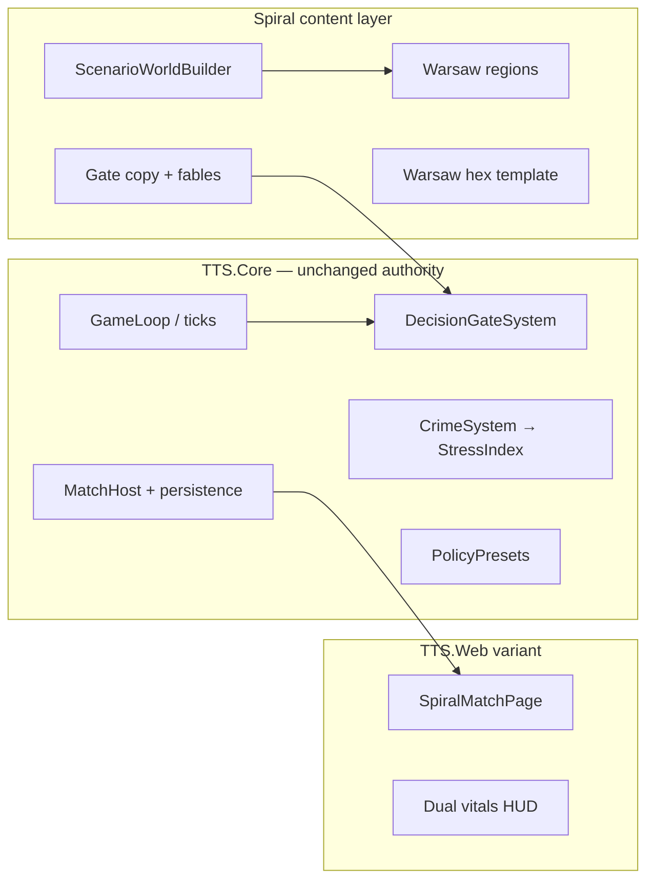

# Spiral — Warsaw 2027 (Spin-off Game Design)

**Project:** From Stone to Ascension — **alternate game mode / narrative skin**  
**Working title:** **Spiral** (or *Purple Sky*)  
**Status:** **Concept / story-mechanics mapping** · reuses TTS Core + gates + async match; **not implemented**  
**Related:** [decision-gates.md](decision-gates.md) · [paris-map-strikes.md](paris-map-strikes.md) · [satellites-map-technology.md](satellites-map-technology.md) · [tts5-exploring.md](tts5-exploring.md) · [player-experience.md](../player-experience.md) · [match-modes.md](../match-modes.md)

---

## Executive summary

**Spiral** is a **character-driven async life sim** built on the same engine as TTS: scheduled ticks, **decision gates**, policy stances, regional pressure, optional **Warsaw map**, and (at “TTS 5”) **algorithm / advisor** voice — but the fiction is not civilization tiers. It is **Warsaw, autumn 2027**: UBI, technocratic comfort, algorithmic dating, VR addiction, and two burnt-out professionals matched by an app they never would have noticed in an elevator.

The player does not govern a nation. They **govern a week of two lives** — small choices that return in dreams, escalate on the purple sky weekend, and ask whether connection is still possible when every system optimizes for “someone like me.”

---

## 1. Story anchor (source narrative)

### 1.1 World — Huxley with Wi‑Fi

Universal Basic Income is **implemented**, not debated. Class still exists: fashion and venues signal status, but **work is optional** for most — fun is the product, and someone still builds the fun for others.

Algorithms convince everyone that **“people like me”** is the whole world. Information bubbles **widen** real inequality. Love is **ML-mediated**: height, earnings, habits, neural-inferred preferences — everyone gets a match; nobody is “excluded,” but nobody is seen either.

**Warsaw, centre, one weekday before the weekend.** Blade Runner entertainment districts. **Red moon, purple sky.** Devices glitch at 18:15. A dating-app SMS: *“I would be grateful to see you at the centre this weekend, too”* — polite as pre-Covid elevator small talk.

### 1.2 The pair

| Character | Role | Pressure |
|-----------|------|----------|
| **Her** — aspiring **behaviorist** | Studies patterns; ecstasy on weekends; paranoid loops | “Scenarios” from the past replay in dreams |
| **Him** — **VR architect** | Security-adjacent deployment; ~1,000 users/day in tragic loops | Xanax, MDMA hangovers, **Metaverse only on Thursday** rule |

They were **algorithmically matched**. They share an **elevator** at 7:45 — black clothes, dark circles, burnout. Virtual identities mask everyone; **touch feels unnatural**, like the border between fiction and reality.

### 1.3 Counterpoint — Africa thread

Material abundance in the core world; **African societies** evolved toward **spiritual peak** and **water scarcity** — a second “civilization” in match lore for contrast (not caricature): different gate types, no UBI fiction, **spiritual stability** vs **physical crisis**.

---

## 2. Game pitch

| | TTS (base) | **Spiral** |
|---|------------|------------|
| **Fantasy** | Governor across eras | Two people, one weekend, one city |
| **Agency** | Policy + gates | **Life gates** + lifestyle policy |
| **Time** | Days–weeks match | **~48h weekend arc** (standard mode) |
| **Opponents** | Rival civs | **Algorithms, habits, past selves** |
| **Win** | Tier + stability | **Connection / clarity / survival** ending grades |
| **Map** | Hex planet | **Warsaw districts** (+ optional orbital purple-sky layer) |

**Tagline:** *“The app matched you. The elevator didn’t. The weekend decides.”*

---

## 3. Reuse of TTS engine (no rewrite)

| TTS system | Spiral use |
|------------|------------|
| `MatchHost` / ticks | **Hours pass** — Tuesday → weekend |
| `DecisionGate` | **Life gates** — reply to SMS, rave vs sleep, therapy, elevator moment |
| `CivilizationPolicy` | **Lifestyle policy** — Connect / Numb / Optimize / Withdraw |
| `Region` + crime CSV | **District stress** — Śródmieście, Praga, office tower “region” |
| `Faction` | **Inner circles** — Security, Marketing, Therapy app, Dealer network |
| `StrategicAdvisor` | **Therapy bot / dating coach** (classical TTS 4; LLM optional) |
| `HexMapView` | Warsaw **entertainment vs residential** heat |
| `KnowledgeNetwork` | **Social graph** — who poisons the bubble |
| `InformationAgeTechSpine` | Already “2027 tech” — map to **devices, VR, ML apps** |
| `GateFableGenerator` | Dream sequences, purple-sky prose |

**Rule preserved:** simulation stays in **Core**; LLM only **flavors** gate text and advisor — never resolves outcomes.

---

## 4. Player model

### 4.1 Recommended: **Dual protagonist (single player)**

One player alternates or sets **one policy for both** with **per-character gates**:

- **Shared match state** — one Warsaw, one timeline  
- **Split vitals** — Her stability / His stability / **Relationship** meter  
- Gates tagged `contextCharacterId`: `char-behaviorist` | `char-vr-architect` | `char-both`

### 4.2 Alternate: **Co-op (2 players)**

Each player one character; shared regions; **joint gates** require both to resolve within window (async negotiation via app message fiction).

### 4.3 Not in v1

Real-time elevator scene; 3D metaverse; dating sim minigames.

---

## 5. Vitals (reskin stability pillars)

| TTS pillar | Her track | His track | Shared |
|------------|---------|---------|--------|
| Political | **Grounding** (therapy, routine) | **Compliance** (security job) | — |
| Economic | **UBI comfort** (material ease) | **Salary buffer** | **Shared rent / lifestyle** |
| Technological | **Research / insight** | **VR craft / deployment guilt** | **Device glitch stress** |
| — | — | — | **Connection** (0–100, new scalar on `MatchState`) |

**Connection** moves on: meeting choices, SMS tone, elevator, weekend centre date.

---

## 6. Regions — Warsaw map

Reuse [hex-map.md](hex-map.md) + [paris-map-strikes.md](paris-map-strikes.md) pattern (**hot districts**, not military).

| Region id | Name | Fiction | Stress driver |
|-----------|------|---------|---------------|
| `reg-centre` | **Śródmieście / Centre** | Dating “centre,” Blade Runner nightlife | Algorithm events, crowds |
| `reg-office-20f` | **Tower X — 20+ floor** | Rare elevator small talk | Work burnout, security AI |
| `reg-praga` | **Praga** | Cheaper glow, art, afterparties | Rave / drug gates |
| `reg-vr-lab` | **VR Lab Quarter** | His deployment hub | User trauma reports |
| `reg-clinic` | **Therapy & wellness strip** | Her behaviorist placement | Paranoia, dream depth |
| `reg-africa-proxy` | **Lagos uplink** (abstract) | Africa thread — spiritual high, water crisis | Contrast events only |

**Purple sky / red moon:** global `WorldState` cosmetic flag + [satellites-map-technology.md](satellites-map-technology.md) **glitch layer** — device failures at 18:15 as timed **GlobalEvent**.

---

## 7. Decision gates — story beats as mechanics

Gates use existing templates; **copy** carries the narrative.

### 7.1 Act structure (48h standard match)

| Act | Ticks (example) | Beats |
|-----|-----------------|-------|
| **I — Tuesday night** | 0–2 | SMS arrives; “Metaverse only Thursday”; naked sleep vs scroll |
| **II — Wednesday–Thursday** | 3–6 | Office scan 7:45; **elevator gate**; freezing shower deferred |
| **III — Friday glitch** | 7 | 18:15 device anomaly; memories surge |
| **IV — Weekend** | 8–11 | Centre date; rave vs stay in; Xanax vs face it |
| **V — Dawn** | 12 | Ending grade |

### 7.2 Sample gates (mechanics → fiction)

| Gate type | Title (example) | Options | Effect |
|-----------|-----------------|---------|--------|
| **CrimePressure** → *SocialPressure* | “Reply to the dating app” | Warm · Delay · Cold official | Connection ±, Her grounding |
| **FactionCrisis** | “Security AI rollout — week 3” | Log the bugs · Ignore · Whistle | His compliance, shared glitch risk |
| **ForbiddenTech** → *ForbiddenHabit* | “Thursday metaverse rule” | Break it · Keep it · One hour only | His tech stability, addiction |
| **TierAdvancement** → *LifePhase* | “Go to the centre this weekend” | Yes · Maybe · Cancel with polite text | Connection, Praga stress |
| **GlobalCrisis** | “Purple sky — devices desync” | Unplug together · Scroll alone · Call therapy bot | Both pillars, dream depth |
| **FactionCrisis** | “Elevator — same floor” | Eye contact · Phone · Small talk | **Connection** spike or crash |

**Dream recursion:** resolving a gate with **Delay** adds `OfferedGateKeys` dream variant — same choice, deeper `Fable` (reuse forbidden **delay** pattern from [decision-gates.md](decision-gates.md)).

---

## 8. Lifestyle policies (reskin `PolicyPresets`)

| Policy id | Label | Research auto-path | Fiction |
|-----------|-------|---------------------|---------|
| `connect` | **Show up** | Therapy, social, grounding tech | “RL Thursdays matter” |
| `numb` | **Numb out** | Xanax path, passive feeds | His default drift |
| `optimize` | **Optimize** | ML self-tracking, behaviorist tools | Her professional mask |
| `withdraw` | **Withdraw** | VR solo, cancel plans | High connection risk |

Advisor recommends **Connect** when Connection < 40 and weekend gate pending.

---

## 9. Technology tree (diegetic, TTS 4 band)

Not “research nuclear.” **Coping & connection tech** mapped to existing nodes:

| Catalog id | Spiral name |
|------------|-------------|
| `tech-computing` | Personal stack / devices |
| `tech-cybersecurity` | Security dept tools |
| `tech-ml` | Dating & behavior ML |
| `tech-internet` | Feeds & bubbles |
| `tech-satellite` | Purple sky / glitch sky layer |
| `tech-ml` → path | VR deployment platform |

**TTS 5** in Spiral = **“Full AI companion deployed”** — advisor becomes unreliable mirror (MAF optional).

---

## 10. Scenarios — past choices that return

Core design mechanic from the story: **small past choices recurse in dreams.**

| Mechanism | Implementation idea |
|-----------|---------------------|
| **Scenario keys** | Reuse `OfferedGateKeys` + gate id suffix `-dream-2`, `-dream-3` |
| **Depth** | Each recurrence: darker `Fable`, higher stability cost for **Ignore** |
| **Player visibility** | Away summary: “You deferred the shower again. It returns in sleep.” |
| **Win condition** | Break loop by **Connect** policy + one **joint** gate resolved |

Optional: `CivActionHistory` / `GateResolutionRecord` UI as **journal** tab.

---

## 11. Africa contrast (second lens)

Not a full second game — **event injections** from `reg-africa-proxy`:

| Event | Message | Player choice |
|-------|---------|---------------|
| Water crisis bulletin | Spiritual community thrives; wells dry | Donate UBI · Ignore · Obsess (guilt gate) |
| Perspective gate | “Your bubble is not the world” | Humility + grounding · Deflect · Cynicism |

Avoid poverty tourism — mechanics focus on **player’s bubble rupture**, not playing Africa.

---

## 12. Match modes

| Mode | ID | Wall clock | Fiction |
|------|-----|------------|---------|
| **Weekend** | `spiral-weekend-48h` | 48h | Full arc to centre date |
| **Weeknight** | `spiral-sprint-8h` | 8h | SMS → one elevator → dawn |
| **Dev** | `spiral-dev-blitz` | 3m | QA dream loops |

Victory: no tier. **Ending card:**

- **Connected** — weekend centre, touch not unnatural  
- **Parallel** — polite SMS forever, elevator never again  
- **Spiral** — recursion wins; both numb  
- **Clear** — rare; glitch resolved, shower taken, truth told  

---

## 13. UI / presentation

| TTS UI | Spiral |
|--------|--------|
| Governor dashboard | **Split diary** — Her / Him tabs |
| Stability bars | Grounding · Salary · VR · **Connection** |
| Gate hero | Full-width prose, SMS / notification styling |
| Map panel | Warsaw night map, entertainment heat |
| Tech tree | **“Tools & habits”** accordion |
| Advisor | Therapy bot + dating coach voices |

Palette: purple sky, red moon accent, Blade Runner rain on `match-ui.css` variant `spiral-theme.css`.

---

## 14. Implementation path

| Phase | Work | Reuse |
|-------|------|-------|
| **P0** | This doc + gate copy pack | — |
| **P1** | `SpiralWorldFactory` — 2 chars, Warsaw regions, demo SMS gate | `SampleWorldFactory` pattern |
| **P2** | `MatchConfig` mode ids + `Connection` on match state | `MatchHost` |
| **P3** | Gate template reskin (`SocialPressure` copy only) | `DecisionGateSystem` |
| **P4** | Warsaw hex template or rename procedural capital | `HexMapBootstrap` |
| **P5** | `SpiralMatchPage` route `/spiral/:matchId` | `MatchPage` fork |
| **P6** | Dream recurrence rules | `OfferedGateKeys` + fables |
| **P7** | LLM dream prose | `GateFableGenerator` tone profile |

**Smallest playable:** P1 + P3 + one weekend gate chain in existing `MatchPage` with Spiral CSS — **no new gate types required**.

---

## 15. Explicit non-goals

- Glorifying substance abuse (gates show **cost** on stability)  
- Dating sim stats grind  
- Real Warsaw geodata requirement  
- Replacing TTS civilization mode  
- Multiplayer dating with strangers (co-op is opt-in fiction)  

---

## 16. Relation to other v2 docs

| Doc | Link |
|-----|------|
| [paris-map-strikes.md](paris-map-strikes.md) | Hot districts → Warsaw nightlife stress |
| [satellites-map-technology.md](satellites-map-technology.md) | Purple sky, 18:15 device glitch |
| [tts5-exploring.md](tts5-exploring.md) | AI deployment week 3 → alignment / advisor break |
| [decision-gates.md](decision-gates.md) | Queue, region context, dream delay pattern |

---

## 17. Opening text (player-facing)

> Universal basic income landed years ago. Work is optional; fun is mandatory.  
> The app says you’re perfect for each other.  
> Tomorrow you might share an elevator and never look up.  
> **This weekend, the sky is purple. Reply?**

---

*Spiral* is the same **async gate engine** as TTS — but the civilization is **two nervous systems and one city**, and the research tree is **how they cope until Monday.*
