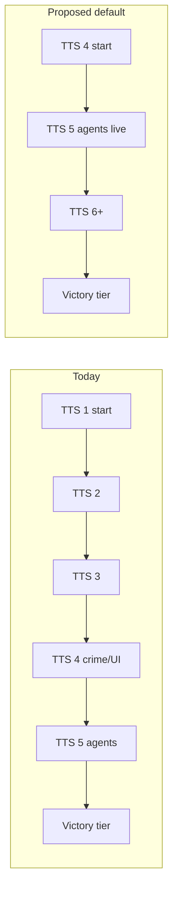

# Remigration — Start Matches at TTS 4

**Project:** TTS — Technology Tier Simulation  
**Status:** Exploration / v2 planning  
**Related:** [agent-integration.md](agent-integration.md) · [procedural-generation.md](procedural-generation.md) · [crime-data.md](../crime-data.md) · [tech-trees-by-tier.md](../tech-trees-by-tier.md) · [match-modes.md](../match-modes.md)

---

## Executive summary

Today every new match begins at **TTS 1 (Pre-Industrial)** with empty tech trees and no crime, advisor, or rival-agent mechanics until players research through three eras. Much of the **implemented** differentiation — CSV crime perspective, cybersecurity, digital gates, LLM advisor, rival MAF turns — lives at **TTS 4–5+**.

**Proposal:** Remigrate the default game loop so **matches start at TTS 4 (Information Age)** with a curated “already modern” baseline, and compress the **playable** progression band to **TTS 4 → 8** (with optional tutorial mode at TTS 1 for legacy / onboarding).

This is a **product pivot**, not a small tweak: it changes pacing, UI first impressions, match presets, world factory, and how agents meet the player in the first session.

---

## 1. Problem with TTS 1 start today

| Issue | Detail |
|-------|--------|
| **Slow path to “real game”** | Sprint 8h victory is TTS 5; players spend early ticks on agriculture/industrial nodes they never see in UI flavor |
| **Agents feel bolted-on** | Advisor + rival LLM unlock at TTS 5 — often **after** a dev blitz or many ticks in 8h mode |
| **Crime / digital systems idle** | `CrimeSystem`, regional CSV profiles, cybersecurity tech — all TTS 4+ — invisible at match start |
| **Narrative mismatch** | `SampleWorldFactory` attaches **California 2015 / Louisiana 2015** city data while civs are Pre-Industrial |
| **Demo gates** | Faction dispute gates at TTS 1 feel disconnected from Information Age city cards |

The codebase already **behaves** like a late-era governor sim in UI and data; the **starting tier** lags behind.

---

## 2. Vision — “You inherit a digital civilization”

**Opening fantasy:** You take control of an Information Age nation already wired into global networks, factional politics, and socioeconomic stress. The match is about **AI alignment, bio/nano, temporal risk** — not discovering steam power.



---

## 3. What TTS 4 start means mechanically

### 3.1 Civilization baseline (per civ)

| Field | Today (TTS 1) | Proposed (TTS 4) |
|-------|---------------|------------------|
| `CurrentTier` | `PreIndustrial` | `InformationAge` |
| `ResearchedTechnologyIds` | `[]` | Spine through **Digital Computing** + 1–2 era gates (e.g. cybersecurity, satellite networks) |
| Stability | ~70 defaults | Slightly **lower** (55–65) — modern fragility |
| Factions | Same structure | Emphasize **Corporation / Media / AI precursor** stances |
| Crime profile | Loaded but hidden in UI | **Visible day one** on city cards |

### 3.2 Technology tree visibility

- **Prune UI default** to TTS 4–8 branches (collapse or gray out TTS 1–3 as “historical foundation — completed”).
- Research slots stay 3/turn at TTS 4 (`ResearchThroughput`).
- First **player choices** are Information → Early AI branches (computing, ML, governance tech).

### 3.3 Systems active from tick 1

| System | TTS 1 today | TTS 4 start |
|--------|-------------|-------------|
| `CrimeSystem` / `CrimePressurePhase` | Runs but low relevance | **Core loop** |
| `EconomySystem` + CSV anchors | Odd vs tier | **Aligned** |
| Decision gates | Pre-industrial disputes | **Digital governance / crime / alignment** gates |
| LLM gate fables | Generic | Crime + network themed |
| Advisor panel | Locked | Unlocks after **1 tier** (TTS 5) or **optional TTS 4 lite** (classical only) |
| Rival `AgentTurnRunner` | Locked until TTS 5 | Same — rival starts TTS 4, hits agents within 1–2 ticks |

### 3.4 Match presets (rebalance)

| Mode | Today victory | Proposed victory | Rationale |
|------|---------------|------------------|-----------|
| Sprint 8h | TTS 5 | **TTS 6** (Bio/Nano) | Start at 4 → 2–3 tier climb in 8 ticks |
| Blitz 24h | TTS 6 | **TTS 7** | Room for forbidden gates |
| Standard 36h | TTS 6 | TTS 7 | Same |
| Extended 48h | TTS 7 | **TTS 8** | Full singularity arc |
| Dev blitz 3m | TTS 3 | **TTS 5** | Fast agent smoke test |

`VictoryStabilityMin` may need a small bump — higher tiers are harder to hold stable.

---

## 4. World factory changes

### 4.1 `SampleWorldFactory` / procgen hook

Replace “empty civ + full catalog” with:

```csharp
// Conceptual — not implemented
WorldBootstrap.Create(config, new WorldBootstrapOptions
{
    StartingTier = TechTier.InformationAge,
    CompletedTierCap = TechTier.EarlyElectronics, // TTS 1–3 auto-complete
    StartingTechnologies = TechSpine.InformationAgeBaseline(seed),
    WithDemoGate = config.IncludeTutorialGate
});
```

Align with [procedural-generation.md](procedural-generation.md): **`WorldBootstrap`** becomes the single entry (factory + seed), not hardcoded TTS 1 only.

### 4.2 Regions & narrative

- Keep CSV-backed cities — they **fit** TTS 4.
- Rename or reflavor regions if needed (still valid to use US state data as “anchored modern regions”).
- Optional: procgen region names with fixed **2015-era** stat bundles.

### 4.3 Demo gate

- Default **off** on home page (already done).
- When on: **Information Age** gate — e.g. “Data sovereignty dispute” / “Platform regulation” — not pre-industrial faction feud.

---

## 5. UI / UX impact

| Area | Change |
|------|--------|
| Home / match card | Show **TTS 4** as starting era badge |
| Match header | “Information Age” band colors from tick 0 |
| City cards | Crime block visible immediately |
| Tech tree | Default expand TTS 4 branch; historical tiers collapsed |
| Advisor | Consider **TTS 4 classical advisor** (policy text) before TTS 5 LLM |
| Away summary | Events framed as digital/AI from start |
| Onboarding | One-screen “You begin in the Information Age” |

See [ui-design.md](../ui-design.md) §5.7 — crime panel was already designed for TTS 4+.

---

## 6. Agent integration payoff

With TTS 4 start ([agent-integration.md](agent-integration.md)):

| Milestone | Ticks (typical sprint) | Player experience |
|-----------|------------------------|-------------------|
| Match start | 0 | Crime, factions, modern tech tree |
| Rival hits TTS 5 | 1–2 | First **LLM rival turns** |
| Player hits TTS 5 | 2–4 | **Strategic advisor** (MAF tools) |
| Victory TTS 6 | 6–8 | Bio/nano endgame |

Agents become part of the **core** 8h match fantasy instead of a late easter egg.

**Optional stretch:** “TTS 4 advisor lite” — classical `GetPolicyResearchAnalysis` in advisor panel before TTS 5, LLM upgrades at TTS 5 (UI already has fallback path).

---

## 7. What we keep from TTS 1–3

| Approach | Use |
|----------|-----|
| **Legacy tutorial mode** | `modeId: classic-stone` — full TTS 1→8 for purists / education |
| **Tech tree catalog** | Full tree remains in data; only **bootstrap** skips early research |
| **Tech-trees-by-tier.md** | Lore reference; collapsed in UI |
| **Tests** | Keep unit tests on low-tier logic; add `InformationAgeBootstrapTests` |

Do **not** delete Pre-Industrial systems — gate them behind mode or “historical completion” flags.

---

## 8. Migration strategy

### Phase A — Bootstrap only (low risk)

1. Add `MatchConfig.StartingTier` (default `InformationAge` for new modes).
2. `SampleWorldFactory.Create` applies tier + tech spine when `StartingTier >= InformationAge`.
3. Rebalance victory tiers + dev blitz target.
4. UI: starting tier badge, show crime from tick 0.
5. Update tests + `ScenarioWorldBuilder` defaults.

### Phase B — Content pass

1. New TTS 4 decision gate templates in `DecisionGateSystem`.
2. Gate fable prompts keyed to Information Age.
3. Global events weighted to digital/AI at low turn count.

### Phase C — Procgen (optional)

1. Seeded `WorldBootstrap` per [procedural-generation.md](procedural-generation.md).
2. Multiple regions / civs at TTS 4 baseline.

### Phase D — Classic mode

1. `match-modes.md` documents `classic-full` (TTS 1 start).
2. Home page mode picker: **Information Age** (default) vs **From Stone** (legacy).

---

## 9. Risks & mitigations

| Risk | Mitigation |
|------|------------|
| Less “civilization journey” fantasy | Legacy mode; UI “historical ages completed” lore |
| Tech tree overwhelm | Collapse completed tiers; highlight 3 next researches |
| Balance — too fast to TTS 5 | Tune research throughput / gate frequency |
| Existing saves | Version `MatchPersistence`; old saves keep their tier |
| Agent load in short matches | Keep `TTS_LLM_MAX_CALLS_PER_TICK`; classical fallback |

---

## 10. Open questions

1. **Player auto-policy at TTS 4** — still classical on ticks, or allow opt-in “delegate to advisor” at TTS 5?
2. **Multiplayer join mid-match** — do late joiners inherit host’s tier snapshot?
3. **Company sim / other products** — share `WorldBootstrap` or fork?
4. **Victory** — stability + tier only, or add TTS 4 “digital stability” metric?

---

## 11. Implementation checklist

- [ ] `MatchConfig.StartingTier` + preset rebalance
- [ ] `InformationAgeTechSpine` — shared by factory, scenarios, tests
- [ ] `SampleWorldFactory` / future `WorldBootstrap`
- [ ] `TechTreeView` — collapse completed eras
- [ ] `MatchPage` — crime visible at start; era copy
- [ ] `DecisionGateSystem` — TTS 4 default gates
- [ ] `GateFableGenerator` — era-appropriate prompts
- [ ] `match-modes.md` + `current-state.md` update
- [ ] Optional `classic-stone` mode
- [ ] Agent smoke: dev blitz reaches TTS 5 in &lt; 2 minutes

---

## 12. Success criteria

- New player in **Sprint 8h** sees crime + modern UI on **first dashboard load**.
- **Rival LLM turn** observable within **first 2 ticks** without cheats.
- **Advisor** reachable within **half** a sprint match.
- Legacy **TTS 1** path still available for documentation and long-form campaigns.
