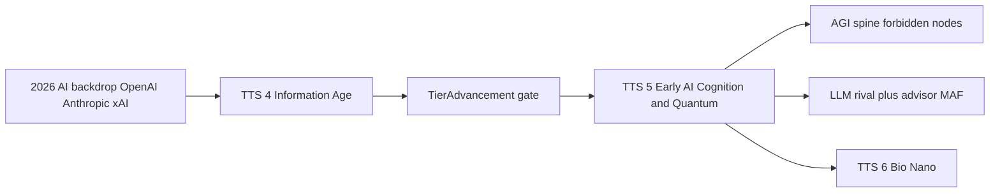

# TTS 4 → TTS 5 — Exploring the Early AI Transition

**Project:** TTS — Technology Tier Simulation  
**Status:** **Partially shipped** · agents + alignment gates live; full TTS 5 catalog and economy hooks incomplete  
**Related:** [tts4-start.md](tts4-start.md) · [tts6-exploring.md](tts6-exploring.md) · [decision-gates.md](decision-gates.md) · [agent-integration.md](agent-integration.md) · [tech-trees-by-tier.md](../tech-trees-by-tier.md) §7 · [paris-map-strikes.md](paris-map-strikes.md)

---

## Executive summary

Default matches start in **June 2026** at **TTS 4 (Information Age)** ([tts4-start.md](tts4-start.md)): digital infrastructure, CSV crime perspective, cybersecurity, and **classical** gate counsel from day one.

**TTS 5 (Early AI / Cognition & Quantum)** is where the game’s rules change again — not because you “discover computers,” but because **frontier AI becomes governance**:

- **Rival civilizations** can run **LLM agent turns** (MAF tool loops).  
- **Global crises** flip to **AI alignment** gates.  
- **Forbidden tech** (recursive AI, mass surveillance) becomes a recurring player choice.  
- The **2026 vendor landscape** (OpenAI, Anthropic, xAI, etc.) is the narrative backdrop for *this* climb — before [TTS 6 biological rewriting](tts6-exploring.md).

---

## 1. The 2026 world situation (TTS 4 → 5)

TTS uses the **public 2026 situation** as flavor and gate copy — not a stock-market sim. The player starts **inside** the AI era’s infrastructure; reaching TTS 5 means **your civilization operationalizes** what the news already talks about every week.

### 1.1 Timeline inside a standard match

| Phase | In-fiction | Real-world echo (≈2026) |
|-------|------------|-------------------------|
| **Match start (TTS 4)** | You inherit ML, cloud, cyber, regional crime data | Models everywhere; agents in beta; regulation lagging |
| **Mid climb (TTS 4 late)** | Cybersecurity, diffusion, faction/platform fights | Consolidation, chip wars, datacenter builds |
| **Tier gate (TTS 4 → 5)** | **TierAdvancement** — embrace / regulate / delay AGI path | “Do we treat AI as utility, regulator, or sovereign?” |
| **TTS 5 live** | AGI spine, forbidden offers, **AiAlignment** gates, **LLM rivals** | Alignment summits, agent autonomy, recursive-risk debate |

### 1.2 “Big Five + X” — who shapes the climb

| Actor | 2026 backdrop | TTS 4–5 gameplay mapping |
|-------|---------------|---------------------------|
| **OpenAI** | Frontier closed models; ChatGPT-class agents in workflows; Stargate-scale compute narrative | **TechRush** pressure; **ForbiddenTech** (`tech-recursive-ai` pursue/ban/delay) |
| **Anthropic** | Claude; constitutional AI; enterprise safety positioning | **Stability-first** advisor; **AiAlignment** → **contain** / **regulate** |
| **Google DeepMind** | Gemini; search + cloud + science integration | Strong **KnowledgeNetwork** diffusion; espionage of your AGI path |
| **Meta** | Llama open ecosystem; social scale | Hard-to-contain diffusion; **Diplomatic** / platform **FactionCrisis** |
| **Microsoft** | Copilot; Azure; **Agent Framework (MAF)** in production stacks | **Shipped** rival + advisor MAF path ([agent-integration.md](agent-integration.md)) |
| **xAI (X)** | Grok on X; real-time discourse; contrarian tone | **Accelerationist** rival lines; crime / legitimacy spikes in urban regions |
| **Apple** | On-device models; privacy framing | **Isolate**-leaning alignment option; infra without cloud dependency fiction |
| **Amazon / NVIDIA** | AWS train/infer; GPU chokepoints | **GlobalCrisis** resource events; **Energy / Manufacturing** branch weight |

**Design rule:** name vendors in **advisor briefings, fables, and scenario docs** — keep in-game faction names fictional (Aurora Collective, etc.) unless running a deliberate “2026 Earth” scenario mode.

### 1.3 News themes → gate types

| 2026 headline pattern | `GateType` | Example player choice |
|----------------------|------------|------------------------|
| “Model can self-improve / recursive risk” | **ForbiddenTech** | Pursue · Ban · Delay |
| “AI regulation bill passes / fails” | **GlobalCrisis** → **AiAlignment** (TTS 5+) | Regulate · Accelerate · Isolate / Align · Contain · Merge |
| “Platform strike / urban unrest” | **CrimePressure** (region-scoped) | Invest · Ignore · Crackdown — see [paris-map-strikes.md](paris-map-strikes.md) |
| “Union / gov / corp split on automation” | **FactionCrisis** | Appease · Suppress · Reform |
| “You crossed into AGI band” | **TierAdvancement** | Embrace · Regulate · Delay |

---

## 2. Narrative and mechanical shift

| Tier | Name | What the player feels |
|------|------|------------------------|
| **TTS 4** | Information Age | **Digital governor** — crime, cyber, policy, classical advisor + gate counsel |
| **TTS 5** | Cognition & Quantum | **Intelligence layer** — AGI path, alignment crises, **agents as rivals**, quantum branches |

Mechanically ([tech-trees-by-tier.md](../tech-trees-by-tier.md) §7):

- **Automation** branches replace pure labor-value fiction.  
- **Forbidden** nodes (`tech-recursive-ai`, reality prediction) sit on the spine’s shadow side.  
- **Victory** in several presets targets **TTS 5** (`MatchConfig.VictoryTier = EarlyAI` for sprint modes).

---

## 3. Spine technologies (TTS 4 → 5)

### 3.1 What you already have at TTS 4 start (shipped)

`InformationAgeTechSpine` grants prior-era tech and a curated TTS 4 band — typically including:

- Digital computing, ML, cybersecurity (demo spine)  
- Crime-relevant fusion tags (`cyber`, `crime`)  
- Tier already `InformationAge`; crime systems active tick 0  

See [tts4-start.md](tts4-start.md) and `src/TTS.Core/Systems/InformationAgeTechSpine.cs`.

### 3.2 What unlocks the TTS 5 band

| Node (design / demo) | Role | Notes |
|----------------------|------|-------|
| `tech-ml` | TTS 4 branch | On-ramp to AGI prereqs |
| `tech-agi` | **TTS 5 core capstone** | Triggers alignment fiction; path to TTS 6 |
| `tech-recursive-ai` | **Forbidden** | Demo ✓ — **ForbiddenTech** gate |
| Quantum branch (`tech-quantum-sim`, etc.) | Depth quota | Design catalog; partial in JSON |
| `tech-distributed-ai`, autonomous gov | TTS 5 branches | Agent / automation narrative |

**TierAdvancement gate (TTS 4 → 5)** fires when `CurrentTier` crosses — options **Embrace / Regulate / Delay** ([decision-gates.md](decision-gates.md)). Copy should read like **“operationalize frontier AI”**, not “unlock electricity.”

---

## 4. Agentic intelligence — the TTS 5 rules change

This is the **largest shipped difference** between TTS 4 and TTS 5.

| Capability | TTS 4 | TTS 5+ |
|------------|-------|--------|
| **Rival turn runner** | `ClassicalAiSystem` (policy pick) | `AgentTurnRunner` → MAF tool loop ([agent-integration.md](agent-integration.md)) |
| **Strategic advisor** | **Classical** briefing + gate counsel (shipped) | **LLM** advisor via `AgentToolWorkflow` (same tool boundary) |
| **Gate fables** | Ollama flavor (crime/digital tone) | Sci-fi / alignment tone (`GateFableGenerator` tier rules) |
| **Rate limits** | Advisor calls capped per tick | Same — cost control |

Code gates:

- `AgentTurnRunner`: rival + `CurrentTier >= EarlyAI`  
- `ClassicalAiTurnRunner`: player civs or below TTS 5  
- `WorldGrain`: injects `ILlmTurnAgent` into match host  

**Narrative:** at TTS 4 you read about OpenAI and Anthropic in the news; at TTS 5 your **rival acts like one** — proposing research through validated tools, not hallucinating state.

---

## 5. Decision gates at TTS 5

| Gate | When | 2026-flavored example |
|------|------|------------------------|
| **TierAdvancement** | Cross into TTS 5 | “National AGI taskforce charter — sign or stall?” |
| **ForbiddenTech** | Recursive / surveillance nodes available | “Allow self-improving model deployment?” |
| **AiAlignment** | Global crisis at TTS 5+ minimum tier | “Merge with platform AI · Contain · Align standards” |
| **CrimePressure** | Region hot (TTS 4+ but peaks in modern cities) | “Platform strike in capital — negotiate?” |
| **FactionCrisis** | Low stability | “Automation union blockade” |

Shipped mechanics: region + faction context, queue UX, crime offset — [decision-gates.md](decision-gates.md).

**AiAlignment** replaces generic **GlobalCrisis** when `crisis.MinimumTier >= EarlyAI` (`DecisionGateSystem`).

---

## 6. Socioeconomic and regional play

TTS 4 anchors regions to **CSV socioeconomic data** ([crime-data.md](../crime-data.md)). That stays true through the TTS 5 climb:

| Effect | Detail |
|--------|--------|
| **Crime perspective** | Active from TTS 4; gates can target **one city** |
| **Cybersecurity tech** | Mitigates crime pressure drift (`CrimeSystem`) |
| **Stability vs progress** | **Embrace** on tier gate trades stability for tech pace |
| **Urban hot spots** | [paris-map-strikes.md](paris-map-strikes.md) — map heat + strike gates as scenario template |

TTS 5 does **not** abandon CSV baselines — it **stress-tests** them with alignment and automation fiction.

---

## 7. Implementation status (repo)

| Area | Status |
|------|--------|
| TTS 4 default start + spine | **Shipped** |
| Classical advisor + gate counsel at TTS 4 | **Shipped** |
| Rival MAF turns at TTS 5+ | **Shipped** |
| LLM advisor at TTS 5+ | **Shipped** (Ollama dev; cloud optional) |
| `tech-agi`, `tech-recursive-ai` in fallback spine | **Shipped** |
| Full ~50-node TTS 5 catalog | **Partial** — `catalog.json` + design tables |
| Automation economy (labor value) | **Design** — not fully in `EconomySystem` |
| TTS 5-specific tier gate copy | **Design** — generic strings today |
| Vendor names in UI | **Design** — fictional civs by default |

---

## 8. Open design questions

1. Should **TTS 5** unlock at a **fixed tick** in sprint modes, or only via research + tier gate?  
2. Do we show a **“frontier AI” HUD strip** (vendor-neutral icons) when crossing TTS 5?  
3. Should **player civs** ever run MAF turns (Player-as-AI mode), or stay classical forever?  
4. How aggressive should **rival agents** be on forbidden tech vs stability?  
5. Victory at **TTS 5** only — still default for 8h sprint, or raise to TTS 6 in some modes?

---

## 9. Suggested reading order

1. [tts4-start.md](tts4-start.md) — June 2026 / TTS 4 baseline  
2. [agent-integration.md](agent-integration.md) — MAF boundaries and tick flow  
3. [decision-gates.md](decision-gates.md) — alignment and forbidden gates  
4. [tts6-exploring.md](tts6-exploring.md) — what changes **after** AGI (Bio/Nano)  
