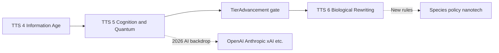

# TTS 5 → TTS 6 — Exploring the Bio / Nano Transition

**Project:** TTS — Technology Tier Simulation  
**Status:** **Exploration / design notes** · not fully implemented in catalog or gates  
**Related:** [tts4-start.md](tts4-start.md) · [tts5-exploring.md](tts5-exploring.md) · [decision-gates.md](decision-gates.md) · [agent-integration.md](agent-integration.md) · [tech-trees-by-tier.md](../tech-trees-by-tier.md) · [tech-tree.md](../tech-tree.md) · [procedural-generation.md](procedural-generation.md)

---

## Executive summary

Modern match modes default to a **June 2026** baseline ([tts4-start.md](tts4-start.md)): players begin in the **Information Age (TTS 4)**, climb through **Early AI (TTS 5)** — see **[tts5-exploring.md](tts5-exploring.md)** for the 2026 AI backdrop and agent unlock — then cross into **Bio / Nano (TTS 6)** here.

---

## 1. The 2026 world situation (design anchor)

> **TTS 4 → 5 and the full OpenAI / Anthropic / xAI backdrop** live in **[tts5-exploring.md](tts5-exploring.md)**. This section covers what **changes in the fiction** once you leave the Intelligence Layer for biological rewriting.

TTS 6 **outgrows** the 2026 AI-news cycle. The design anchor becomes:

- **CRISPR-scale biology**, synthetic life, nanomedicine, molecular manufacturing  
- Governance of **species-level** choice, not just model weights  
- Regions still use CSV socioeconomic baselines at TTS 4, but **species-modification gates** and **post-national** factions supersede “platform regulation” as the main story  

The OpenAI/Anthropic era is the **on-ramp**; TTS 6 is **biological rewriting as policy**.

---

## 2. Narrative and mechanical shift

In a standard match starting **June 2026 (TTS 4)**, players inherit a digital civilization anchored to contemporary socioeconomic data ([crime-data.md](../crime-data.md)). The journey **TTS 5 → TTS 6** is:

| Tier | Name | Gameplay focus |
|------|------|----------------|
| **TTS 5** | Cognition & Quantum | **Intelligence layer** — AGI paths, neural interfaces, quantum simulation, **AiAlignment** gates |
| **TTS 6** | Bio / Nano | **Biological rewriting** — genome editing, nanotech, **species modification as policy** |

Mechanically, TTS 6 introduces branches where progress is ** irreversible at civilization scale** (forbidden / high-risk nodes, stability caps) — see [tech-trees-by-tier.md](../tech-trees-by-tier.md) §8.

---

## 3. Key progression and spine technologies

To trigger the **TierAdvancement** decision gate for TTS 6, a civilization follows the **core spine** ([tech-tree.md](../tech-tree.md)):

| Requirement | Detail |
|-------------|--------|
| **Spine node** | **AGI** (`tech-agi`) — mandatory TTS 5 capstone unlocking the TTS 6 band |
| **Branch depth** | Core spine plus a quota of branch nodes (e.g. **Quantum Cryptography**, **Distributed AI**) so advancement is not a single beeline |
| **Layer gate** | TTS 6 nodes (e.g. **Genome Editing**) locked until the tier gate is **resolved** via [decision-gates.md](decision-gates.md) |
| **Forbidden preview** | **ForbiddenTech** gates may offer dangerous early glimpses of TTS 6 nodes before formal tier advance |

**TierAdvancement gate (TTS 5 → 6)** — template options today: **Embrace / Regulate / Delay** — should be rewritten in UI copy as “species-level commitment,” not just “new era unlocked.”

---

## 4. The fusion mechanism

Migration is enriched by **procedural tech-tree fusion** ([procedural-generation.md](procedural-generation.md), [tech-tree.md](../tech-tree.md) expansion rules):

| Fusion tags | Eras | Example node (design) |
|-------------|------|------------------------|
| `ai` + `biology` | TTS 5 + TTS 6 | **Synthetic Sentient Organisms** — hallmark of the Bio/Nano transition |
| `quantum` + `nano` | TTS 5 + TTS 6 | **Molecular assembly** — self-healing infrastructure, regional infra spikes |

Fusion content is **Phase 7+** in the repo; the TTS 5→6 climb is where fusion tags first matter for default victory paths.

---

## 5. Agentic intelligence in the migration

From the 2026 perspective, **Microsoft Agent Framework (MAF)** is the reference stack for agentic rivals and advisor workflows in this codebase ([agent-integration.md](agent-integration.md)):

| Feature | When | TTS 5→6 role |
|---------|------|----------------|
| **Rival agents** | TTS 5+ | Rivals run LLM turn workflows — racing you toward AGI and bio/nano while you resolve gates |
| **Strategic Advisor** | TTS 5+ LLM path | Briefings on **alignment risk** before tier advance; later, **biological rewriting** and nanotech outbreak risk |
| **Gate counsel** | TTS 4+ classical; TTS 5+ enriched | **AiAlignment** and future **species-modification** gates tie advisor recommendations to policy |

Narrative hook: in 2026 everyone has a “copilot”; by TTS 6 the question is whether the **copilot edits the genome**.

---

## 6. Socioeconomic impact on modern regions

Because the 2026 start uses **CSV-backed regions** (California 2015, Louisiana 2015, or procedural anchors), TTS 6 migration has **localized** effects — see shipped **region-scoped crime gates** in [decision-gates.md](decision-gates.md):

| Effect | Detail |
|--------|--------|
| **Stability vs progress** | TTS 6 raises civilizational **fragility**; **AiAlignment** (TTS 5) and species-modification gates (TTS 6, planned) hit **CrimePressureOffset** in named cities |
| **Region names** | Demo anchors: Meridian Bay, Redstone Harbor; procedural matches use seeded capitals |
| **Species policy** | TTS 6+ fiction: **post-national governance**, **hive-mind networks** — mechanics outgrow pure 2026 CSV baselines (new gate types, not just crime index) |

For a **spatial** expression of urban unrest before bio/nano, see [paris-map-strikes.md](paris-map-strikes.md) (hot regions on the map).

---

## 7. Implementation status (repo)

| Area | Status |
|------|--------|
| TTS 4 default start | **Shipped** — `InformationAgeTechSpine`, modern presets |
| TTS 5 advisor + rival MAF | **Shipped** — TTS 5+ tier gate in code |
| AGI / forbidden nodes in catalog | **Partial** — fallback spine; full catalog in `src/data/tech/catalog.json` |
| TierAdvancement gate | **Shipped** — generic copy; TTS 6-specific narrative **not** |
| TTS 6 branch gameplay | **Design** — enum + docs; limited nodes and gates |
| Fusion-generated TTS 6 nodes | **Planned** — Phase 7 |

---

## 8. Open design questions

1. Should **TTS 6** gates explicitly reference the **post-AGI** world (synthetic biology labs, gain-of-function bans) vs abstract tier text?  
2. Do **rivals** at TTS 6 get new MAF tools (`propose_species_policy`) or reuse research tools with higher risk?  
3. Is **victory** in standard modes still **TTS 5–6 band**, or does `sprint-8h` extend to **TTS 6 stability win**?  
4. How much **real-world AI vendor** flavor belongs in UI strings vs purely fictional faction names?

---

## 9. Suggested reading order

1. [tts4-start.md](tts4-start.md) — why matches begin in 2026 / TTS 4  
2. [tts5-exploring.md](tts5-exploring.md) — TTS 4→5, 2026 AI backdrop, MAF unlock  
3. [agent-integration.md](agent-integration.md) — MAF at TTS 5+  
4. [tech-trees-by-tier.md](../tech-trees-by-tier.md) §8 — TTS 6 node families  
5. [decision-gates.md](decision-gates.md) — tier and alignment gates on the climb  
